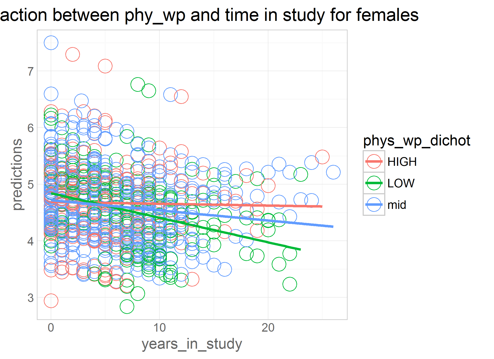

# mmse-obas

<!-- These two chunks should be added in the beginning of every .Rmd that you want to source an .R script -->
<!--  The 1st mandatory chunck  -->
<!--  Set the working directory to the repository's base directory -->


<!--  The 2nd mandatory chunck  -->
<!-- Set the report-wide options, and point to the external code file. -->


```
[1] "C:/Users/Rebecca/Documents/GitHub/cognition-stress-activity"
```


# **confound Variables initial equations**

```r
eq_0 <- as.formula("dsb ~ 1 + years_in_study +             
                   (1 + years_in_study |id)")
###does the outcome change over time? i.e. if so, it makes sense to add predictors.

eq_1 <- as.formula("dsb ~ 1 + years_in_study + age_bl_centered +    
                   (1 + years_in_study |id)")

eq_2 <- as.formula("dsb ~ 1 + years_in_study + age_bl_centered + years_in_study:age_bl_centered + 
                   (1 + years_in_study |id)")

####main effect of time in study: when baseline age is at the mean (i.e. 0)
####main effects of age_bl: when year in study is 0 (i.e. at baseline)
####interactioin: Those who are older decline faster over time

eq_3 <- as.formula("dsb ~ 1 + years_in_study + age_bl_centered + years_in_study:age_bl_centered + edu +     
                   (1 + years_in_study |id)")


eq_3int <- as.formula("dsb ~ 1 + years_in_study + age_bl_centered + years_in_study:age_bl_centered + edu + years_in_study:edu +  
                   (1 + years_in_study |id)")
```

### full data set- confound models

```r
model_0<- lmerTest::lmer(eq_0, data=dwn, REML=TRUE) 
model_1<- lmerTest::lmer(eq_1, data=dwn, REML=TRUE) 
model_2<- lmerTest::lmer(eq_2, data=dwn, REML=TRUE) 
model_3<- lmerTest::lmer(eq_3, data=dwn, REML=TRUE) 
model_3int<- lmerTest::lmer(eq_3int, data=dwn, REML=TRUE) 

lmerTest::summary((model_0)) #time in study is sig
```

```
Linear mixed model fit by REML 
t-tests use  Satterthwaite approximations to degrees of freedom ['lmerMod']
Formula: dsb ~ 1 + years_in_study + (1 + years_in_study | id)
   Data: dwn

REML criterion at convergence: 4200

Scaled residuals: 
    Min      1Q  Median      3Q     Max 
-4.0595 -0.5853 -0.0331  0.5546  3.7350 

Random effects:
 Groups   Name           Variance Std.Dev. Corr 
 id       (Intercept)    0.894458 0.94576       
          years_in_study 0.003428 0.05855  -0.60
 Residual                0.603059 0.77657       
Number of obs: 1550, groups:  id, 278

Fixed effects:
                 Estimate Std. Error         df t value Pr(>|t|)    
(Intercept)      4.930498   0.068137 238.460000  72.362  < 2e-16 ***
years_in_study  -0.062581   0.006979 109.050000  -8.966 9.77e-15 ***
---
Signif. codes:  0 '***' 0.001 '**' 0.01 '*' 0.05 '.' 0.1 ' ' 1

Correlation of Fixed Effects:
            (Intr)
yers_n_stdy -0.600
```

```r
lmerTest::summary((model_1)) # "" + age at baseline 
```

```
Linear mixed model fit by REML 
t-tests use  Satterthwaite approximations to degrees of freedom ['lmerMod']
Formula: dsb ~ 1 + years_in_study + age_bl_centered + (1 + years_in_study |      id)
   Data: dwn

REML criterion at convergence: 4183.8

Scaled residuals: 
    Min      1Q  Median      3Q     Max 
-4.0264 -0.5889 -0.0384  0.5742  3.7217 

Random effects:
 Groups   Name           Variance Std.Dev. Corr 
 id       (Intercept)    0.876386 0.93615       
          years_in_study 0.003355 0.05793  -0.67
 Residual                0.601948 0.77585       
Number of obs: 1550, groups:  id, 278

Fixed effects:
                  Estimate Std. Error         df t value Pr(>|t|)    
(Intercept)       4.977618   0.068347 234.150000  72.829  < 2e-16 ***
years_in_study   -0.066285   0.006917 116.320000  -9.583 2.22e-16 ***
age_bl_centered  -0.032236   0.006348 252.960000  -5.078 7.41e-07 ***
---
Signif. codes:  0 '***' 0.001 '**' 0.01 '*' 0.05 '.' 0.1 ' ' 1

Correlation of Fixed Effects:
            (Intr) yrs_n_
yers_n_stdy -0.642       
ag_bl_cntrd -0.151  0.154
```

```r
lmerTest::summary((model_2)) # "" + interaction - those who are older decline faster over time
```

```
Linear mixed model fit by REML 
t-tests use  Satterthwaite approximations to degrees of freedom ['lmerMod']
Formula: dsb ~ 1 + years_in_study + age_bl_centered + years_in_study:age_bl_centered +      (1 + years_in_study | id)
   Data: dwn

REML criterion at convergence: 4192

Scaled residuals: 
    Min      1Q  Median      3Q     Max 
-4.0224 -0.5928 -0.0370  0.5563  3.7074 

Random effects:
 Groups   Name           Variance Std.Dev. Corr 
 id       (Intercept)    0.867014 0.93114       
          years_in_study 0.003058 0.05529  -0.66
 Residual                0.602310 0.77609       
Number of obs: 1550, groups:  id, 278

Fixed effects:
                                 Estimate Std. Error         df t value Pr(>|t|)    
(Intercept)                     4.983e+00  6.811e-02  2.403e+02  73.156  < 2e-16 ***
years_in_study                 -6.973e-02  7.023e-03  1.515e+02  -9.929  < 2e-16 ***
age_bl_centered                -2.185e-02  8.109e-03  2.323e+02  -2.695  0.00756 ** 
years_in_study:age_bl_centered -1.657e-03  7.966e-04  1.128e+02  -2.080  0.03979 *  
---
Signif. codes:  0 '***' 0.001 '**' 0.01 '*' 0.05 '.' 0.1 ' ' 1

Correlation of Fixed Effects:
            (Intr) yrs_n_ ag_bl_
yers_n_stdy -0.625              
ag_bl_cntrd -0.090 -0.041       
yrs_n_st:__ -0.047  0.257 -0.619
```

```r
lmerTest::summary((model_3)) # "" + edu and gender are sig
```

```
Linear mixed model fit by REML 
t-tests use  Satterthwaite approximations to degrees of freedom ['lmerMod']
Formula: dsb ~ 1 + years_in_study + age_bl_centered + years_in_study:age_bl_centered +  
    edu + (1 + years_in_study | id)
   Data: dwn

REML criterion at convergence: 4190.4

Scaled residuals: 
    Min      1Q  Median      3Q     Max 
-4.0737 -0.5884 -0.0428  0.5643  3.6740 

Random effects:
 Groups   Name           Variance Std.Dev. Corr 
 id       (Intercept)    0.827672 0.90976       
          years_in_study 0.003097 0.05565  -0.64
 Residual                0.602035 0.77591       
Number of obs: 1550, groups:  id, 278

Fixed effects:
                                 Estimate Std. Error         df t value Pr(>|t|)    
(Intercept)                     4.141e+00  3.093e-01  2.693e+02  13.386  < 2e-16 ***
years_in_study                 -6.993e-02  7.057e-03  1.518e+02  -9.910  < 2e-16 ***
age_bl_centered                -1.829e-02  8.082e-03  2.349e+02  -2.263  0.02457 *  
edu                             5.743e-02  2.059e-02  2.584e+02   2.789  0.00568 ** 
years_in_study:age_bl_centered -1.677e-03  8.013e-04  1.138e+02  -2.093  0.03854 *  
---
Signif. codes:  0 '***' 0.001 '**' 0.01 '*' 0.05 '.' 0.1 ' ' 1

Correlation of Fixed Effects:
            (Intr) yrs_n_ ag_bl_ edu   
yers_n_stdy -0.131                     
ag_bl_cntrd -0.175 -0.043              
edu         -0.976 -0.004  0.160       
yrs_n_st:__  0.002  0.254 -0.608 -0.013
```

```r
lmerTest::summary((model_3int)) # interaction between time and education not sig
```

```
Linear mixed model fit by REML 
t-tests use  Satterthwaite approximations to degrees of freedom ['lmerMod']
Formula: dsb ~ 1 + years_in_study + age_bl_centered + years_in_study:age_bl_centered +  
    edu + years_in_study:edu + (1 + years_in_study | id)
   Data: dwn

REML criterion at convergence: 4197.3

Scaled residuals: 
    Min      1Q  Median      3Q     Max 
-4.0304 -0.5905 -0.0390  0.5584  3.6715 

Random effects:
 Groups   Name           Variance Std.Dev. Corr 
 id       (Intercept)    0.820726 0.90594       
          years_in_study 0.002908 0.05392  -0.64
 Residual                0.602993 0.77653       
Number of obs: 1550, groups:  id, 278

Fixed effects:
                                 Estimate Std. Error         df t value Pr(>|t|)    
(Intercept)                      3.716359   0.393798 245.540000   9.437  < 2e-16 ***
years_in_study                   0.001559   0.041401 117.180000   0.038  0.97003    
age_bl_centered                 -0.016198   0.008141 231.620000  -1.990  0.04781 *  
edu                              0.086310   0.026457 245.230000   3.262  0.00126 ** 
years_in_study:age_bl_centered  -0.002002   0.000812 110.420000  -2.465  0.01523 *  
years_in_study:edu              -0.004867   0.002784 118.940000  -1.748  0.08297 .  
---
Signif. codes:  0 '***' 0.001 '**' 0.01 '*' 0.05 '.' 0.1 ' ' 1

Correlation of Fixed Effects:
            (Intr) yrs_n_ ag_bl_ edu    y__:__
yers_n_stdy -0.628                            
ag_bl_cntrd -0.226  0.135                     
edu         -0.986  0.619  0.214              
yrs_n_st:__  0.140 -0.179 -0.616 -0.151       
yrs_n_stdy:  0.620 -0.986 -0.145 -0.629  0.225
```

### male- confound models

```r
model_0<- lmerTest::lmer(eq_0, data=dwn_male, REML=TRUE) 
model_1<- lmerTest::lmer(eq_1, data=dwn_male, REML=TRUE) 
model_2<- lmerTest::lmer(eq_2, data=dwn_male, REML=TRUE) 
model_3<- lmerTest::lmer(eq_3, data=dwn_male, REML=TRUE) 
model_3int<- lmerTest::lmer(eq_3int, data=dwn_male, REML=TRUE) 

lmerTest::summary((model_0)) #time in study is sig
```

```
Linear mixed model fit by REML 
t-tests use  Satterthwaite approximations to degrees of freedom ['lmerMod']
Formula: dsb ~ 1 + years_in_study + (1 + years_in_study | id)
   Data: dwn_male

REML criterion at convergence: 1824.1

Scaled residuals: 
    Min      1Q  Median      3Q     Max 
-4.0743 -0.6261  0.0300  0.5952  3.6556 

Random effects:
 Groups   Name           Variance Std.Dev. Corr 
 id       (Intercept)    1.026475 1.01315       
          years_in_study 0.001778 0.04216  -0.62
 Residual                0.624459 0.79023       
Number of obs: 666, groups:  id, 112

Fixed effects:
                Estimate Std. Error        df t value Pr(>|t|)    
(Intercept)     4.999555   0.111545 95.880000  44.821  < 2e-16 ***
years_in_study -0.064997   0.009167 24.870000  -7.091 2.03e-07 ***
---
Signif. codes:  0 '***' 0.001 '**' 0.01 '*' 0.05 '.' 0.1 ' ' 1

Correlation of Fixed Effects:
            (Intr)
yers_n_stdy -0.557
```

```r
lmerTest::summary((model_1)) # "" + age at baseline 
```

```
Linear mixed model fit by REML 
t-tests use  Satterthwaite approximations to degrees of freedom ['lmerMod']
Formula: dsb ~ 1 + years_in_study + age_bl_centered + (1 + years_in_study |      id)
   Data: dwn_male

REML criterion at convergence: 1811.2

Scaled residuals: 
    Min      1Q  Median      3Q     Max 
-4.0214 -0.6430  0.0201  0.6030  3.6286 

Random effects:
 Groups   Name           Variance Std.Dev. Corr 
 id       (Intercept)    0.905419 0.95154       
          years_in_study 0.001951 0.04417  -0.66
 Residual                0.619132 0.78685       
Number of obs: 666, groups:  id, 112

Fixed effects:
                  Estimate Std. Error         df t value Pr(>|t|)    
(Intercept)       5.045996   0.106932  95.430000  47.189  < 2e-16 ***
years_in_study   -0.072911   0.009387  28.250000  -7.767 1.74e-08 ***
age_bl_centered  -0.046601   0.010007 108.940000  -4.657 9.12e-06 ***
---
Signif. codes:  0 '***' 0.001 '**' 0.01 '*' 0.05 '.' 0.1 ' ' 1

Correlation of Fixed Effects:
            (Intr) yrs_n_
yers_n_stdy -0.599       
ag_bl_cntrd -0.095  0.205
```

```r
lmerTest::summary((model_2)) # "" + interaction - those who are older decline faster over time
```

```
Linear mixed model fit by REML 
t-tests use  Satterthwaite approximations to degrees of freedom ['lmerMod']
Formula: dsb ~ 1 + years_in_study + age_bl_centered + years_in_study:age_bl_centered +      (1 + years_in_study | id)
   Data: dwn_male

REML criterion at convergence: 1822.9

Scaled residuals: 
    Min      1Q  Median      3Q     Max 
-4.0164 -0.6461  0.0179  0.5859  3.6294 

Random effects:
 Groups   Name           Variance Std.Dev. Corr 
 id       (Intercept)    0.912789 0.95540       
          years_in_study 0.002068 0.04548  -0.66
 Residual                0.618567 0.78649       
Number of obs: 666, groups:  id, 112

Fixed effects:
                                 Estimate Std. Error         df t value Pr(>|t|)    
(Intercept)                     5.050e+00  1.079e-01  1.010e+02  46.813  < 2e-16 ***
years_in_study                 -7.423e-02  1.044e-02  5.584e+01  -7.109 2.32e-09 ***
age_bl_centered                -4.471e-02  1.229e-02  9.760e+01  -3.637 0.000442 ***
years_in_study:age_bl_centered -3.029e-04  1.129e-03  3.816e+01  -0.268 0.789869    
---
Signif. codes:  0 '***' 0.001 '**' 0.01 '*' 0.05 '.' 0.1 ' ' 1

Correlation of Fixed Effects:
            (Intr) yrs_n_ ag_bl_
yers_n_stdy -0.587              
ag_bl_cntrd -0.017 -0.091       
yrs_n_st:__ -0.104  0.416 -0.579
```

```r
lmerTest::summary((model_3)) # "" + edu and gender are sig
```

```
Linear mixed model fit by REML 
t-tests use  Satterthwaite approximations to degrees of freedom ['lmerMod']
Formula: dsb ~ 1 + years_in_study + age_bl_centered + years_in_study:age_bl_centered +  
    edu + (1 + years_in_study | id)
   Data: dwn_male

REML criterion at convergence: 1823.1

Scaled residuals: 
    Min      1Q  Median      3Q     Max 
-4.0706 -0.6416  0.0050  0.6047  3.6050 

Random effects:
 Groups   Name           Variance Std.Dev. Corr 
 id       (Intercept)    0.861822 0.92834       
          years_in_study 0.001991 0.04462  -0.64
 Residual                0.618943 0.78673       
Number of obs: 666, groups:  id, 112

Fixed effects:
                                 Estimate Std. Error         df t value Pr(>|t|)    
(Intercept)                     3.925e+00  5.221e-01  1.097e+02   7.517 1.62e-11 ***
years_in_study                 -7.399e-02  1.042e-02  5.520e+01  -7.102 2.52e-09 ***
age_bl_centered                -4.105e-02  1.215e-02  9.772e+01  -3.377  0.00105 ** 
edu                             7.364e-02  3.345e-02  1.061e+02   2.201  0.02989 *  
years_in_study:age_bl_centered -3.047e-04  1.126e-03  3.763e+01  -0.271  0.78813    
---
Signif. codes:  0 '***' 0.001 '**' 0.01 '*' 0.05 '.' 0.1 ' ' 1

Correlation of Fixed Effects:
            (Intr) yrs_n_ ag_bl_ edu   
yers_n_stdy -0.128                     
ag_bl_cntrd -0.136 -0.092              
edu         -0.979  0.011  0.136       
yrs_n_st:__ -0.018  0.419 -0.568 -0.004
```

```r
lmerTest::summary((model_3int)) # interaction between time and education not sig
```

```
Linear mixed model fit by REML 
t-tests use  Satterthwaite approximations to degrees of freedom ['lmerMod']
Formula: dsb ~ 1 + years_in_study + age_bl_centered + years_in_study:age_bl_centered +  
    edu + years_in_study:edu + (1 + years_in_study | id)
   Data: dwn_male

REML criterion at convergence: 1831

Scaled residuals: 
    Min      1Q  Median      3Q     Max 
-4.0328 -0.6385  0.0096  0.6028  3.6083 

Random effects:
 Groups   Name           Variance Std.Dev. Corr 
 id       (Intercept)    0.862645 0.92879       
          years_in_study 0.002071 0.04551  -0.63
 Residual                0.617709 0.78594       
Number of obs: 666, groups:  id, 112

Fixed effects:
                                 Estimate Std. Error         df t value Pr(>|t|)    
(Intercept)                     3.513e+00  6.426e-01  1.035e+02   5.467  3.2e-07 ***
years_in_study                 -5.376e-03  6.348e-02  4.586e+01  -0.085  0.93288    
age_bl_centered                -3.938e-02  1.226e-02  9.682e+01  -3.213  0.00179 ** 
edu                             1.006e-01  4.148e-02  1.029e+02   2.426  0.01699 *  
years_in_study:age_bl_centered -5.703e-04  1.160e-03  3.939e+01  -0.492  0.62576    
years_in_study:edu             -4.519e-03  4.118e-03  4.529e+01  -1.097  0.27826    
---
Signif. codes:  0 '***' 0.001 '**' 0.01 '*' 0.05 '.' 0.1 ' ' 1

Correlation of Fixed Effects:
            (Intr) yrs_n_ ag_bl_ edu    y__:__
yers_n_stdy -0.592                            
ag_bl_cntrd -0.184  0.110                     
edu         -0.986  0.584  0.184              
yrs_n_st:__  0.109 -0.141 -0.578 -0.128       
yrs_n_stdy:  0.582 -0.986 -0.127 -0.591  0.211
```

### female- confound models

```r
model_0<- lmerTest::lmer(eq_0, data=dwn_female, REML=TRUE) 
model_1<- lmerTest::lmer(eq_1, data=dwn_female, REML=TRUE) 
model_2<- lmerTest::lmer(eq_2, data=dwn_female, REML=TRUE) 
model_3<- lmerTest::lmer(eq_3, data=dwn_female, REML=TRUE) 
model_3int<- lmerTest::lmer(eq_3int, data=dwn_female, REML=TRUE) 


lmerTest::summary((model_0)) ####time in study is sig
```

```
Linear mixed model fit by REML 
t-tests use  Satterthwaite approximations to degrees of freedom ['lmerMod']
Formula: dsb ~ 1 + years_in_study + (1 + years_in_study | id)
   Data: dwn_female

REML criterion at convergence: 2378

Scaled residuals: 
    Min      1Q  Median      3Q     Max 
-2.7277 -0.5629 -0.0819  0.5522  3.6007 

Random effects:
 Groups   Name           Variance Std.Dev. Corr 
 id       (Intercept)    0.775584 0.88067       
          years_in_study 0.004756 0.06897  -0.60
 Residual                0.587993 0.76681       
Number of obs: 884, groups:  id, 166

Fixed effects:
                Estimate Std. Error        df t value Pr(>|t|)    
(Intercept)      4.88561    0.08471 130.44000  57.676  < 2e-16 ***
years_in_study  -0.06203    0.01002  76.10000  -6.194 2.76e-08 ***
---
Signif. codes:  0 '***' 0.001 '**' 0.01 '*' 0.05 '.' 0.1 ' ' 1

Correlation of Fixed Effects:
            (Intr)
yers_n_stdy -0.625
```

```r
lmerTest::summary((model_1)) #### "" + age at baseline 
```

```
Linear mixed model fit by REML 
t-tests use  Satterthwaite approximations to degrees of freedom ['lmerMod']
Formula: dsb ~ 1 + years_in_study + age_bl_centered + (1 + years_in_study |      id)
   Data: dwn_female

REML criterion at convergence: 2380.9

Scaled residuals: 
    Min      1Q  Median      3Q     Max 
-2.7188 -0.5626 -0.0827  0.5545  3.6093 

Random effects:
 Groups   Name           Variance Std.Dev. Corr 
 id       (Intercept)    0.799332 0.89405       
          years_in_study 0.004541 0.06739  -0.64
 Residual                0.588775 0.76732       
Number of obs: 884, groups:  id, 166

Fixed effects:
                  Estimate Std. Error         df t value Pr(>|t|)    
(Intercept)       4.916575   0.086908 127.940000  56.572  < 2e-16 ***
years_in_study   -0.062895   0.009864  76.590000  -6.376 1.25e-08 ***
age_bl_centered  -0.018659   0.008231 143.380000  -2.267   0.0249 *  
---
Signif. codes:  0 '***' 0.001 '**' 0.01 '*' 0.05 '.' 0.1 ' ' 1

Correlation of Fixed Effects:
            (Intr) yrs_n_
yers_n_stdy -0.649       
ag_bl_cntrd -0.180  0.100
```

```r
lmerTest::summary((model_2)) #### "" + interaction - those who are older decline faster over time
```

```
Linear mixed model fit by REML 
t-tests use  Satterthwaite approximations to degrees of freedom ['lmerMod']
Formula: dsb ~ 1 + years_in_study + age_bl_centered + years_in_study:age_bl_centered +      (1 + years_in_study | id)
   Data: dwn_female

REML criterion at convergence: 2386.2

Scaled residuals: 
    Min      1Q  Median      3Q     Max 
-2.7031 -0.5577 -0.0702  0.5438  3.6758 

Random effects:
 Groups   Name           Variance Std.Dev. Corr 
 id       (Intercept)    0.769677 0.87731       
          years_in_study 0.003546 0.05954  -0.62
 Residual                0.591427 0.76904       
Number of obs: 884, groups:  id, 166

Fixed effects:
                                 Estimate Std. Error         df t value Pr(>|t|)    
(Intercept)                      4.912173   0.085655 127.330000  57.348  < 2e-16 ***
years_in_study                  -0.065081   0.009455  75.930000  -6.883 1.46e-09 ***
age_bl_centered                 -0.001904   0.010532 123.160000  -0.181   0.8568    
years_in_study:age_bl_centered  -0.002918   0.001111  60.510000  -2.626   0.0109 *  
---
Signif. codes:  0 '***' 0.001 '**' 0.01 '*' 0.05 '.' 0.1 ' ' 1

Correlation of Fixed Effects:
            (Intr) yrs_n_ ag_bl_
yers_n_stdy -0.628              
ag_bl_cntrd -0.140 -0.004       
yrs_n_st:__ -0.007  0.139 -0.620
```

```r
lmerTest::summary((model_3)) #### "" + edu and gender are sig
```

```
Linear mixed model fit by REML 
t-tests use  Satterthwaite approximations to degrees of freedom ['lmerMod']
Formula: dsb ~ 1 + years_in_study + age_bl_centered + years_in_study:age_bl_centered +  
    edu + (1 + years_in_study | id)
   Data: dwn_female

REML criterion at convergence: 2388.2

Scaled residuals: 
    Min      1Q  Median      3Q     Max 
-2.7240 -0.5616 -0.0776  0.5585  3.6105 

Random effects:
 Groups   Name           Variance Std.Dev. Corr 
 id       (Intercept)    0.74234  0.86159       
          years_in_study 0.00364  0.06034  -0.61
 Residual                0.59109  0.76882       
Number of obs: 884, groups:  id, 166

Fixed effects:
                                 Estimate Std. Error         df t value Pr(>|t|)    
(Intercept)                      4.195060   0.390985 155.260000  10.729  < 2e-16 ***
years_in_study                  -0.065551   0.009524  75.630000  -6.883 1.49e-09 ***
age_bl_centered                  0.001475   0.010563 125.690000   0.140   0.8892    
edu                              0.050382   0.026796 148.890000   1.880   0.0620 .  
years_in_study:age_bl_centered  -0.002970   0.001121  60.770000  -2.650   0.0102 *  
---
Signif. codes:  0 '***' 0.001 '**' 0.01 '*' 0.05 '.' 0.1 ' ' 1

Correlation of Fixed Effects:
            (Intr) yrs_n_ ag_bl_ edu   
yers_n_stdy -0.119                     
ag_bl_cntrd -0.198 -0.008              
edu         -0.976 -0.016  0.173       
yrs_n_st:__  0.027  0.135 -0.612 -0.030
```

```r
lmerTest::summary((model_3int)) #### interaction between time and education not sig
```

```
Linear mixed model fit by REML 
t-tests use  Satterthwaite approximations to degrees of freedom ['lmerMod']
Formula: dsb ~ 1 + years_in_study + age_bl_centered + years_in_study:age_bl_centered +  
    edu + years_in_study:edu + (1 + years_in_study | id)
   Data: dwn_female

REML criterion at convergence: 2396.3

Scaled residuals: 
    Min      1Q  Median      3Q     Max 
-2.7165 -0.5766 -0.0745  0.5439  3.5446 

Random effects:
 Groups   Name           Variance Std.Dev. Corr 
 id       (Intercept)    0.740773 0.86068       
          years_in_study 0.003489 0.05907  -0.61
 Residual                0.592277 0.76960       
Number of obs: 884, groups:  id, 166

Fixed effects:
                                 Estimate Std. Error         df t value Pr(>|t|)    
(Intercept)                      3.851215   0.505696 132.480000   7.616 4.42e-12 ***
years_in_study                  -0.005190   0.056495  64.400000  -0.092  0.92708    
age_bl_centered                  0.003159   0.010668 124.070000   0.296  0.76760    
edu                              0.074473   0.035003 132.800000   2.128  0.03522 *  
years_in_study:age_bl_centered  -0.003225   0.001134  58.660000  -2.844  0.00612 ** 
years_in_study:edu              -0.004220   0.003905  66.530000  -1.081  0.28372    
---
Signif. codes:  0 '***' 0.001 '**' 0.01 '*' 0.05 '.' 0.1 ' ' 1

Correlation of Fixed Effects:
            (Intr) yrs_n_ ag_bl_ edu    y__:__
yers_n_stdy -0.641                            
ag_bl_cntrd -0.244  0.142                     
edu         -0.986  0.633  0.225              
yrs_n_st:__  0.149 -0.177 -0.622 -0.153       
yrs_n_stdy:  0.635 -0.986 -0.146 -0.644  0.203
```

```r
#adding exposure variables
```

# **raw physical activity**

```r
eq_3raw <- as.formula("dsb ~ 1 + years_in_study + age_bl_centered + years_in_study:age_bl_centered + edu + walk_now +
                   (1 + years_in_study |id)")
```

### full data set - Raw PA

```r
model_rawm<- lmerTest::lmer(eq_3raw, data=dwn, REML=TRUE) 
lmerTest::summary((model_rawm)) #raw PA is sig for males  
```

```
Linear mixed model fit by REML 
t-tests use  Satterthwaite approximations to degrees of freedom ['lmerMod']
Formula: dsb ~ 1 + years_in_study + age_bl_centered + years_in_study:age_bl_centered +  
    edu + walk_now + (1 + years_in_study | id)
   Data: dwn

REML criterion at convergence: 4199.9

Scaled residuals: 
    Min      1Q  Median      3Q     Max 
-4.0714 -0.5898 -0.0393  0.5641  3.6718 

Random effects:
 Groups   Name           Variance Std.Dev. Corr 
 id       (Intercept)    0.827258 0.90954       
          years_in_study 0.003081 0.05551  -0.64
 Residual                0.602547 0.77624       
Number of obs: 1550, groups:  id, 278

Fixed effects:
                                 Estimate Std. Error         df t value Pr(>|t|)    
(Intercept)                     4.136e+00  3.097e-01  2.698e+02  13.354  < 2e-16 ***
years_in_study                 -6.947e-02  7.176e-03  1.570e+02  -9.680  < 2e-16 ***
age_bl_centered                -1.810e-02  8.099e-03  2.368e+02  -2.235  0.02635 *  
edu                             5.700e-02  2.063e-02  2.602e+02   2.763  0.00614 ** 
walk_now                        1.083e-03  3.175e-03  1.516e+03   0.341  0.73306    
years_in_study:age_bl_centered -1.659e-03  8.026e-04  1.136e+02  -2.067  0.04097 *  
---
Signif. codes:  0 '***' 0.001 '**' 0.01 '*' 0.05 '.' 0.1 ' ' 1

Correlation of Fixed Effects:
            (Intr) yrs_n_ ag_bl_ edu    wlk_nw
yers_n_stdy -0.137                            
ag_bl_cntrd -0.177 -0.030                     
edu         -0.971 -0.015  0.155              
walk_now    -0.045  0.185  0.066 -0.059       
yrs_n_st:__ -0.001  0.263 -0.600 -0.017  0.068
```

### males - Raw PA

```r
model_rawm<- lmerTest::lmer(eq_3raw, data=dwn_male, REML=TRUE) 
lmerTest::summary((model_rawm)) #raw PA is sig for males
```

```
Linear mixed model fit by REML 
t-tests use  Satterthwaite approximations to degrees of freedom ['lmerMod']
Formula: dsb ~ 1 + years_in_study + age_bl_centered + years_in_study:age_bl_centered +  
    edu + walk_now + (1 + years_in_study | id)
   Data: dwn_male

REML criterion at convergence: 1831.5

Scaled residuals: 
    Min      1Q  Median      3Q     Max 
-4.0647 -0.6336  0.0019  0.6056  3.6012 

Random effects:
 Groups   Name           Variance Std.Dev. Corr 
 id       (Intercept)    0.860383 0.92757       
          years_in_study 0.002049 0.04526  -0.64
 Residual                0.619284 0.78695       
Number of obs: 666, groups:  id, 112

Fixed effects:
                                 Estimate Std. Error         df t value Pr(>|t|)    
(Intercept)                     3.908e+00  5.221e-01  1.097e+02   7.485 1.91e-11 ***
years_in_study                 -7.273e-02  1.066e-02  5.820e+01  -6.820 5.78e-09 ***
age_bl_centered                -4.103e-02  1.215e-02  9.750e+01  -3.377  0.00106 ** 
edu                             7.259e-02  3.345e-02  1.063e+02   2.170  0.03226 *  
walk_now                        3.133e-03  4.879e-03  6.563e+02   0.642  0.52098    
years_in_study:age_bl_centered -2.169e-04  1.139e-03  3.820e+01  -0.190  0.85002    
---
Signif. codes:  0 '***' 0.001 '**' 0.01 '*' 0.05 '.' 0.1 ' ' 1

Correlation of Fixed Effects:
            (Intr) yrs_n_ ag_bl_ edu    wlk_nw
yers_n_stdy -0.136                            
ag_bl_cntrd -0.136 -0.089                     
edu         -0.974  0.001  0.136              
walk_now    -0.049  0.192  0.006 -0.051       
yrs_n_st:__ -0.023  0.428 -0.565 -0.010  0.115
```

### females -Raw PA

```r
model_rawf<- lmerTest::lmer(eq_3raw, data=dwn_female, REML=TRUE) 
lmerTest::summary((model_rawf)) #raw PA is sig for females 
```

```
Linear mixed model fit by REML 
t-tests use  Satterthwaite approximations to degrees of freedom ['lmerMod']
Formula: dsb ~ 1 + years_in_study + age_bl_centered + years_in_study:age_bl_centered +  
    edu + walk_now + (1 + years_in_study | id)
   Data: dwn_female

REML criterion at convergence: 2397.3

Scaled residuals: 
    Min      1Q  Median      3Q     Max 
-2.7207 -0.5612 -0.0761  0.5584  3.6054 

Random effects:
 Groups   Name           Variance Std.Dev. Corr 
 id       (Intercept)    0.743530 0.86228       
          years_in_study 0.003661 0.06051  -0.61
 Residual                0.591683 0.76921       
Number of obs: 884, groups:  id, 166

Fixed effects:
                                 Estimate Std. Error         df t value Pr(>|t|)    
(Intercept)                     4.196e+00  3.916e-01  1.558e+02  10.715  < 2e-16 ***
years_in_study                 -6.564e-02  9.709e-03  7.690e+01  -6.761 2.37e-09 ***
age_bl_centered                 1.414e-03  1.064e-02  1.279e+02   0.133   0.8945    
edu                             5.046e-02  2.684e-02  1.496e+02   1.880   0.0621 .  
walk_now                       -1.972e-04  4.200e-03  8.395e+02  -0.047   0.9626    
years_in_study:age_bl_centered -2.970e-03  1.123e-03  5.960e+01  -2.645   0.0104 *  
---
Signif. codes:  0 '***' 0.001 '**' 0.01 '*' 0.05 '.' 0.1 ' ' 1

Correlation of Fixed Effects:
            (Intr) yrs_n_ ag_bl_ edu    wlk_nw
yers_n_stdy -0.127                            
ag_bl_cntrd -0.202  0.014                     
edu         -0.971 -0.026  0.165              
walk_now    -0.050  0.187  0.118 -0.055       
yrs_n_st:__  0.026  0.138 -0.604 -0.031  0.030
```

```r
#between person and within person effects 
```


# **Between-and-within-effects**


```r
eq_5 <- as.formula("dsb ~ 1 + years_in_study + age_bl_centered + years_in_study:age_bl_centered + edu + phys_bp_median  +
                   (1 + years_in_study |id)")
####bp effects: are people with higher values than other people (on average, over time)
####also higher in dsb (on average over time) (hoffman pdf page 72)

eq_6 <- as.formula("dsb ~ 1 + years_in_study + age_bl_centered + years_in_study:age_bl_centered + edu + phys_bp_median  + phys_wp +
                   (1 + years_in_study |id)")
```


### full- bp and wp

```r
model_5<- lmerTest::lmer(eq_5, data=dwn, REML=TRUE) 
model_6<- lmerTest::lmer(eq_6, data=dwn, REML=TRUE) 

lmerTest::summary((model_5))  #NS between person effects 
```

```
Linear mixed model fit by REML 
t-tests use  Satterthwaite approximations to degrees of freedom ['lmerMod']
Formula: dsb ~ 1 + years_in_study + age_bl_centered + years_in_study:age_bl_centered +  
    edu + phys_bp_median + (1 + years_in_study | id)
   Data: dwn

REML criterion at convergence: 4196.9

Scaled residuals: 
    Min      1Q  Median      3Q     Max 
-4.0911 -0.5803 -0.0430  0.5618  3.6760 

Random effects:
 Groups   Name           Variance Std.Dev. Corr 
 id       (Intercept)    0.832232 0.91227       
          years_in_study 0.003082 0.05551  -0.65
 Residual                0.601658 0.77567       
Number of obs: 1550, groups:  id, 278

Fixed effects:
                                 Estimate Std. Error         df t value Pr(>|t|)    
(Intercept)                     4.104e+00  3.118e-01  2.725e+02  13.162  < 2e-16 ***
years_in_study                 -7.027e-02  7.055e-03  1.511e+02  -9.961  < 2e-16 ***
age_bl_centered                -2.029e-02  8.302e-03  2.463e+02  -2.444  0.01523 *  
edu                             6.095e-02  2.089e-02  2.636e+02   2.918  0.00383 ** 
phys_bp_median                 -9.240e-03  8.487e-03  2.684e+02  -1.089  0.27727    
years_in_study:age_bl_centered -1.690e-03  8.001e-04  1.134e+02  -2.112  0.03687 *  
---
Signif. codes:  0 '***' 0.001 '**' 0.01 '*' 0.05 '.' 0.1 ' ' 1

Correlation of Fixed Effects:
            (Intr) yrs_n_ ag_bl_ edu    phys__
yers_n_stdy -0.125                            
ag_bl_cntrd -0.144 -0.031                     
edu         -0.976 -0.011  0.118              
phys_bp_mdn  0.113  0.047  0.221 -0.160       
yrs_n_st:__  0.003  0.255 -0.590 -0.015  0.013
```

```r
lmerTest::summary((model_6)) #WP effects are sig (those who walk
```

```
Linear mixed model fit by REML 
t-tests use  Satterthwaite approximations to degrees of freedom ['lmerMod']
Formula: dsb ~ 1 + years_in_study + age_bl_centered + years_in_study:age_bl_centered +  
    edu + phys_bp_median + phys_wp + (1 + years_in_study | id)
   Data: dwn

REML criterion at convergence: 4206.2

Scaled residuals: 
    Min      1Q  Median      3Q     Max 
-4.0909 -0.5782 -0.0396  0.5682  3.6770 

Random effects:
 Groups   Name           Variance Std.Dev. Corr 
 id       (Intercept)    0.83017  0.91114       
          years_in_study 0.00305  0.05523  -0.64
 Residual                0.60230  0.77608       
Number of obs: 1550, groups:  id, 278

Fixed effects:
                                 Estimate Std. Error         df t value Pr(>|t|)    
(Intercept)                     4.101e+00  3.119e-01  2.727e+02  13.149  < 2e-16 ***
years_in_study                 -6.958e-02  7.168e-03  1.567e+02  -9.707  < 2e-16 ***
age_bl_centered                -2.032e-02  8.296e-03  2.458e+02  -2.450  0.01500 *  
edu                             6.093e-02  2.089e-02  2.637e+02   2.916  0.00385 ** 
phys_bp_median                 -9.132e-03  8.490e-03  2.685e+02  -1.076  0.28310    
phys_wp                         1.725e-03  3.342e-03  1.329e+03   0.516  0.60584    
years_in_study:age_bl_centered -1.661e-03  8.009e-04  1.129e+02  -2.075  0.04030 *  
---
Signif. codes:  0 '***' 0.001 '**' 0.01 '*' 0.05 '.' 0.1 ' ' 1

Correlation of Fixed Effects:
            (Intr) yrs_n_ ag_bl_ edu    phys__ phys_w
yers_n_stdy -0.126                                   
ag_bl_cntrd -0.144 -0.033                            
edu         -0.975 -0.011  0.118                     
phys_bp_mdn  0.112  0.050  0.221 -0.160              
phys_wp     -0.018  0.184 -0.009 -0.003  0.025       
yrs_n_st:__  0.002  0.265 -0.588 -0.015  0.015  0.072
```
### male -bp and wp

```r
model_5<- lmerTest::lmer(eq_5, data=dwn_male, REML=TRUE) 
model_6<- lmerTest::lmer(eq_6, data=dwn_male, REML=TRUE) 

lmerTest::summary((model_5))  #NS between person effects 
```

```
Linear mixed model fit by REML 
t-tests use  Satterthwaite approximations to degrees of freedom ['lmerMod']
Formula: dsb ~ 1 + years_in_study + age_bl_centered + years_in_study:age_bl_centered +  
    edu + phys_bp_median + (1 + years_in_study | id)
   Data: dwn_male

REML criterion at convergence: 1829.7

Scaled residuals: 
    Min      1Q  Median      3Q     Max 
-4.0617 -0.6337  0.0060  0.5984  3.6030 

Random effects:
 Groups   Name           Variance Std.Dev. Corr 
 id       (Intercept)    0.870370 0.93294       
          years_in_study 0.002037 0.04514  -0.64
 Residual                0.618739 0.78660       
Number of obs: 666, groups:  id, 112

Fixed effects:
                                 Estimate Std. Error         df t value Pr(>|t|)    
(Intercept)                      3.947178   0.525783 109.040000   7.507 1.75e-11 ***
years_in_study                  -0.074043   0.010449  55.600000  -7.086 2.58e-09 ***
age_bl_centered                 -0.040619   0.012243  98.700000  -3.318  0.00127 ** 
edu                              0.071376   0.033924 106.030000   2.104  0.03774 *  
phys_bp_median                   0.005565   0.012904  98.860000   0.431  0.66721    
years_in_study:age_bl_centered  -0.000279   0.001131  38.060000  -0.247  0.80653    
---
Signif. codes:  0 '***' 0.001 '**' 0.01 '*' 0.05 '.' 0.1 ' ' 1

Correlation of Fixed Effects:
            (Intr) yrs_n_ ag_bl_ edu    phys__
yers_n_stdy -0.128                            
ag_bl_cntrd -0.127 -0.091                     
edu         -0.978  0.011  0.121              
phys_bp_mdn  0.094 -0.004  0.086 -0.150       
yrs_n_st:__ -0.013  0.416 -0.562 -0.012  0.051
```

```r
lmerTest::summary((model_6)) #WP effects are sig (those who walk higher than average have higher dsb scores at that time)
```

```
Linear mixed model fit by REML 
t-tests use  Satterthwaite approximations to degrees of freedom ['lmerMod']
Formula: dsb ~ 1 + years_in_study + age_bl_centered + years_in_study:age_bl_centered +  
    edu + phys_bp_median + phys_wp + (1 + years_in_study | id)
   Data: dwn_male

REML criterion at convergence: 1838.4

Scaled residuals: 
    Min      1Q  Median      3Q     Max 
-4.0601 -0.6342  0.0001  0.5997  3.6005 

Random effects:
 Groups   Name           Variance Std.Dev. Corr 
 id       (Intercept)    0.869510 0.93248       
          years_in_study 0.002048 0.04526  -0.64
 Residual                0.619568 0.78713       
Number of obs: 666, groups:  id, 112

Fixed effects:
                                 Estimate Std. Error         df t value Pr(>|t|)    
(Intercept)                      3.943512   0.526199 109.100000   7.494 1.86e-11 ***
years_in_study                  -0.073522   0.010717  59.500000  -6.861 4.50e-09 ***
age_bl_centered                 -0.040669   0.012244  98.500000  -3.322  0.00126 ** 
edu                              0.071474   0.033944 106.000000   2.106  0.03760 *  
phys_bp_median                   0.005591   0.012916  98.900000   0.433  0.66607    
phys_wp                          0.001202   0.005117 591.700000   0.235  0.81437    
years_in_study:age_bl_centered  -0.000249   0.001141  38.200000  -0.218  0.82835    
---
Signif. codes:  0 '***' 0.001 '**' 0.01 '*' 0.05 '.' 0.1 ' ' 1

Correlation of Fixed Effects:
            (Intr) yrs_n_ ag_bl_ edu    phys__ phys_w
yers_n_stdy -0.129                                   
ag_bl_cntrd -0.127 -0.093                            
edu         -0.978  0.011  0.121                     
phys_bp_mdn  0.093 -0.001  0.086 -0.150              
phys_wp     -0.021  0.215 -0.015  0.002  0.012       
yrs_n_st:__ -0.015  0.427 -0.559 -0.011  0.052  0.111
```
### female - bp and wp

```r
model_5<- lmerTest::lmer(eq_5, data=dwn_female, REML=TRUE) #NS between person effects
model_6<- lmerTest::lmer(eq_6, data=dwn_female, REML=TRUE) #NS between person and within person effects for females! 

lmerTest::summary((model_5)) #bp sig at .1
```

```
Linear mixed model fit by REML 
t-tests use  Satterthwaite approximations to degrees of freedom ['lmerMod']
Formula: dsb ~ 1 + years_in_study + age_bl_centered + years_in_study:age_bl_centered +  
    edu + phys_bp_median + (1 + years_in_study | id)
   Data: dwn_female

REML criterion at convergence: 2393.1

Scaled residuals: 
    Min      1Q  Median      3Q     Max 
-2.7197 -0.5580 -0.0840  0.5542  3.5886 

Random effects:
 Groups   Name           Variance Std.Dev. Corr 
 id       (Intercept)    0.76654  0.87552       
          years_in_study 0.00372  0.06099  -0.64
 Residual                0.58962  0.76787       
Number of obs: 884, groups:  id, 166

Fixed effects:
                                 Estimate Std. Error         df t value Pr(>|t|)    
(Intercept)                      4.153796   0.391690 156.410000  10.605  < 2e-16 ***
years_in_study                  -0.066463   0.009550  76.500000  -6.959 1.02e-09 ***
age_bl_centered                 -0.004180   0.011321 134.000000  -0.369   0.7125    
edu                              0.054837   0.026951 150.640000   2.035   0.0436 *  
phys_bp_median                  -0.017000   0.011476 161.100000  -1.481   0.1405    
years_in_study:age_bl_centered  -0.002897   0.001121  61.350000  -2.586   0.0121 *  
---
Signif. codes:  0 '***' 0.001 '**' 0.01 '*' 0.05 '.' 0.1 ' ' 1

Correlation of Fixed Effects:
            (Intr) yrs_n_ ag_bl_ edu    phys__
yers_n_stdy -0.116                            
ag_bl_cntrd -0.155  0.026                     
edu         -0.975 -0.027  0.116              
phys_bp_mdn  0.088  0.087  0.334 -0.130       
yrs_n_st:__  0.025  0.129 -0.601 -0.025 -0.036
```

```r
lmerTest::summary((model_6)) #wp sig at .1
```

```
Linear mixed model fit by REML 
t-tests use  Satterthwaite approximations to degrees of freedom ['lmerMod']
Formula: dsb ~ 1 + years_in_study + age_bl_centered + years_in_study:age_bl_centered +  
    edu + phys_bp_median + phys_wp + (1 + years_in_study | id)
   Data: dwn_female

REML criterion at convergence: 2402

Scaled residuals: 
    Min      1Q  Median      3Q     Max 
-2.7320 -0.5534 -0.0857  0.5530  3.6022 

Random effects:
 Groups   Name           Variance Std.Dev. Corr 
 id       (Intercept)    0.763498 0.87378       
          years_in_study 0.003639 0.06032  -0.64
 Residual                0.591074 0.76881       
Number of obs: 884, groups:  id, 166

Fixed effects:
                                 Estimate Std. Error         df t value Pr(>|t|)    
(Intercept)                      4.153028   0.391658 156.400000  10.604  < 2e-16 ***
years_in_study                  -0.065777   0.009656  76.700000  -6.812 1.91e-09 ***
age_bl_centered                 -0.004182   0.011309 133.500000  -0.370   0.7121    
edu                              0.054633   0.026950 150.600000   2.027   0.0444 *  
phys_bp_median                  -0.016855   0.011479 161.000000  -1.468   0.1440    
phys_wp                          0.001653   0.004432 722.600000   0.373   0.7093    
years_in_study:age_bl_centered  -0.002883   0.001117  59.500000  -2.581   0.0123 *  
---
Signif. codes:  0 '***' 0.001 '**' 0.01 '*' 0.05 '.' 0.1 ' ' 1

Correlation of Fixed Effects:
            (Intr) yrs_n_ ag_bl_ edu    phys__ phys_w
yers_n_stdy -0.115                                   
ag_bl_cntrd -0.155  0.024                            
edu         -0.975 -0.028  0.116                     
phys_bp_mdn  0.088  0.091  0.334 -0.130              
phys_wp     -0.010  0.170 -0.002 -0.012  0.031       
yrs_n_st:__  0.024  0.137 -0.599 -0.025 -0.034  0.044
```

```r
#allowing the effect of the TVC to vary over tiem (interaction term) -page 171 singer and willett
```


# **TVC-interaction**


### physical activity (TVC) interaction with time equation

```r
eq_tv_intxn <- as.formula("dsb ~ 1 + years_in_study + age_bl_centered + years_in_study:age_bl_centered + edu + phys_bp_median  + phys_wp + phys_wp:years_in_study +
                          (1 + years_in_study |id)")
```

### full - tvc interaction

```r
model_tv_intx<- lmerTest::lmer(eq_tv_intxn, data=dwn, REML=TRUE) #significant interaction term
lmerTest::summary((model_tv_intx)) 
```

```
Linear mixed model fit by REML 
t-tests use  Satterthwaite approximations to degrees of freedom ['lmerMod']
Formula: dsb ~ 1 + years_in_study + age_bl_centered + years_in_study:age_bl_centered +  
    edu + phys_bp_median + phys_wp + phys_wp:years_in_study +      (1 + years_in_study | id)
   Data: dwn

REML criterion at convergence: 4216.6

Scaled residuals: 
    Min      1Q  Median      3Q     Max 
-4.0952 -0.5720 -0.0431  0.5630  3.6965 

Random effects:
 Groups   Name           Variance Std.Dev. Corr 
 id       (Intercept)    0.823158 0.90728       
          years_in_study 0.002998 0.05475  -0.63
 Residual                0.601846 0.77579       
Number of obs: 1550, groups:  id, 278

Fixed effects:
                                 Estimate Std. Error         df t value Pr(>|t|)    
(Intercept)                     4.100e+00  3.123e-01  2.726e+02  13.130  < 2e-16 ***
years_in_study                 -6.933e-02  7.159e-03  1.549e+02  -9.684  < 2e-16 ***
age_bl_centered                -1.972e-02  8.282e-03  2.465e+02  -2.382  0.01800 *  
edu                             6.111e-02  2.092e-02  2.636e+02   2.921  0.00379 ** 
phys_bp_median                 -8.579e-03  8.509e-03  2.702e+02  -1.008  0.31425    
phys_wp                        -4.626e-03  5.339e-03  1.336e+03  -0.866  0.38642    
years_in_study:age_bl_centered -1.747e-03  8.011e-04  1.132e+02  -2.181  0.03129 *  
years_in_study:phys_wp          1.054e-03  6.897e-04  1.329e+03   1.529  0.12657    
---
Signif. codes:  0 '***' 0.001 '**' 0.01 '*' 0.05 '.' 0.1 ' ' 1

Correlation of Fixed Effects:
            (Intr) yrs_n_ ag_bl_ edu    phys__ phys_w y__:__
yers_n_stdy -0.124                                          
ag_bl_cntrd -0.144 -0.033                                   
edu         -0.976 -0.011  0.119                            
phys_bp_mdn  0.112  0.051  0.224 -0.159                     
phys_wp     -0.015  0.093 -0.041 -0.001 -0.018              
yrs_n_st:__  0.001  0.264 -0.585 -0.015  0.012  0.096       
yrs_n_std:_  0.005  0.029  0.046 -0.001  0.042 -0.780 -0.065
```
### male - tvc interaction

```r
model_tv_intx<- lmerTest::lmer(eq_tv_intxn, data=dwn_male, REML=TRUE) #significant interaction term
lmerTest::summary((model_tv_intx)) 
```

```
Linear mixed model fit by REML 
t-tests use  Satterthwaite approximations to degrees of freedom ['lmerMod']
Formula: dsb ~ 1 + years_in_study + age_bl_centered + years_in_study:age_bl_centered +  
    edu + phys_bp_median + phys_wp + phys_wp:years_in_study +      (1 + years_in_study | id)
   Data: dwn_male

REML criterion at convergence: 1850.5

Scaled residuals: 
    Min      1Q  Median      3Q     Max 
-4.0565 -0.6328  0.0002  0.5978  3.5970 

Random effects:
 Groups   Name           Variance Std.Dev. Corr 
 id       (Intercept)    0.869393 0.93241       
          years_in_study 0.002056 0.04534  -0.64
 Residual                0.620571 0.78776       
Number of obs: 666, groups:  id, 112

Fixed effects:
                                 Estimate Std. Error         df t value Pr(>|t|)    
(Intercept)                     3.944e+00  5.266e-01  1.091e+02   7.490 1.91e-11 ***
years_in_study                 -7.350e-02  1.074e-02  6.010e+01  -6.844 4.58e-09 ***
age_bl_centered                -4.064e-02  1.226e-02  9.900e+01  -3.316  0.00128 ** 
edu                             7.145e-02  3.397e-02  1.059e+02   2.104  0.03778 *  
phys_bp_median                  5.617e-03  1.293e-02  9.920e+01   0.434  0.66500    
phys_wp                         9.004e-04  8.074e-03  5.801e+02   0.112  0.91125    
years_in_study:age_bl_centered -2.525e-04  1.145e-03  3.940e+01  -0.220  0.82663    
years_in_study:phys_wp          4.616e-05  9.436e-04  5.637e+02   0.049  0.96101    
---
Signif. codes:  0 '***' 0.001 '**' 0.01 '*' 0.05 '.' 0.1 ' ' 1

Correlation of Fixed Effects:
            (Intr) yrs_n_ ag_bl_ edu    phys__ phys_w y__:__
yers_n_stdy -0.128                                          
ag_bl_cntrd -0.125 -0.091                                   
edu         -0.978  0.010  0.120                            
phys_bp_mdn  0.094  0.001  0.088 -0.151                     
phys_wp     -0.034  0.102 -0.043  0.023 -0.024              
yrs_n_st:__ -0.017  0.422 -0.561 -0.009  0.049  0.127       
yrs_n_std:_  0.028  0.044  0.043 -0.028  0.041 -0.773 -0.074
```
### female - tvc interaction

```r
model_tv_intx<- lmerTest::lmer(eq_tv_intxn, data=dwn_female, REML=TRUE) #significant interaction term, but loose within person effects
lmerTest::summary((model_tv_intx))
```

```
Linear mixed model fit by REML 
t-tests use  Satterthwaite approximations to degrees of freedom ['lmerMod']
Formula: dsb ~ 1 + years_in_study + age_bl_centered + years_in_study:age_bl_centered +  
    edu + phys_bp_median + phys_wp + phys_wp:years_in_study +      (1 + years_in_study | id)
   Data: dwn_female

REML criterion at convergence: 2409.3

Scaled residuals: 
    Min      1Q  Median      3Q     Max 
-2.7529 -0.5571 -0.0790  0.5535  3.6386 

Random effects:
 Groups   Name           Variance Std.Dev. Corr 
 id       (Intercept)    0.756302 0.86966       
          years_in_study 0.003447 0.05871  -0.63
 Residual                0.589590 0.76785       
Number of obs: 884, groups:  id, 166

Fixed effects:
                                 Estimate Std. Error         df t value Pr(>|t|)    
(Intercept)                      4.141128   0.391731 156.300000  10.571  < 2e-16 ***
years_in_study                  -0.065362   0.009555  72.100000  -6.841 2.16e-09 ***
age_bl_centered                 -0.002919   0.011283 134.300000  -0.259  0.79625    
edu                              0.055808   0.026964 150.700000   2.070  0.04019 *  
phys_bp_median                  -0.015630   0.011490 161.700000  -1.360  0.17562    
phys_wp                         -0.010611   0.007236 752.800000  -1.467  0.14291    
years_in_study:age_bl_centered  -0.003042   0.001106  56.400000  -2.751  0.00797 ** 
years_in_study:phys_wp           0.002205   0.001024 751.900000   2.154  0.03153 *  
---
Signif. codes:  0 '***' 0.001 '**' 0.01 '*' 0.05 '.' 0.1 ' ' 1

Correlation of Fixed Effects:
            (Intr) yrs_n_ ag_bl_ edu    phys__ phys_w y__:__
yers_n_stdy -0.114                                          
ag_bl_cntrd -0.156  0.022                                   
edu         -0.975 -0.028  0.117                            
phys_bp_mdn  0.087  0.091  0.337 -0.129                     
phys_wp      0.006  0.093 -0.042 -0.026 -0.019              
yrs_n_st:__  0.025  0.143 -0.596 -0.027 -0.037  0.076       
yrs_n_std:_ -0.016  0.015  0.051  0.023  0.048 -0.792 -0.062
```


# hypothetical graph

```
     Min.   1st Qu.    Median      Mean   3rd Qu.      Max. 
-22.67000  -2.87300  -0.15560   0.05907   2.44700  50.45000 
```


```
Source: local data frame [1 x 3]
Groups: id [1]

     id phys_wp phys_wp_dichot
  <dbl>   <dbl>          <chr>
1  7065       0            mid
```




# **TVC by age-at-visit interaction**


```r
# eq_tv_intxn <- as.formula("dsb ~ 1 + years_in_study + age_bl_centered + years_in_study:age_bl_centered + age_at_visit_centered + edu + phys_bp_median  + phys_wp + phys_wp:age_at_visit_centered +
#                           (1 + years_in_study |id)")
# # @knitr tvc-intxn ---------------------------------------------
# model_tv_intx<- lmerTest::lmer(eq_tv_intxn, data=dwn, REML=TRUE) #significant interaction term
# lmerTest::summary((model_tv_intx)) 
# dtemp<-dwn
# dtemp$pred<- predict(model_tv_intx)
# 
# # @knitr tvc-intxn-graph ---------------------------------------------
# 
# g<- ggplot2::ggplot(dtemp, aes_string(x= "age_at_visit_centered", y="pred", colour="phys_wp_dichot")) +
#   geom_point(shape=21, size=5)+
#   stat_smooth(method=lm, se=FALSE)+
#   main_theme
# # stat_smooth(method=lm, level=0.95, fullrange=FALSE)
# g <- g + labs(list(
#   title="interaction between phy_wp and age at visit",
#   x="age_at_visit", y="predictions"))
# 
# g
```


# **Fluctuation in MMSE**
##Here, I explore the effects of using deviations from your average mmse score, to see if within person changes in PA also predict mmse changes at that occasion 


```r
###using dsb deviation from mean as outcome  
### thus, those who score higher than their average on physical activity, 
###also score higher than their average dsb 

eq_a <- as.formula("dsb_wp ~ 1 + years_in_study + age_bl_centered + years_in_study:age_bl_centered + edu + phys_bp_median  + phys_wp + 
                     (1 + years_in_study |id)")
```


```r
model<- lmerTest::lmer(eq_a, data=dwn, REML=TRUE) 
lmerTest::summary((model)) 
```

```
Linear mixed model fit by REML 
t-tests use  Satterthwaite approximations to degrees of freedom ['lmerMod']
Formula: dsb_wp ~ 1 + years_in_study + age_bl_centered + years_in_study:age_bl_centered +  
    edu + phys_bp_median + phys_wp + (1 + years_in_study | id)
   Data: dwn

REML criterion at convergence: 3705.4

Scaled residuals: 
    Min      1Q  Median      3Q     Max 
-3.8864 -0.6413 -0.0437  0.6219  4.9093 

Random effects:
 Groups   Name           Variance  Std.Dev. Corr 
 id       (Intercept)    0.0440406 0.20986       
          years_in_study 0.0008307 0.02882  -1.00
 Residual                0.5975672 0.77302       
Number of obs: 1550, groups:  id, 278

Fixed effects:
                                 Estimate Std. Error         df t value Pr(>|t|)    
(Intercept)                     2.252e-01  1.288e-01  1.051e+03   1.749  0.08063 .  
years_in_study                 -5.373e-02  5.316e-03  1.434e+02 -10.108  < 2e-16 ***
age_bl_centered                -2.895e-03  4.293e-03  1.752e+02  -0.674  0.50092    
edu                             6.901e-03  8.408e-03  1.171e+03   0.821  0.41190    
phys_bp_median                 -1.549e-03  3.322e-03  1.063e+03  -0.466  0.64120    
phys_wp                         3.357e-03  3.142e-03  1.533e+03   1.068  0.28557    
years_in_study:age_bl_centered -1.583e-03  5.780e-04  7.820e+01  -2.739  0.00764 ** 
---
Signif. codes:  0 '***' 0.001 '**' 0.01 '*' 0.05 '.' 0.1 ' ' 1

Correlation of Fixed Effects:
            (Intr) yrs_n_ ag_bl_ edu    phys__ phys_w
yers_n_stdy -0.251                                   
ag_bl_cntrd -0.094 -0.129                            
edu         -0.958  0.019  0.104                     
phys_bp_mdn  0.150  0.047  0.164 -0.205              
phys_wp     -0.047  0.172 -0.012  0.008  0.007       
yrs_n_st:__ -0.039  0.345 -0.782 -0.009  0.003  0.052
```


```r
model<- lmerTest::lmer(eq_a, data=dwn_male, REML=TRUE) 
lmerTest::summary((model)) 
```

```
Linear mixed model fit by REML 
t-tests use  Satterthwaite approximations to degrees of freedom ['lmerMod']
Formula: dsb_wp ~ 1 + years_in_study + age_bl_centered + years_in_study:age_bl_centered +  
    edu + phys_bp_median + phys_wp + (1 + years_in_study | id)
   Data: dwn_male

REML criterion at convergence: 1630.9

Scaled residuals: 
    Min      1Q  Median      3Q     Max 
-3.9834 -0.6766  0.0012  0.6801  3.7516 

Random effects:
 Groups   Name           Variance  Std.Dev. Corr 
 id       (Intercept)    0.0135172 0.11626       
          years_in_study 0.0002446 0.01564  -1.00
 Residual                0.6196201 0.78716       
Number of obs: 666, groups:  id, 112

Fixed effects:
                                 Estimate Std. Error         df t value Pr(>|t|)    
(Intercept)                     2.157e-01  2.015e-01  3.110e+02   1.070   0.2852    
years_in_study                 -6.003e-02  7.877e-03  1.600e+01  -7.621 1.05e-06 ***
age_bl_centered                -1.180e-02  5.946e-03  2.330e+01  -1.984   0.0591 .  
edu                             1.076e-02  1.265e-02  4.001e+02   0.850   0.3958    
phys_bp_median                  7.045e-04  4.543e-03  1.148e+02   0.155   0.8770    
phys_wp                         1.295e-03  4.721e-03  6.577e+02   0.274   0.7839    
years_in_study:age_bl_centered -6.581e-04  7.992e-04  7.900e+00  -0.823   0.4345    
---
Signif. codes:  0 '***' 0.001 '**' 0.01 '*' 0.05 '.' 0.1 ' ' 1

Correlation of Fixed Effects:
            (Intr) yrs_n_ ag_bl_ edu    phys__ phys_w
yers_n_stdy -0.271                                   
ag_bl_cntrd -0.035 -0.224                            
edu         -0.962  0.062  0.069                     
phys_bp_mdn  0.121 -0.030  0.084 -0.179              
phys_wp     -0.079  0.197 -0.006  0.042 -0.005       
yrs_n_st:__ -0.098  0.508 -0.756  0.022  0.032  0.072
```


```r
model<- lmerTest::lmer(eq_a, data=dwn_female, REML=TRUE) 
lmerTest::summary((model)) 
```

```
Linear mixed model fit by REML 
t-tests use  Satterthwaite approximations to degrees of freedom ['lmerMod']
Formula: dsb_wp ~ 1 + years_in_study + age_bl_centered + years_in_study:age_bl_centered +  
    edu + phys_bp_median + phys_wp + (1 + years_in_study | id)
   Data: dwn_female

REML criterion at convergence: 2120.5

Scaled residuals: 
    Min      1Q  Median      3Q     Max 
-3.0445 -0.6319 -0.0666  0.5957  4.9702 

Random effects:
 Groups   Name           Variance  Std.Dev. Corr 
 id       (Intercept)    0.0394433 0.19860       
          years_in_study 0.0008199 0.02863  -1.00
 Residual                0.5895984 0.76785       
Number of obs: 884, groups:  id, 166

Fixed effects:
                                 Estimate Std. Error         df t value Pr(>|t|)    
(Intercept)                      0.223529   0.169916 657.100000   1.316  0.18879    
years_in_study                  -0.047733   0.006935  57.200000  -6.883 4.93e-09 ***
age_bl_centered                  0.005107   0.005915  90.700000   0.863  0.39021    
edu                              0.003499   0.011435 738.400000   0.306  0.75970    
phys_bp_median                  -0.002717   0.004909 573.600000  -0.554  0.58011    
phys_wp                          0.005292   0.004221 845.100000   1.254  0.21022    
years_in_study:age_bl_centered  -0.002430   0.000781  31.200000  -3.112  0.00396 ** 
---
Signif. codes:  0 '***' 0.001 '**' 0.01 '*' 0.05 '.' 0.1 ' ' 1

Correlation of Fixed Effects:
            (Intr) yrs_n_ ag_bl_ edu    phys__ phys_w
yers_n_stdy -0.220                                   
ag_bl_cntrd -0.139 -0.064                            
edu         -0.960 -0.009  0.132                     
phys_bp_mdn  0.126  0.114  0.258 -0.176              
phys_wp     -0.015  0.163 -0.015 -0.025  0.014       
yrs_n_st:__  0.006  0.255 -0.780 -0.037 -0.052  0.038
```

# **random effects**
## Here, I include the random effects of the within person PA variable.
### random effects equation

```r
eq_re<- as.formula("dsb ~ 1 + years_in_study + age_bl_centered + years_in_study:age_bl_centered + edu + phys_bp_median  + phys_wp + 
                          (1 + years_in_study + phys_wp |id)")
```
### full- random effects 

```r
model_re<- lmerTest::lmer(eq_re, data=dwn, REML=TRUE) 
lmerTest::summary((model_re)) 
```

```
Linear mixed model fit by REML 
t-tests use  Satterthwaite approximations to degrees of freedom ['lmerMod']
Formula: dsb ~ 1 + years_in_study + age_bl_centered + years_in_study:age_bl_centered +  
    edu + phys_bp_median + phys_wp + (1 + years_in_study + phys_wp |      id)
   Data: dwn

REML criterion at convergence: 4205.6

Scaled residuals: 
    Min      1Q  Median      3Q     Max 
-4.0904 -0.5824 -0.0428  0.5652  3.6827 

Random effects:
 Groups   Name           Variance  Std.Dev. Corr       
 id       (Intercept)    8.410e-01 0.917060            
          years_in_study 3.179e-03 0.056380 -0.65      
          phys_wp        1.042e-05 0.003229 -0.96  0.84
 Residual                6.014e-01 0.775486            
Number of obs: 1550, groups:  id, 278

Fixed effects:
                                 Estimate Std. Error         df t value Pr(>|t|)    
(Intercept)                     4.105e+00  3.122e-01  2.727e+02  13.148  < 2e-16 ***
years_in_study                 -6.960e-02  7.221e-03  1.467e+02  -9.637  < 2e-16 ***
age_bl_centered                -2.016e-02  8.296e-03  2.449e+02  -2.429  0.01584 *  
edu                             6.066e-02  2.091e-02  2.637e+02   2.901  0.00404 ** 
phys_bp_median                 -8.804e-03  8.495e-03  2.671e+02  -1.036  0.30096    
phys_wp                         1.917e-03  3.343e-03  1.246e+03   0.574  0.56632    
years_in_study:age_bl_centered -1.643e-03  8.023e-04  1.108e+02  -2.047  0.04298 *  
---
Signif. codes:  0 '***' 0.001 '**' 0.01 '*' 0.05 '.' 0.1 ' ' 1

Correlation of Fixed Effects:
            (Intr) yrs_n_ ag_bl_ edu    phys__ phys_w
yers_n_stdy -0.127                                   
ag_bl_cntrd -0.145 -0.026                            
edu         -0.975 -0.012  0.119                     
phys_bp_mdn  0.113  0.050  0.222 -0.161              
phys_wp     -0.031  0.213  0.011 -0.001  0.004       
yrs_n_st:__  0.003  0.259 -0.588 -0.015  0.014  0.056
```
### male - random effects 

```r
model_re<- lmerTest::lmer(eq_re, data=dwn_male, REML=TRUE) 
lmerTest::summary((model_re)) #no bp or wp effects
```

```
Linear mixed model fit by REML 
t-tests use  Satterthwaite approximations to degrees of freedom ['lmerMod']
Formula: dsb ~ 1 + years_in_study + age_bl_centered + years_in_study:age_bl_centered +  
    edu + phys_bp_median + phys_wp + (1 + years_in_study + phys_wp |      id)
   Data: dwn_male

REML criterion at convergence: 1836.5

Scaled residuals: 
    Min      1Q  Median      3Q     Max 
-4.0718 -0.6304  0.0135  0.5811  3.6019 

Random effects:
 Groups   Name           Variance  Std.Dev. Corr       
 id       (Intercept)    8.759e-01 0.935887            
          years_in_study 1.905e-03 0.043647 -0.67      
          phys_wp        9.948e-05 0.009974 -0.42 -0.40
 Residual                6.160e-01 0.784887            
Number of obs: 666, groups:  id, 112

Fixed effects:
                                 Estimate Std. Error         df t value Pr(>|t|)    
(Intercept)                      3.977080   0.522456 108.780000   7.612 1.04e-11 ***
years_in_study                  -0.073665   0.010519  65.820000  -7.003 1.62e-09 ***
age_bl_centered                 -0.041076   0.012222 101.420000  -3.361   0.0011 ** 
edu                              0.069312   0.033738 106.010000   2.054   0.0424 *  
phys_bp_median                   0.005217   0.012611  83.760000   0.414   0.6802    
phys_wp                          0.002467   0.005393  93.090000   0.457   0.6484    
years_in_study:age_bl_centered  -0.000125   0.001129  43.180000  -0.111   0.9123    
---
Signif. codes:  0 '***' 0.001 '**' 0.01 '*' 0.05 '.' 0.1 ' ' 1

Correlation of Fixed Effects:
            (Intr) yrs_n_ ag_bl_ edu    phys__ phys_w
yers_n_stdy -0.124                                   
ag_bl_cntrd -0.129 -0.088                            
edu         -0.978  0.004  0.123                     
phys_bp_mdn  0.100 -0.020  0.088 -0.155              
phys_wp     -0.043  0.135  0.000  0.019 -0.083       
yrs_n_st:__ -0.015  0.442 -0.566 -0.012  0.039  0.134
```
### female - random effects 

```r
model_re<- lmerTest::lmer(eq_re, data=dwn_female, REML=TRUE) 
lmerTest::summary((model_re)) #no bp or wp effects  
```

```
Linear mixed model fit by REML 
t-tests use  Satterthwaite approximations to degrees of freedom ['lmerMod']
Formula: dsb ~ 1 + years_in_study + age_bl_centered + years_in_study:age_bl_centered +  
    edu + phys_bp_median + phys_wp + (1 + years_in_study + phys_wp |      id)
   Data: dwn_female

REML criterion at convergence: 2399.9

Scaled residuals: 
    Min      1Q  Median      3Q     Max 
-2.6678 -0.5642 -0.0718  0.5586  3.6513 

Random effects:
 Groups   Name           Variance  Std.Dev. Corr       
 id       (Intercept)    0.7739693 0.87976             
          years_in_study 0.0037338 0.06110  -0.64      
          phys_wp        0.0001173 0.01083  -0.35  0.90
 Residual                0.5886633 0.76724             
Number of obs: 884, groups:  id, 166

Fixed effects:
                                 Estimate Std. Error         df t value Pr(>|t|)    
(Intercept)                      4.156586   0.392051 155.440000  10.602  < 2e-16 ***
years_in_study                  -0.066591   0.009740  70.830000  -6.837 2.36e-09 ***
age_bl_centered                 -0.004039   0.011279 131.280000  -0.358  0.72085    
edu                              0.054726   0.026975 149.960000   2.029  0.04425 *  
phys_bp_median                  -0.017273   0.011498 159.210000  -1.502  0.13500    
phys_wp                          0.001255   0.004653  60.070000   0.270  0.78835    
years_in_study:age_bl_centered  -0.002991   0.001090  49.240000  -2.743  0.00846 ** 
---
Signif. codes:  0 '***' 0.001 '**' 0.01 '*' 0.05 '.' 0.1 ' ' 1

Correlation of Fixed Effects:
            (Intr) yrs_n_ ag_bl_ edu    phys__ phys_w
yers_n_stdy -0.116                                   
ag_bl_cntrd -0.154  0.027                            
edu         -0.975 -0.030  0.115                     
phys_bp_mdn  0.090  0.092  0.334 -0.132              
phys_wp     -0.023  0.298  0.025 -0.015  0.044       
yrs_n_st:__  0.023  0.137 -0.596 -0.024 -0.035 -0.001
```

```r
# # @knitr biomarker-models -------------------------------------------------------
# 
# eq_bmk<- as.formula("dsb ~ 1 + years_in_study + age_bl_centered + years_in_study:age_bl_centered + edu + phys_bp_median  + phys_wp  + al_catg_wave +
#                    (1 + years_in_study + phys_wp |id)")
# 
# # @knitr biomarker-full -------------------------------------------------------
# model_bmk<- lmerTest::lmer(eq_bmk, data=dbio, REML=TRUE) 
# lmerTest::summary((model_bmk)) #al category is sig related to dsb score
# # @knitr biomarker-male -------------------------------------------------------
# model_bmk<- lmerTest::lmer(eq_bmk, data=dbio_male, REML=TRUE) 
# lmerTest::summary((model_bmk)) #al category is sig related to dsb score
# # @knitr biomarker-female -------------------------------------------------------
# model_bmk<- lmerTest::lmer(eq_bmk, data=dbio_female, REML=TRUE) 
# lmerTest::summary((model_bmk)) #al category is sig related to dsb 
# 
# # @knitr graph-biomarker -------------------------------------------------------
# 
# dtemp<-dbio
# 
# model_bmk<- lmerTest::lmer(eq_bmk, data=dtemp, REML=TRUE)
# dtemp$pred<- predict(model_bmk)
# 
# set.seed(1)
# ids <- sample(dtemp$id,100)
# d <- dtemp %>%  dplyr::filter( id %in% ids)
# str(d)
# 
# ggplot(d, aes(x=al_catg_wave, y=pred)) +geom_bar(stat="identity", fill="lightblue", width=0.5)
# #those high in AL have sig lower dsb scores than lose low in dsb or medium in dsb
# #those with medium AL scores actually have the highest dsb scores 
# 
# 
# # @knitr biomarker-interaction -------------------------------------------------------
# eq_bmk<- as.formula("dsb ~ 1 + years_in_study + age_bl_centered + years_in_study:age_bl_centered + edu + phys_bp_median  + phys_wp + al_catg_wave + al_catg_wave:phys_wp +
#                    (1 + years_in_study + phys_wp |id)")
# 
# model_bmk<- lmerTest::lmer(eq_bmk, data=dbio, REML=TRUE) 
# lmerTest::summary((model_bmk))
# 
# model_bmk<- lmerTest::lmer(eq_bmk, data=dbio_male, REML=TRUE) 
# lmerTest::summary((model_bmk)) #no interaction between walking more than usual and AL category at that time
# 
# model_bmk<- lmerTest::lmer(eq_bmk, data=dbio_female, REML=TRUE) 
# lmerTest::summary((model_bmk)) #no interaction between walking more than usual and AL category at that time
# 
# # @knitr PA-predicted-by-bio -------------------------------------------------------
# ##does-AL-predict_fluctuations-in-PA---------------------------------------
# 
# eq_pwp<- as.formula("phys_wp ~ 1 + years_in_study + age_bl_centered + years_in_study:age_bl_centered + edu + al_catg_wave + 
#                    (1 + years_in_study |id)")
# 
# model_pwp<- lmerTest::lmer(eq_pwp, data=dbio, REML=TRUE) 
# lmerTest::summary((model_pwp)) 
# 
# 
# model_pwp<- lmerTest::lmer(eq_pwp, data=dbio_male, REML=TRUE) 
# lmerTest::summary((model_pwp)) 
# 
# model_pwp<- lmerTest::lmer(eq_pwp, data=dbio_female, REML=TRUE) 
# lmerTest::summary((model_pwp)) 
# 
# # @knitr transform -------------------------------------------------------
# #do fluctuations in PA predict fluctuations in AL variables 
# str(dbio_male)
# 
# for(i in unique(dbio_male$id)) {
#   for (j in 1:length(dbio_male$al_count_wave[dbio_male$id==i])) {
#     
#     dbio_male$al_wp[dbio_male$id==i][j]<- (dbio_male$al_count_wave[dbio_male$id==i][j]) - (mean(dbio_male$al_count_wave[dbio_male$id==i], na.rm =TRUE))
#   } }
# 
# 
# 
# for(i in unique(dbio_female$id)) {
#   for (j in 1:length(dbio_female$al_count_wave[dbio_female$id==i])) {
#     
#     dbio_female$al_wp[dbio_female$id==i][j]<- (dbio_female$al_count_wave[dbio_female$id==i][j]) - (mean(dbio_female$al_count_wave[dbio_female$id==i], na.rm =TRUE))
#   } }
# 
# #keep re-reunning this to see different people in the sample - IT WORKED
# ids <- sample(unique(dbio_male$id),1)
# dbio_male %>%
#   dplyr::filter(id %in% ids ) %>%
#   dplyr::group_by(id) %>%
#   dplyr::select(id,al_count_wave, al_wp)
```


##Moreover, WP effects are sig. across all 3 analyses. People vary in how much they fluctuate from their average over time, and this fluctuation is sig associated with mmse  
(??)Am I interpreting this right??

# ** allostatic load models**

### full

### male

### female

# **graph**


# **AL score X physical Activity

# *explore*


```r
##al_wp is each persons total alostatic load score at that time, minus their mean alostatic load score
##to see if fluctuation in biomarkers predict physicl activity 
# eq_pwp<- as.formula("phys_wp ~ 1 + years_in_study + age_bl_centered + years_in_study:age_bl_centered + edu + al_wp + 
#                    (1 + years_in_study |id)")
# eq_pwp<- as.formula("al_wp ~ 1 + years_in_study + age_bl_centered + years_in_study:age_bl_centered + edu + phys_bp_median + phys_wp + 
#                    (1 + years_in_study |id)")
# model_pwp<- lmerTest::lmer(eq_pwp, data=dbio_male, REML=TRUE) 
# lmerTest::summary((model_pwp)) 
# 
# model_pwp<- lmerTest::lmer(eq_pwp, data=dbio_female, REML=TRUE) 
# lmerTest::summary((model_pwp)) 
# 
```


