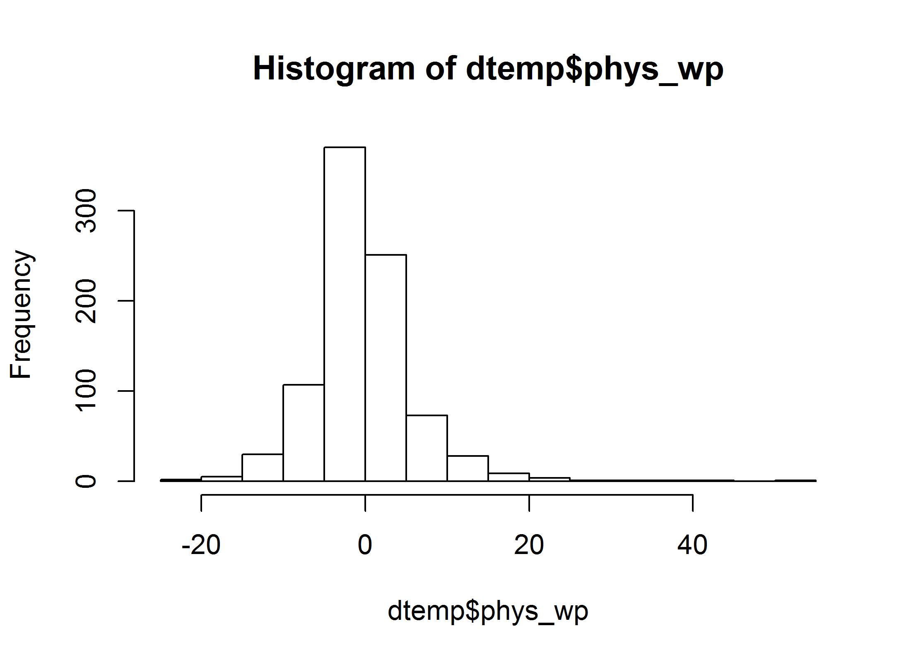
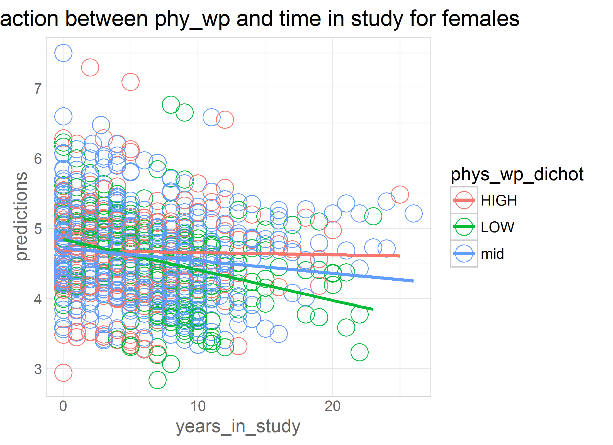
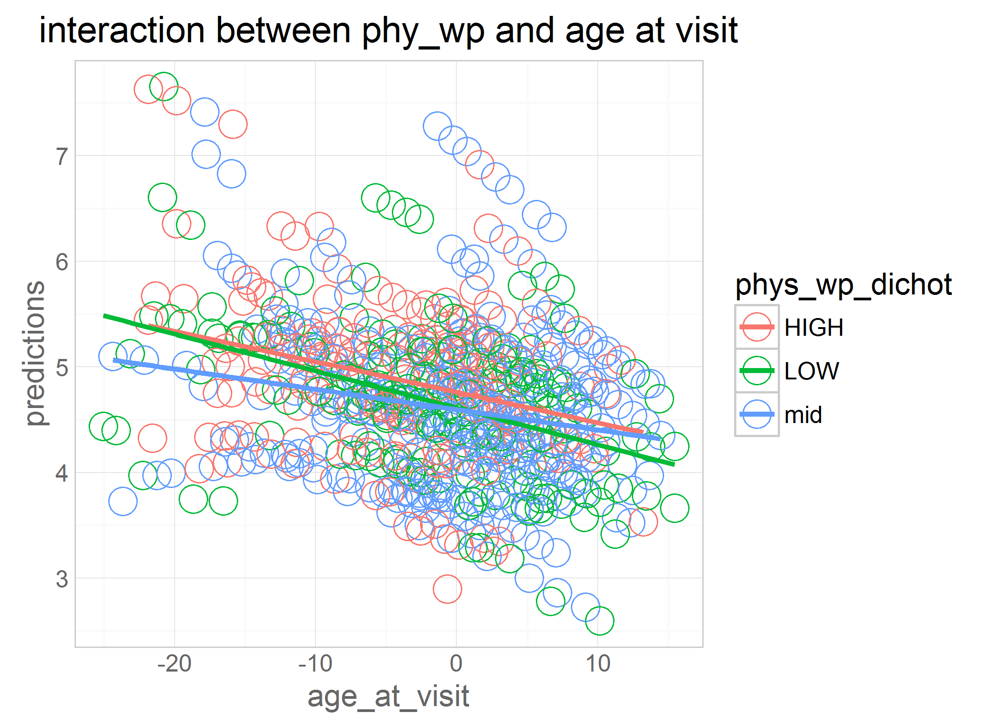

# mmse-obas

<!-- These two chunks should be added in the beginning of every .Rmd that you want to source an .R script -->
<!--  The 1st mandatory chunck  -->
<!--  Set the working directory to the repository's base directory -->


<!--  The 2nd mandatory chunck  -->
<!-- Set the report-wide options, and point to the external code file. -->


```
[1] "C:/Users/Rebecca/Documents/GitHub/cognition-stress-activity"
```


# **confound Variables initial equations**

```r
eq_0 <- as.formula("mmse ~ 1 + years_in_study +             
                   (1 + years_in_study |id)")
###does the outcome change over time? i.e. if so, it makes sense to add predictors.

eq_1 <- as.formula("mmse ~ 1 + years_in_study + age_bl_centered +    
                   (1 + years_in_study |id)")

eq_2 <- as.formula("mmse ~ 1 + years_in_study + age_bl_centered + years_in_study:age_bl_centered + 
                   (1 + years_in_study |id)")

####main effect of time in study: when baseline age is at the mean (i.e. 0)
####main effects of age_bl: when year in study is 0 (i.e. at baseline)
####interactioin: Those who are older decline faster over time

eq_3 <- as.formula("mmse ~ 1 + years_in_study + age_bl_centered + years_in_study:age_bl_centered + edu +     
                   (1 + years_in_study |id)")


eq_3int <- as.formula("mmse ~ 1 + years_in_study + age_bl_centered + years_in_study:age_bl_centered + edu + years_in_study:edu +  
                   (1 + years_in_study |id)")
```

### full data set- confound models

```r
model_0<- lmerTest::lmer(eq_0, data=dwn, REML=TRUE) 
model_1<- lmerTest::lmer(eq_1, data=dwn, REML=TRUE) 
model_2<- lmerTest::lmer(eq_2, data=dwn, REML=TRUE) 
model_3<- lmerTest::lmer(eq_3, data=dwn, REML=TRUE) 
model_3int<- lmerTest::lmer(eq_3int, data=dwn, REML=TRUE) 

lmerTest::summary((model_0)) #time in study is sig
```

```
Linear mixed model fit by REML 
t-tests use  Satterthwaite approximations to degrees of freedom ['lmerMod']
Formula: mmse ~ 1 + years_in_study + (1 + years_in_study | id)
   Data: dwn

REML criterion at convergence: 7516

Scaled residuals: 
    Min      1Q  Median      3Q     Max 
-6.9915 -0.4150  0.0498  0.4299  5.6533 

Random effects:
 Groups   Name           Variance Std.Dev. Corr 
 id       (Intercept)    1.8568   1.3627        
          years_in_study 0.6329   0.7955   -0.54
 Residual                2.7967   1.6723        
Number of obs: 1680, groups:  id, 284

Fixed effects:
                Estimate Std. Error        df t value Pr(>|t|)    
(Intercept)     29.19654    0.11717 156.41000 249.177  < 2e-16 ***
years_in_study  -0.47054    0.05467 215.97000  -8.607 1.55e-15 ***
---
Signif. codes:  0 '***' 0.001 '**' 0.01 '*' 0.05 '.' 0.1 ' ' 1

Correlation of Fixed Effects:
            (Intr)
yers_n_stdy -0.522
```

```r
lmerTest::summary((model_1)) # "" + age at baseline 
```

```
Linear mixed model fit by REML 
t-tests use  Satterthwaite approximations to degrees of freedom ['lmerMod']
Formula: mmse ~ 1 + years_in_study + age_bl_centered + (1 + years_in_study |      id)
   Data: dwn

REML criterion at convergence: 7492.4

Scaled residuals: 
    Min      1Q  Median      3Q     Max 
-7.0722 -0.4124  0.0482  0.4443  5.4819 

Random effects:
 Groups   Name           Variance Std.Dev. Corr 
 id       (Intercept)    1.8487   1.360         
          years_in_study 0.6304   0.794    -0.67
 Residual                2.8154   1.678         
Number of obs: 1680, groups:  id, 284

Fixed effects:
                 Estimate Std. Error        df t value Pr(>|t|)    
(Intercept)      29.21082    0.11678 143.79000 250.142  < 2e-16 ***
years_in_study   -0.45731    0.05419 225.19000  -8.439 4.00e-15 ***
age_bl_centered  -0.06685    0.01101 183.47000  -6.069 7.22e-09 ***
---
Signif. codes:  0 '***' 0.001 '**' 0.01 '*' 0.05 '.' 0.1 ' ' 1

Correlation of Fixed Effects:
            (Intr) yrs_n_
yers_n_stdy -0.608       
ag_bl_cntrd -0.012 -0.014
```

```r
lmerTest::summary((model_2)) # "" + interaction - those who are older decline faster over time
```

```
Linear mixed model fit by REML 
t-tests use  Satterthwaite approximations to degrees of freedom ['lmerMod']
Formula: mmse ~ 1 + years_in_study + age_bl_centered + years_in_study:age_bl_centered +      (1 + years_in_study | id)
   Data: dwn

REML criterion at convergence: 7475.4

Scaled residuals: 
    Min      1Q  Median      3Q     Max 
-7.0578 -0.3983  0.0422  0.4395  5.5368 

Random effects:
 Groups   Name           Variance Std.Dev. Corr 
 id       (Intercept)    1.6745   1.294         
          years_in_study 0.5535   0.744    -0.63
 Residual                2.8211   1.680         
Number of obs: 1680, groups:  id, 284

Fixed effects:
                                 Estimate Std. Error         df t value Pr(>|t|)    
(Intercept)                     29.182060   0.113997 147.590000 255.989  < 2e-16 ***
years_in_study                  -0.435819   0.051496 210.550000  -8.463 4.44e-15 ***
age_bl_centered                 -0.026193   0.013517 137.800000  -1.938   0.0547 .  
years_in_study:age_bl_centered  -0.032023   0.006197 207.180000  -5.168 5.55e-07 ***
---
Signif. codes:  0 '***' 0.001 '**' 0.01 '*' 0.05 '.' 0.1 ' ' 1

Correlation of Fixed Effects:
            (Intr) yrs_n_ ag_bl_
yers_n_stdy -0.582              
ag_bl_cntrd -0.031  0.036       
yrs_n_st:__  0.036 -0.087 -0.581
```

```r
lmerTest::summary((model_3)) # "" + edu and gender are sig
```

```
Linear mixed model fit by REML 
t-tests use  Satterthwaite approximations to degrees of freedom ['lmerMod']
Formula: mmse ~ 1 + years_in_study + age_bl_centered + years_in_study:age_bl_centered +  
    edu + (1 + years_in_study | id)
   Data: dwn

REML criterion at convergence: 7473.5

Scaled residuals: 
    Min      1Q  Median      3Q     Max 
-7.0486 -0.4048  0.0459  0.4376  5.4851 

Random effects:
 Groups   Name           Variance Std.Dev. Corr 
 id       (Intercept)    1.6109   1.2692        
          years_in_study 0.5539   0.7443   -0.64
 Residual                2.8245   1.6806        
Number of obs: 1680, groups:  id, 284

Fixed effects:
                                Estimate Std. Error        df t value Pr(>|t|)    
(Intercept)                     27.77811    0.55032 209.24000  50.476  < 2e-16 ***
years_in_study                  -0.43609    0.05149 211.21000  -8.469 4.22e-15 ***
age_bl_centered                 -0.01905    0.01368 143.11000  -1.393  0.16591    
edu                              0.09566    0.03676 204.79000   2.602  0.00994 ** 
years_in_study:age_bl_centered  -0.03258    0.00620 207.95000  -5.254 3.67e-07 ***
---
Signif. codes:  0 '***' 0.001 '**' 0.01 '*' 0.05 '.' 0.1 ' ' 1

Correlation of Fixed Effects:
            (Intr) yrs_n_ ag_bl_ edu   
yers_n_stdy -0.113                     
ag_bl_cntrd -0.210  0.034              
edu         -0.979 -0.008  0.209       
yrs_n_st:__  0.043 -0.087 -0.581 -0.037
```

```r
lmerTest::summary((model_3int)) # interaction between time and education not sig
```

```
Linear mixed model fit by REML 
t-tests use  Satterthwaite approximations to degrees of freedom ['lmerMod']
Formula: mmse ~ 1 + years_in_study + age_bl_centered + years_in_study:age_bl_centered +  
    edu + years_in_study:edu + (1 + years_in_study | id)
   Data: dwn

REML criterion at convergence: 7479.4

Scaled residuals: 
    Min      1Q  Median      3Q     Max 
-7.0480 -0.4045  0.0467  0.4375  5.4825 

Random effects:
 Groups   Name           Variance Std.Dev. Corr 
 id       (Intercept)    1.619    1.2723        
          years_in_study 0.557    0.7463   -0.64
 Residual                2.824    1.6805        
Number of obs: 1680, groups:  id, 284

Fixed effects:
                                 Estimate Std. Error         df t value Pr(>|t|)    
(Intercept)                     27.755594   0.674313 161.490000  41.161  < 2e-16 ***
years_in_study                  -0.418917   0.300457 221.090000  -1.394   0.1646    
age_bl_centered                 -0.018901   0.013835 140.060000  -1.366   0.1741    
edu                              0.097212   0.045439 160.190000   2.139   0.0339 *  
years_in_study:age_bl_centered  -0.032647   0.006326 208.680000  -5.160 5.72e-07 ***
years_in_study:edu              -0.001166   0.020247 221.720000  -0.058   0.9541    
---
Signif. codes:  0 '***' 0.001 '**' 0.01 '*' 0.05 '.' 0.1 ' ' 1

Correlation of Fixed Effects:
            (Intr) yrs_n_ ag_bl_ edu    y__:__
yers_n_stdy -0.585                            
ag_bl_cntrd -0.252  0.146                     
edu         -0.986  0.578  0.250              
yrs_n_st:__  0.143 -0.200 -0.593 -0.139       
yrs_n_stdy:  0.578 -0.985 -0.142 -0.588  0.188
```

### male- confound models

```r
model_0<- lmerTest::lmer(eq_0, data=dwn_male, REML=TRUE) 
model_1<- lmerTest::lmer(eq_1, data=dwn_male, REML=TRUE) 
model_2<- lmerTest::lmer(eq_2, data=dwn_male, REML=TRUE) 
model_3<- lmerTest::lmer(eq_3, data=dwn_male, REML=TRUE) 
model_3int<- lmerTest::lmer(eq_3int, data=dwn_male, REML=TRUE) 

lmerTest::summary((model_0)) #time in study is sig
```

```
Linear mixed model fit by REML 
t-tests use  Satterthwaite approximations to degrees of freedom ['lmerMod']
Formula: mmse ~ 1 + years_in_study + (1 + years_in_study | id)
   Data: dwn_male

REML criterion at convergence: 3114.6

Scaled residuals: 
    Min      1Q  Median      3Q     Max 
-6.2063 -0.4387  0.0623  0.5023  5.1011 

Random effects:
 Groups   Name           Variance Std.Dev. Corr 
 id       (Intercept)    1.9547   1.3981        
          years_in_study 0.6867   0.8287   -0.85
 Residual                2.5704   1.6032        
Number of obs: 719, groups:  id, 114

Fixed effects:
               Estimate Std. Error       df t value Pr(>|t|)    
(Intercept)    29.20857    0.18018 33.31000 162.112  < 2e-16 ***
years_in_study -0.36245    0.08758 71.09000  -4.138 9.47e-05 ***
---
Signif. codes:  0 '***' 0.001 '**' 0.01 '*' 0.05 '.' 0.1 ' ' 1

Correlation of Fixed Effects:
            (Intr)
yers_n_stdy -0.743
```

```r
lmerTest::summary((model_1)) # "" + age at baseline 
```

```
Linear mixed model fit by REML 
t-tests use  Satterthwaite approximations to degrees of freedom ['lmerMod']
Formula: mmse ~ 1 + years_in_study + age_bl_centered + (1 + years_in_study |      id)
   Data: dwn_male

REML criterion at convergence: 3099.4

Scaled residuals: 
    Min      1Q  Median      3Q     Max 
-6.1710 -0.4372  0.0623  0.5106  4.6131 

Random effects:
 Groups   Name           Variance Std.Dev. Corr 
 id       (Intercept)    2.4960   1.5799        
          years_in_study 0.7335   0.8564   -0.95
 Residual                2.5691   1.6029        
Number of obs: 719, groups:  id, 114

Fixed effects:
                Estimate Std. Error       df t value Pr(>|t|)    
(Intercept)     29.18276    0.19222 35.38000 151.819  < 2e-16 ***
years_in_study  -0.35042    0.08890 76.86000  -3.942 0.000177 ***
age_bl_centered -0.06293    0.01185 66.61000  -5.312 1.35e-06 ***
---
Signif. codes:  0 '***' 0.001 '**' 0.01 '*' 0.05 '.' 0.1 ' ' 1

Correlation of Fixed Effects:
            (Intr) yrs_n_
yers_n_stdy -0.842       
ag_bl_cntrd  0.059  0.005
```

```r
lmerTest::summary((model_2)) # "" + interaction - those who are older decline faster over time
```

```
Linear mixed model fit by REML 
t-tests use  Satterthwaite approximations to degrees of freedom ['lmerMod']
Formula: mmse ~ 1 + years_in_study + age_bl_centered + years_in_study:age_bl_centered +      (1 + years_in_study | id)
   Data: dwn_male

REML criterion at convergence: 3100.8

Scaled residuals: 
    Min      1Q  Median      3Q     Max 
-6.1768 -0.4191  0.0578  0.5065  4.7110 

Random effects:
 Groups   Name           Variance Std.Dev. Corr 
 id       (Intercept)    2.169    1.4729        
          years_in_study 0.672    0.8198   -0.95
 Residual                2.581    1.6066        
Number of obs: 719, groups:  id, 114

Fixed effects:
                                Estimate Std. Error        df t value Pr(>|t|)    
(Intercept)                    29.170117   0.184435 33.770000 158.159  < 2e-16 ***
years_in_study                 -0.349597   0.085726 71.330000  -4.078 0.000117 ***
age_bl_centered                -0.018921   0.021190 32.330000  -0.893 0.378511    
years_in_study:age_bl_centered -0.024761   0.009966 71.560000  -2.485 0.015308 *  
---
Signif. codes:  0 '***' 0.001 '**' 0.01 '*' 0.05 '.' 0.1 ' ' 1

Correlation of Fixed Effects:
            (Intr) yrs_n_ ag_bl_
yers_n_stdy -0.826              
ag_bl_cntrd  0.024  0.013       
yrs_n_st:__  0.014 -0.015 -0.828
```

```r
lmerTest::summary((model_3)) # "" + edu and gender are sig
```

```
Linear mixed model fit by REML 
t-tests use  Satterthwaite approximations to degrees of freedom ['lmerMod']
Formula: mmse ~ 1 + years_in_study + age_bl_centered + years_in_study:age_bl_centered +  
    edu + (1 + years_in_study | id)
   Data: dwn_male

REML criterion at convergence: 3105.1

Scaled residuals: 
    Min      1Q  Median      3Q     Max 
-6.1757 -0.4220  0.0524  0.5123  4.6909 

Random effects:
 Groups   Name           Variance Std.Dev. Corr 
 id       (Intercept)    2.1881   1.4792        
          years_in_study 0.6726   0.8201   -0.95
 Residual                2.5821   1.6069        
Number of obs: 719, groups:  id, 114

Fixed effects:
                               Estimate Std. Error       df t value Pr(>|t|)    
(Intercept)                    28.82438    0.65921 85.67000  43.725  < 2e-16 ***
years_in_study                 -0.35076    0.08578 71.39000  -4.089 0.000112 ***
age_bl_centered                -0.01741    0.02142 33.10000  -0.813 0.422001    
edu                             0.02267    0.04145 75.86000   0.547 0.585961    
years_in_study:age_bl_centered -0.02501    0.00998 71.79000  -2.506 0.014466 *  
---
Signif. codes:  0 '***' 0.001 '**' 0.01 '*' 0.05 '.' 0.1 ' ' 1

Correlation of Fixed Effects:
            (Intr) yrs_n_ ag_bl_ edu   
yers_n_stdy -0.209                     
ag_bl_cntrd -0.113  0.011              
edu         -0.960 -0.024  0.125       
yrs_n_st:__  0.048 -0.014 -0.827 -0.046
```

```r
lmerTest::summary((model_3int)) # interaction between time and education not sig
```

```
Linear mixed model fit by REML 
t-tests use  Satterthwaite approximations to degrees of freedom ['lmerMod']
Formula: mmse ~ 1 + years_in_study + age_bl_centered + years_in_study:age_bl_centered +  
    edu + years_in_study:edu + (1 + years_in_study | id)
   Data: dwn_male

REML criterion at convergence: 3110

Scaled residuals: 
    Min      1Q  Median      3Q     Max 
-6.1733 -0.4223  0.0503  0.5128  4.6755 

Random effects:
 Groups   Name           Variance Std.Dev. Corr 
 id       (Intercept)    2.2467   1.499         
          years_in_study 0.6839   0.827    -0.95
 Residual                2.5796   1.606         
Number of obs: 719, groups:  id, 114

Fixed effects:
                                Estimate Std. Error        df t value Pr(>|t|)    
(Intercept)                    28.689635   1.124242 36.880000  25.519   <2e-16 ***
years_in_study                 -0.273507   0.523181 78.990000  -0.523   0.6026    
age_bl_centered                -0.016775   0.021879 32.390000  -0.767   0.4488    
edu                             0.031597   0.072952 36.510000   0.433   0.6675    
years_in_study:age_bl_centered -0.025252   0.010192 70.630000  -2.478   0.0156 *  
years_in_study:edu             -0.005035   0.033908 78.830000  -0.148   0.8823    
---
Signif. codes:  0 '***' 0.001 '**' 0.01 '*' 0.05 '.' 0.1 ' ' 1

Correlation of Fixed Effects:
            (Intr) yrs_n_ ag_bl_ edu    y__:__
yers_n_stdy -0.819                            
ag_bl_cntrd -0.198  0.163                     
edu         -0.986  0.809  0.204              
yrs_n_st:__  0.163 -0.167 -0.834 -0.163       
yrs_n_stdy:  0.810 -0.986 -0.164 -0.823  0.167
```

### female- confound models

```r
model_0<- lmerTest::lmer(eq_0, data=dwn_female, REML=TRUE) 
model_1<- lmerTest::lmer(eq_1, data=dwn_female, REML=TRUE) 
model_2<- lmerTest::lmer(eq_2, data=dwn_female, REML=TRUE) 
model_3<- lmerTest::lmer(eq_3, data=dwn_female, REML=TRUE) 
model_3int<- lmerTest::lmer(eq_3int, data=dwn_female, REML=TRUE) 


lmerTest::summary((model_0)) ####time in study is sig
```

```
Linear mixed model fit by REML 
t-tests use  Satterthwaite approximations to degrees of freedom ['lmerMod']
Formula: mmse ~ 1 + years_in_study + (1 + years_in_study | id)
   Data: dwn_female

REML criterion at convergence: 4385.5

Scaled residuals: 
    Min      1Q  Median      3Q     Max 
-6.7433 -0.3825  0.0384  0.3994  4.9863 

Random effects:
 Groups   Name           Variance Std.Dev. Corr 
 id       (Intercept)    2.3459   1.5316        
          years_in_study 0.6581   0.8112   -0.45
 Residual                2.9314   1.7121        
Number of obs: 961, groups:  id, 170

Fixed effects:
                Estimate Std. Error        df t value Pr(>|t|)    
(Intercept)     29.22361    0.16479 106.14000 177.340  < 2e-16 ***
years_in_study  -0.53177    0.07222 140.68000  -7.363 1.38e-11 ***
---
Signif. codes:  0 '***' 0.001 '**' 0.01 '*' 0.05 '.' 0.1 ' ' 1

Correlation of Fixed Effects:
            (Intr)
yers_n_stdy -0.469
```

```r
lmerTest::summary((model_1)) #### "" + age at baseline 
```

```
Linear mixed model fit by REML 
t-tests use  Satterthwaite approximations to degrees of freedom ['lmerMod']
Formula: mmse ~ 1 + years_in_study + age_bl_centered + (1 + years_in_study |      id)
   Data: dwn_female

REML criterion at convergence: 4375.9

Scaled residuals: 
    Min      1Q  Median      3Q     Max 
-6.7957 -0.3756  0.0433  0.4115  5.0310 

Random effects:
 Groups   Name           Variance Std.Dev. Corr 
 id       (Intercept)    2.2879   1.5126        
          years_in_study 0.6472   0.8045   -0.57
 Residual                2.9567   1.7195        
Number of obs: 961, groups:  id, 170

Fixed effects:
                 Estimate Std. Error        df t value Pr(>|t|)    
(Intercept)      29.27950    0.16407  95.72000 178.453  < 2e-16 ***
years_in_study   -0.51857    0.07127 145.11000  -7.276 1.99e-11 ***
age_bl_centered  -0.07314    0.01685 108.85000  -4.341 3.19e-05 ***
---
Signif. codes:  0 '***' 0.001 '**' 0.01 '*' 0.05 '.' 0.1 ' ' 1

Correlation of Fixed Effects:
            (Intr) yrs_n_
yers_n_stdy -0.545       
ag_bl_cntrd -0.081 -0.016
```

```r
lmerTest::summary((model_2)) #### "" + interaction - those who are older decline faster over time
```

```
Linear mixed model fit by REML 
t-tests use  Satterthwaite approximations to degrees of freedom ['lmerMod']
Formula: mmse ~ 1 + years_in_study + age_bl_centered + years_in_study:age_bl_centered +      (1 + years_in_study | id)
   Data: dwn_female

REML criterion at convergence: 4365.7

Scaled residuals: 
    Min      1Q  Median      3Q     Max 
-6.7834 -0.3696  0.0446  0.3876  5.0329 

Random effects:
 Groups   Name           Variance Std.Dev. Corr 
 id       (Intercept)    2.1599   1.4697        
          years_in_study 0.5653   0.7519   -0.53
 Residual                2.9518   1.7181        
Number of obs: 961, groups:  id, 170

Fixed effects:
                                 Estimate Std. Error         df t value Pr(>|t|)    
(Intercept)                     29.227185   0.161866  96.890000 180.564  < 2e-16 ***
years_in_study                  -0.472578   0.068174 137.090000  -6.932 1.49e-10 ***
age_bl_centered                 -0.028733   0.019748  90.800000  -1.455    0.149    
years_in_study:age_bl_centered  -0.036513   0.008388 134.880000  -4.353 2.64e-05 ***
---
Signif. codes:  0 '***' 0.001 '**' 0.01 '*' 0.05 '.' 0.1 ' ' 1

Correlation of Fixed Effects:
            (Intr) yrs_n_ ag_bl_
yers_n_stdy -0.525              
ag_bl_cntrd -0.106  0.067       
yrs_n_st:__  0.066 -0.159 -0.519
```

```r
lmerTest::summary((model_3)) #### "" + edu and gender are sig
```

```
Linear mixed model fit by REML 
t-tests use  Satterthwaite approximations to degrees of freedom ['lmerMod']
Formula: mmse ~ 1 + years_in_study + age_bl_centered + years_in_study:age_bl_centered +  
    edu + (1 + years_in_study | id)
   Data: dwn_female

REML criterion at convergence: 4361.7

Scaled residuals: 
    Min      1Q  Median      3Q     Max 
-6.7730 -0.3694  0.0373  0.3969  4.9958 

Random effects:
 Groups   Name           Variance Std.Dev. Corr 
 id       (Intercept)    1.9272   1.3882        
          years_in_study 0.5637   0.7508   -0.53
 Residual                2.9622   1.7211        
Number of obs: 961, groups:  id, 170

Fixed effects:
                                Estimate Std. Error        df t value Pr(>|t|)    
(Intercept)                     26.91633    0.82055 126.55000  32.803  < 2e-16 ***
years_in_study                  -0.47181    0.06808 136.75000  -6.931 1.51e-10 ***
age_bl_centered                 -0.01693    0.01963  95.21000  -0.862  0.39069    
edu                              0.16172    0.05652 125.59000   2.861  0.00494 ** 
years_in_study:age_bl_centered  -0.03712    0.00838 134.59000  -4.430 1.93e-05 ***
---
Signif. codes:  0 '***' 0.001 '**' 0.01 '*' 0.05 '.' 0.1 ' ' 1

Correlation of Fixed Effects:
            (Intr) yrs_n_ ag_bl_ edu   
yers_n_stdy -0.099                     
ag_bl_cntrd -0.241  0.063              
edu         -0.982 -0.001  0.226       
yrs_n_st:__  0.041 -0.159 -0.512 -0.029
```

```r
lmerTest::summary((model_3int)) #### interaction between time and education not sig
```

```
Linear mixed model fit by REML 
t-tests use  Satterthwaite approximations to degrees of freedom ['lmerMod']
Formula: mmse ~ 1 + years_in_study + age_bl_centered + years_in_study:age_bl_centered +  
    edu + years_in_study:edu + (1 + years_in_study | id)
   Data: dwn_female

REML criterion at convergence: 4366.9

Scaled residuals: 
    Min      1Q  Median      3Q     Max 
-6.7693 -0.3723  0.0372  0.3949  4.9971 

Random effects:
 Groups   Name           Variance Std.Dev. Corr 
 id       (Intercept)    1.9368   1.3917        
          years_in_study 0.5678   0.7535   -0.53
 Residual                2.9615   1.7209        
Number of obs: 961, groups:  id, 170

Fixed effects:
                                 Estimate Std. Error         df t value Pr(>|t|)    
(Intercept)                     26.731387   0.956838 105.150000  27.937  < 2e-16 ***
years_in_study                  -0.325616   0.394175 139.660000  -0.826  0.41017    
age_bl_centered                 -0.015920   0.019824  93.610000  -0.803  0.42396    
edu                              0.174746   0.066285 104.850000   2.636  0.00965 ** 
years_in_study:age_bl_centered  -0.037745   0.008563 135.500000  -4.408 2.11e-05 ***
years_in_study:edu              -0.010276   0.027310 139.640000  -0.376  0.70728    
---
Signif. codes:  0 '***' 0.001 '**' 0.01 '*' 0.05 '.' 0.1 ' ' 1

Correlation of Fixed Effects:
            (Intr) yrs_n_ ag_bl_ edu    y__:__
yers_n_stdy -0.521                            
ag_bl_cntrd -0.271  0.138                     
edu         -0.986  0.514  0.259              
yrs_n_st:__  0.133 -0.215 -0.524 -0.124       
yrs_n_stdy:  0.514 -0.985 -0.129 -0.522  0.190
```

```r
#adding exposure variables
```

# **raw physical activity**

```r
eq_3raw <- as.formula("mmse ~ 1 + years_in_study + age_bl_centered + years_in_study:age_bl_centered + edu + walk_now +
                   (1 + years_in_study |id)")
```

### full data set - Raw PA

```r
model_rawm<- lmerTest::lmer(eq_3raw, data=dwn, REML=TRUE) 
lmerTest::summary((model_rawm)) #raw PA is sig for males  
```

```
Linear mixed model fit by REML 
t-tests use  Satterthwaite approximations to degrees of freedom ['lmerMod']
Formula: mmse ~ 1 + years_in_study + age_bl_centered + years_in_study:age_bl_centered +  
    edu + walk_now + (1 + years_in_study | id)
   Data: dwn

REML criterion at convergence: 7472.7

Scaled residuals: 
    Min      1Q  Median      3Q     Max 
-6.9959 -0.4162  0.0365  0.4365  5.4354 

Random effects:
 Groups   Name           Variance Std.Dev. Corr 
 id       (Intercept)    1.589    1.2605        
          years_in_study 0.550    0.7416   -0.64
 Residual                2.813    1.6771        
Number of obs: 1680, groups:  id, 284

Fixed effects:
                                 Estimate Std. Error         df t value Pr(>|t|)    
(Intercept)                     2.766e+01  5.501e-01  2.113e+02  50.287  < 2e-16 ***
years_in_study                 -4.248e-01  5.147e-02  2.128e+02  -8.254 1.60e-14 ***
age_bl_centered                -1.535e-02  1.367e-02  1.464e+02  -1.122  0.26356    
edu                             8.923e-02  3.672e-02  2.062e+02   2.430  0.01595 *  
walk_now                        2.022e-02  6.766e-03  1.246e+03   2.989  0.00286 ** 
years_in_study:age_bl_centered -3.225e-02  6.180e-03  2.074e+02  -5.219 4.36e-07 ***
---
Signif. codes:  0 '***' 0.001 '**' 0.01 '*' 0.05 '.' 0.1 ' ' 1

Correlation of Fixed Effects:
            (Intr) yrs_n_ ag_bl_ edu    wlk_nw
yers_n_stdy -0.117                            
ag_bl_cntrd -0.215  0.040                     
edu         -0.971 -0.012  0.202              
walk_now    -0.070  0.074  0.092 -0.058       
yrs_n_st:__  0.042 -0.085 -0.575 -0.038  0.017
```

### males - Raw PA

```r
model_rawm<- lmerTest::lmer(eq_3raw, data=dwn_male, REML=TRUE) 
lmerTest::summary((model_rawm)) #raw PA is sig for males
```

```
Linear mixed model fit by REML 
t-tests use  Satterthwaite approximations to degrees of freedom ['lmerMod']
Formula: mmse ~ 1 + years_in_study + age_bl_centered + years_in_study:age_bl_centered +  
    edu + walk_now + (1 + years_in_study | id)
   Data: dwn_male

REML criterion at convergence: 3104.4

Scaled residuals: 
    Min      1Q  Median      3Q     Max 
-6.1694 -0.4291  0.0434  0.5210  4.6559 

Random effects:
 Groups   Name           Variance Std.Dev. Corr 
 id       (Intercept)    2.0503   1.4319        
          years_in_study 0.6608   0.8129   -0.96
 Residual                2.5747   1.6046        
Number of obs: 719, groups:  id, 114

Fixed effects:
                                 Estimate Std. Error         df t value Pr(>|t|)    
(Intercept)                     28.520645   0.652264  90.300000  43.726  < 2e-16 ***
years_in_study                  -0.336905   0.085219  72.800000  -3.953 0.000177 ***
age_bl_centered                 -0.014129   0.020994  33.600000  -0.673 0.505545    
edu                              0.023763   0.040491  76.100000   0.587 0.559028    
walk_now                         0.025601   0.008816 382.500000   2.904 0.003898 ** 
years_in_study:age_bl_centered  -0.024459   0.009900  72.500000  -2.471 0.015841 *  
---
Signif. codes:  0 '***' 0.001 '**' 0.01 '*' 0.05 '.' 0.1 ' ' 1

Correlation of Fixed Effects:
            (Intr) yrs_n_ ag_bl_ edu    wlk_nw
yers_n_stdy -0.215                            
ag_bl_cntrd -0.119  0.012                     
edu         -0.949 -0.023  0.124              
walk_now    -0.156  0.055  0.059  0.006       
yrs_n_st:__  0.044 -0.012 -0.826 -0.045  0.018
```

### females -Raw PA

```r
model_rawf<- lmerTest::lmer(eq_3raw, data=dwn_female, REML=TRUE) 
lmerTest::summary((model_rawf)) #raw PA is sig for females 
```

```
Linear mixed model fit by REML 
t-tests use  Satterthwaite approximations to degrees of freedom ['lmerMod']
Formula: mmse ~ 1 + years_in_study + age_bl_centered + years_in_study:age_bl_centered +  
    edu + walk_now + (1 + years_in_study | id)
   Data: dwn_female

REML criterion at convergence: 4366.5

Scaled residuals: 
    Min      1Q  Median      3Q     Max 
-6.7254 -0.3680  0.0434  0.3921  4.8933 

Random effects:
 Groups   Name           Variance Std.Dev. Corr 
 id       (Intercept)    1.9561   1.3986        
          years_in_study 0.5608   0.7489   -0.53
 Residual                2.9514   1.7180        
Number of obs: 961, groups:  id, 170

Fixed effects:
                                 Estimate Std. Error         df t value Pr(>|t|)    
(Intercept)                     26.873579   0.825085 126.900000  32.571  < 2e-16 ***
years_in_study                  -0.463536   0.068139 137.900000  -6.803 2.86e-10 ***
age_bl_centered                 -0.012770   0.019858  97.400000  -0.643   0.5217    
edu                              0.153855   0.057010 127.300000   2.699   0.0079 ** 
walk_now                         0.015688   0.009705 757.900000   1.616   0.1064    
years_in_study:age_bl_centered  -0.036990   0.008362 134.300000  -4.424 1.99e-05 ***
---
Signif. codes:  0 '***' 0.001 '**' 0.01 '*' 0.05 '.' 0.1 ' ' 1

Correlation of Fixed Effects:
            (Intr) yrs_n_ ag_bl_ edu    wlk_nw
yers_n_stdy -0.101                            
ag_bl_cntrd -0.243  0.072                     
edu         -0.975 -0.008  0.213              
walk_now    -0.034  0.079  0.126 -0.085       
yrs_n_st:__  0.041 -0.157 -0.504 -0.030  0.011
```

```r
#between person and within person effects 
```


# **Between-and-within-effects**


```r
eq_5 <- as.formula("mmse ~ 1 + years_in_study + age_bl_centered + years_in_study:age_bl_centered + edu + phys_bp_median  +
                   (1 + years_in_study |id)")
####bp effects: are people with higher values than other people (on average, over time)
####also higher in mmse (on average over time) (hoffman pdf page 72)

eq_6 <- as.formula("mmse ~ 1 + years_in_study + age_bl_centered + years_in_study:age_bl_centered + edu + phys_bp_median  + phys_wp +
                   (1 + years_in_study |id)")
```


### full- bp and wp

```r
model_5<- lmerTest::lmer(eq_5, data=dwn, REML=TRUE) 
model_6<- lmerTest::lmer(eq_6, data=dwn, REML=TRUE) 

lmerTest::summary((model_5))  #NS between person effects 
```

```
Linear mixed model fit by REML 
t-tests use  Satterthwaite approximations to degrees of freedom ['lmerMod']
Formula: mmse ~ 1 + years_in_study + age_bl_centered + years_in_study:age_bl_centered +  
    edu + phys_bp_median + (1 + years_in_study | id)
   Data: dwn

REML criterion at convergence: 7479.5

Scaled residuals: 
    Min      1Q  Median      3Q     Max 
-7.0499 -0.4103  0.0505  0.4380  5.4764 

Random effects:
 Groups   Name           Variance Std.Dev. Corr 
 id       (Intercept)    1.6133   1.2702        
          years_in_study 0.5532   0.7438   -0.63
 Residual                2.8224   1.6800        
Number of obs: 1680, groups:  id, 284

Fixed effects:
                                 Estimate Std. Error         df t value Pr(>|t|)    
(Intercept)                     27.745018   0.553911 209.700000  50.089  < 2e-16 ***
years_in_study                  -0.438037   0.051515 211.200000  -8.503 3.33e-15 ***
age_bl_centered                 -0.021499   0.014072 149.130000  -1.528   0.1287    
edu                              0.099350   0.037212 205.580000   2.670   0.0082 ** 
phys_bp_median                  -0.010987   0.014561 186.870000  -0.755   0.4515    
years_in_study:age_bl_centered  -0.032635   0.006198 208.030000  -5.265 3.48e-07 ***
---
Signif. codes:  0 '***' 0.001 '**' 0.01 '*' 0.05 '.' 0.1 ' ' 1

Correlation of Fixed Effects:
            (Intr) yrs_n_ ag_bl_ edu    phys__
yers_n_stdy -0.108                            
ag_bl_cntrd -0.184  0.042                     
edu         -0.978 -0.013  0.170              
phys_bp_mdn  0.082  0.041  0.233 -0.134       
yrs_n_st:__  0.044 -0.086 -0.559 -0.038  0.011
```

```r
lmerTest::summary((model_6)) #WP effects are sig (those who walk
```

```
Linear mixed model fit by REML 
t-tests use  Satterthwaite approximations to degrees of freedom ['lmerMod']
Formula: mmse ~ 1 + years_in_study + age_bl_centered + years_in_study:age_bl_centered +  
    edu + phys_bp_median + phys_wp + (1 + years_in_study | id)
   Data: dwn

REML criterion at convergence: 7474.3

Scaled residuals: 
    Min      1Q  Median      3Q     Max 
-6.9925 -0.4114  0.0435  0.4402  5.4151 

Random effects:
 Groups   Name           Variance Std.Dev. Corr 
 id       (Intercept)    1.4928   1.2218        
          years_in_study 0.5434   0.7372   -0.62
 Residual                2.8154   1.6779        
Number of obs: 1680, groups:  id, 284

Fixed effects:
                                 Estimate Std. Error         df t value Pr(>|t|)    
(Intercept)                     2.767e+01  5.481e-01  2.106e+02  50.489  < 2e-16 ***
years_in_study                 -4.267e-01  5.124e-02  2.130e+02  -8.327 9.99e-15 ***
age_bl_centered                -2.324e-02  1.380e-02  1.485e+02  -1.684 0.094322 .  
edu                             1.008e-01  3.681e-02  2.062e+02   2.739 0.006707 ** 
phys_bp_median                 -1.397e-02  1.441e-02  1.880e+02  -0.970 0.333396    
phys_wp                         2.797e-02  7.690e-03  1.415e+03   3.637 0.000286 ***
years_in_study:age_bl_centered -3.231e-02  6.153e-03  2.074e+02  -5.250 3.75e-07 ***
---
Signif. codes:  0 '***' 0.001 '**' 0.01 '*' 0.05 '.' 0.1 ' ' 1

Correlation of Fixed Effects:
            (Intr) yrs_n_ ag_bl_ edu    phys__ phys_w
yers_n_stdy -0.107                                   
ag_bl_cntrd -0.184  0.037                            
edu         -0.978 -0.013  0.172                     
phys_bp_mdn  0.085  0.036  0.236 -0.134              
phys_wp     -0.036  0.065 -0.026  0.012 -0.054       
yrs_n_st:__  0.043 -0.084 -0.549 -0.038  0.010  0.014
```
### male -bp and wp

```r
model_5<- lmerTest::lmer(eq_5, data=dwn_male, REML=TRUE) 
model_6<- lmerTest::lmer(eq_6, data=dwn_male, REML=TRUE) 

lmerTest::summary((model_5))  #NS between person effects 
```

```
Linear mixed model fit by REML 
t-tests use  Satterthwaite approximations to degrees of freedom ['lmerMod']
Formula: mmse ~ 1 + years_in_study + age_bl_centered + years_in_study:age_bl_centered +  
    edu + phys_bp_median + (1 + years_in_study | id)
   Data: dwn_male

REML criterion at convergence: 3110.1

Scaled residuals: 
    Min      1Q  Median      3Q     Max 
-6.1754 -0.4248  0.0549  0.5039  4.6910 

Random effects:
 Groups   Name           Variance Std.Dev. Corr 
 id       (Intercept)    2.2642   1.5047        
          years_in_study 0.6783   0.8236   -0.95
 Residual                2.5794   1.6061        
Number of obs: 719, groups:  id, 114

Fixed effects:
                               Estimate Std. Error       df t value Pr(>|t|)    
(Intercept)                    28.85737    0.65798 84.29000  43.858  < 2e-16 ***
years_in_study                 -0.34684    0.08606 71.77000  -4.030 0.000137 ***
age_bl_centered                -0.01452    0.02174 34.34000  -0.668 0.508563    
edu                             0.01721    0.04155 73.73000   0.414 0.679907    
phys_bp_median                  0.01885    0.01546 60.67000   1.219 0.227458    
years_in_study:age_bl_centered -0.02473    0.01001 71.98000  -2.471 0.015826 *  
---
Signif. codes:  0 '***' 0.001 '**' 0.01 '*' 0.05 '.' 0.1 ' ' 1

Correlation of Fixed Effects:
            (Intr) yrs_n_ ag_bl_ edu    phys__
yers_n_stdy -0.211                            
ag_bl_cntrd -0.107  0.015                     
edu         -0.957 -0.027  0.110              
phys_bp_mdn  0.045  0.031  0.101 -0.114       
yrs_n_st:__  0.049 -0.015 -0.826 -0.047  0.021
```

```r
lmerTest::summary((model_6)) #WP effects are sig (those who walk higher than average have higher mmse scores at that time)
```

```
Linear mixed model fit by REML 
t-tests use  Satterthwaite approximations to degrees of freedom ['lmerMod']
Formula: mmse ~ 1 + years_in_study + age_bl_centered + years_in_study:age_bl_centered +  
    edu + phys_bp_median + phys_wp + (1 + years_in_study | id)
   Data: dwn_male

REML criterion at convergence: 3112

Scaled residuals: 
    Min      1Q  Median      3Q     Max 
-6.1694 -0.4270  0.0436  0.5137  4.6862 

Random effects:
 Groups   Name           Variance Std.Dev. Corr 
 id       (Intercept)    2.045    1.4302        
          years_in_study 0.658    0.8112   -0.95
 Residual                2.578    1.6055        
Number of obs: 719, groups:  id, 114

Fixed effects:
                                 Estimate Std. Error         df t value Pr(>|t|)    
(Intercept)                     28.691945   0.656381  85.700000  43.712  < 2e-16 ***
years_in_study                  -0.338251   0.085144  71.800000  -3.973 0.000167 ***
age_bl_centered                 -0.015164   0.021086  33.200000  -0.719 0.477104    
edu                              0.025205   0.041429  74.800000   0.608 0.544764    
phys_bp_median                   0.016762   0.015354  60.600000   1.092 0.279294    
phys_wp                          0.024536   0.010538 595.600000   2.328 0.020233 *  
years_in_study:age_bl_centered  -0.024451   0.009892  71.500000  -2.472 0.015826 *  
---
Signif. codes:  0 '***' 0.001 '**' 0.01 '*' 0.05 '.' 0.1 ' ' 1

Correlation of Fixed Effects:
            (Intr) yrs_n_ ag_bl_ edu    phys__ phys_w
yers_n_stdy -0.207                                   
ag_bl_cntrd -0.107  0.012                            
edu         -0.959 -0.023  0.112                     
phys_bp_mdn  0.050  0.030  0.105 -0.117              
phys_wp     -0.108  0.049 -0.002  0.085 -0.049       
yrs_n_st:__  0.046 -0.011 -0.816 -0.046  0.020  0.014
```
### female - bp and wp

```r
model_5<- lmerTest::lmer(eq_5, data=dwn_female, REML=TRUE) #NS between person effects
model_6<- lmerTest::lmer(eq_6, data=dwn_female, REML=TRUE) #NS between person and within person effects for females! 

lmerTest::summary((model_5)) #bp sig at .1
```

```
Linear mixed model fit by REML 
t-tests use  Satterthwaite approximations to degrees of freedom ['lmerMod']
Formula: mmse ~ 1 + years_in_study + age_bl_centered + years_in_study:age_bl_centered +  
    edu + phys_bp_median + (1 + years_in_study | id)
   Data: dwn_female

REML criterion at convergence: 4364.4

Scaled residuals: 
    Min      1Q  Median      3Q     Max 
-6.7930 -0.3699  0.0365  0.3925  5.0097 

Random effects:
 Groups   Name           Variance Std.Dev. Corr 
 id       (Intercept)    1.8905   1.3749        
          years_in_study 0.5601   0.7484   -0.52
 Residual                2.9579   1.7198        
Number of obs: 961, groups:  id, 170

Fixed effects:
                                 Estimate Std. Error         df t value Pr(>|t|)    
(Intercept)                     26.818082   0.821349 128.380000  32.651  < 2e-16 ***
years_in_study                  -0.477321   0.067965 136.880000  -7.023 9.26e-11 ***
age_bl_centered                 -0.029229   0.020739  96.810000  -1.409  0.16192    
edu                              0.172578   0.056785 127.550000   3.039  0.00288 ** 
phys_bp_median                  -0.039542   0.022565 117.350000  -1.752  0.08232 .  
years_in_study:age_bl_centered  -0.037200   0.008359 135.000000  -4.450 1.78e-05 ***
---
Signif. codes:  0 '***' 0.001 '**' 0.01 '*' 0.05 '.' 0.1 ' ' 1

Correlation of Fixed Effects:
            (Intr) yrs_n_ ag_bl_ edu    phys__
yers_n_stdy -0.095                            
ag_bl_cntrd -0.204  0.072                     
edu         -0.981 -0.006  0.177              
phys_bp_mdn  0.066  0.042  0.337 -0.107       
yrs_n_st:__  0.041 -0.158 -0.475 -0.030  0.005
```

```r
lmerTest::summary((model_6)) #wp sig at .1
```

```
Linear mixed model fit by REML 
t-tests use  Satterthwaite approximations to degrees of freedom ['lmerMod']
Formula: mmse ~ 1 + years_in_study + age_bl_centered + years_in_study:age_bl_centered +  
    edu + phys_bp_median + phys_wp + (1 + years_in_study | id)
   Data: dwn_female

REML criterion at convergence: 4364.6

Scaled residuals: 
    Min      1Q  Median      3Q     Max 
-6.7309 -0.3656  0.0349  0.3925  4.8442 

Random effects:
 Groups   Name           Variance Std.Dev. Corr 
 id       (Intercept)    1.791    1.3384        
          years_in_study 0.551    0.7423   -0.51
 Residual                2.952    1.7181        
Number of obs: 961, groups:  id, 170

Fixed effects:
                                 Estimate Std. Error         df t value Pr(>|t|)    
(Intercept)                     26.839622   0.813933 129.400000  32.975  < 2e-16 ***
years_in_study                  -0.465016   0.067661 138.300000  -6.873 1.97e-10 ***
age_bl_centered                 -0.031968   0.020463  97.400000  -1.562  0.12147    
edu                              0.167081   0.056323 129.000000   2.967  0.00359 ** 
phys_bp_median                  -0.043353   0.022396 119.400000  -1.936  0.05526 .  
phys_wp                          0.028985   0.010913 796.800000   2.656  0.00807 ** 
years_in_study:age_bl_centered  -0.037012   0.008301 134.600000  -4.459 1.72e-05 ***
---
Signif. codes:  0 '***' 0.001 '**' 0.01 '*' 0.05 '.' 0.1 ' ' 1

Correlation of Fixed Effects:
            (Intr) yrs_n_ ag_bl_ edu    phys__ phys_w
yers_n_stdy -0.092                                   
ag_bl_cntrd -0.206  0.065                            
edu         -0.981 -0.008  0.180                     
phys_bp_mdn  0.066  0.036  0.339 -0.105              
phys_wp      0.013  0.071 -0.046 -0.039 -0.064       
yrs_n_st:__  0.041 -0.156 -0.467 -0.030  0.005  0.008
```

```r
#allowing the effect of the TVC to vary over tiem (interaction term) -page 171 singer and willett
```


# **TVC-interaction**


### physical activity (TVC) interaction with time equation

```r
eq_tv_intxn <- as.formula("mmse ~ 1 + years_in_study + age_bl_centered + years_in_study:age_bl_centered + edu + phys_bp_median  + phys_wp + phys_wp:years_in_study +
                          (1 + years_in_study |id)")
```

### full - tvc interaction

```r
model_tv_intx<- lmerTest::lmer(eq_tv_intxn, data=dwn, REML=TRUE) #significant interaction term
lmerTest::summary((model_tv_intx)) 
```

```
Linear mixed model fit by REML 
t-tests use  Satterthwaite approximations to degrees of freedom ['lmerMod']
Formula: mmse ~ 1 + years_in_study + age_bl_centered + years_in_study:age_bl_centered +  
    edu + phys_bp_median + phys_wp + phys_wp:years_in_study +      (1 + years_in_study | id)
   Data: dwn

REML criterion at convergence: 7473.8

Scaled residuals: 
    Min      1Q  Median      3Q     Max 
-6.9014 -0.4255  0.0519  0.4393  5.4813 

Random effects:
 Groups   Name           Variance Std.Dev. Corr 
 id       (Intercept)    1.4938   1.2222        
          years_in_study 0.5456   0.7387   -0.63
 Residual                2.7939   1.6715        
Number of obs: 1680, groups:  id, 284

Fixed effects:
                                 Estimate Std. Error         df t value Pr(>|t|)    
(Intercept)                     2.770e+01  5.460e-01  2.095e+02  50.720  < 2e-16 ***
years_in_study                 -4.245e-01  5.131e-02  2.132e+02  -8.274 1.40e-14 ***
age_bl_centered                -2.052e-02  1.380e-02  1.486e+02  -1.487 0.139018    
edu                             9.965e-02  3.667e-02  2.050e+02   2.717 0.007141 ** 
phys_bp_median                 -1.298e-02  1.435e-02  1.868e+02  -0.904 0.367184    
phys_wp                        -2.463e-03  1.178e-02  1.470e+03  -0.209 0.834392    
years_in_study:age_bl_centered -3.265e-02  6.161e-03  2.079e+02  -5.299 2.95e-07 ***
years_in_study:phys_wp          5.497e-03  1.617e-03  1.378e+03   3.399 0.000695 ***
---
Signif. codes:  0 '***' 0.001 '**' 0.01 '*' 0.05 '.' 0.1 ' ' 1

Correlation of Fixed Effects:
            (Intr) yrs_n_ ag_bl_ edu    phys__ phys_w y__:__
yers_n_stdy -0.107                                          
ag_bl_cntrd -0.183  0.038                                   
edu         -0.978 -0.013  0.171                            
phys_bp_mdn  0.085  0.037  0.236 -0.135                     
phys_wp     -0.033  0.034 -0.060  0.015 -0.050              
yrs_n_st:__  0.043 -0.085 -0.552 -0.037  0.010  0.021       
yrs_n_std:_  0.013  0.011  0.057 -0.010  0.020 -0.759 -0.016
```
### male - tvc interaction

```r
model_tv_intx<- lmerTest::lmer(eq_tv_intxn, data=dwn_male, REML=TRUE) #significant interaction term
lmerTest::summary((model_tv_intx)) 
```

```
Linear mixed model fit by REML 
t-tests use  Satterthwaite approximations to degrees of freedom ['lmerMod']
Formula: mmse ~ 1 + years_in_study + age_bl_centered + years_in_study:age_bl_centered +  
    edu + phys_bp_median + phys_wp + phys_wp:years_in_study +      (1 + years_in_study | id)
   Data: dwn_male

REML criterion at convergence: 3112.1

Scaled residuals: 
    Min      1Q  Median      3Q     Max 
-6.1630 -0.4316  0.0355  0.5251  4.7432 

Random effects:
 Groups   Name           Variance Std.Dev. Corr 
 id       (Intercept)    2.1471   1.4653        
          years_in_study 0.6719   0.8197   -0.96
 Residual                2.5369   1.5928        
Number of obs: 719, groups:  id, 114

Fixed effects:
                                 Estimate Std. Error         df t value Pr(>|t|)    
(Intercept)                     28.810185   0.648597  85.500000  44.419  < 2e-16 ***
years_in_study                  -0.335830   0.085731  71.900000  -3.917 0.000202 ***
age_bl_centered                 -0.012655   0.021312  32.600000  -0.594 0.556743    
edu                              0.018474   0.040839  74.200000   0.452 0.652334    
phys_bp_median                   0.016653   0.015106  59.700000   1.102 0.274726    
phys_wp                         -0.015128   0.016026 620.100000  -0.944 0.345571    
years_in_study:age_bl_centered  -0.024647   0.009959  71.800000  -2.475 0.015696 *  
years_in_study:phys_wp           0.006566   0.002019 602.100000   3.252 0.001211 ** 
---
Signif. codes:  0 '***' 0.001 '**' 0.01 '*' 0.05 '.' 0.1 ' ' 1

Correlation of Fixed Effects:
            (Intr) yrs_n_ ag_bl_ edu    phys__ phys_w y__:__
yers_n_stdy -0.215                                          
ag_bl_cntrd -0.103  0.015                                   
edu         -0.957 -0.023  0.107                            
phys_bp_mdn  0.049  0.029  0.102 -0.116                     
phys_wp     -0.115  0.030 -0.025  0.096 -0.027              
yrs_n_st:__  0.046 -0.014 -0.827 -0.045  0.020  0.015       
yrs_n_std:_  0.058  0.002  0.031 -0.053 -0.006 -0.758 -0.008
```
### female - tvc interaction

```r
model_tv_intx<- lmerTest::lmer(eq_tv_intxn, data=dwn_female, REML=TRUE) #significant interaction term, but loose within person effects
lmerTest::summary((model_tv_intx))
```

```
Linear mixed model fit by REML 
t-tests use  Satterthwaite approximations to degrees of freedom ['lmerMod']
Formula: mmse ~ 1 + years_in_study + age_bl_centered + years_in_study:age_bl_centered +  
    edu + phys_bp_median + phys_wp + phys_wp:years_in_study +      (1 + years_in_study | id)
   Data: dwn_female

REML criterion at convergence: 4371.4

Scaled residuals: 
    Min      1Q  Median      3Q     Max 
-6.6367 -0.3896  0.0426  0.3893  4.8272 

Random effects:
 Groups   Name           Variance Std.Dev. Corr 
 id       (Intercept)    1.7883   1.3373        
          years_in_study 0.5518   0.7428   -0.51
 Residual                2.9430   1.7155        
Number of obs: 961, groups:  id, 170

Fixed effects:
                                 Estimate Std. Error         df t value Pr(>|t|)    
(Intercept)                     26.824522   0.812892 129.000000  32.999  < 2e-16 ***
years_in_study                  -0.461903   0.067707 138.400000  -6.822 2.57e-10 ***
age_bl_centered                 -0.028902   0.020508  98.600000  -1.409  0.16190    
edu                              0.168138   0.056250 128.500000   2.989  0.00335 ** 
phys_bp_median                  -0.041660   0.022385 119.100000  -1.861  0.06520 .  
phys_wp                          0.005332   0.016984 825.700000   0.314  0.75363    
years_in_study:age_bl_centered  -0.037372   0.008307 134.700000  -4.499 1.46e-05 ***
years_in_study:phys_wp           0.004685   0.002581 767.000000   1.815  0.06993 .  
---
Signif. codes:  0 '***' 0.001 '**' 0.01 '*' 0.05 '.' 0.1 ' ' 1

Correlation of Fixed Effects:
            (Intr) yrs_n_ ag_bl_ edu    phys__ phys_w y__:__
yers_n_stdy -0.092                                          
ag_bl_cntrd -0.206  0.067                                   
edu         -0.981 -0.008  0.180                            
phys_bp_mdn  0.066  0.037  0.341 -0.105                     
phys_wp      0.016  0.026 -0.092 -0.033 -0.073              
yrs_n_st:__  0.041 -0.157 -0.468 -0.030  0.004  0.023       
yrs_n_std:_ -0.010  0.025  0.082  0.010  0.042 -0.767 -0.024
```


# hypothetical graph

```
     Min.   1st Qu.    Median      Mean   3rd Qu.      Max. 
-35.30000  -3.00000  -0.03125  -0.15080   2.40700  33.77000 
```



```
Source: local data frame [10 x 3]
Groups: id [1]

      id phys_wp phys_wp_dichot
   <dbl>   <dbl>          <chr>
1    298    -6.7            LOW
2    298    11.3           HIGH
3    298    -0.7            mid
4    298   -11.7            LOW
5    298     4.3           HIGH
6    298     2.3           HIGH
7    298     2.3           HIGH
8    298     5.3           HIGH
9    298    -3.7            LOW
10   298    -2.7            LOW
```

```
'data.frame':	758 obs. of  14 variables:
 $ id                   : num  103 103 103 103 103 103 103 103 103 103 ...
 $ years_in_study       : num  4 5 6 7 8 9 10 11 12 13 ...
 $ age_at_visit_centered: num  -15.4 -14.3 -13.3 -12.4 -11.3 ...
 $ age_bl_centered      : num  -13.4 -13.4 -13.4 -13.4 -13.4 ...
 $ walk_now             : num  0 0 0 12 18 18 18 18 16 6 ...
 $ phys_bp_mean         : num  -0.541 -0.541 -0.541 -0.541 -0.541 ...
 $ phys_bp_median       : num  1 1 1 1 1 1 1 1 1 1 ...
 $ phys_wp              : num  -8.33 -8.33 -8.33 3.67 9.67 ...
 $ mmse                 : num  30 28 29 30 30 30 28 30 29 30 ...
 $ mmse_wp              : num  0.476 -1.524 -0.524 0.476 0.476 ...
 $ female               : logi  TRUE TRUE TRUE TRUE TRUE TRUE ...
 $ edu                  : num  16 16 16 16 16 16 16 16 16 16 ...
 $ pred                 : num  29.2 29.2 29.1 29.5 29.8 ...
 $ phys_wp_dichot       : chr  "LOW" "LOW" "LOW" "HIGH" ...
```




# **TVC by age-at-visit interaction**


```r
eq_tv_intxn <- as.formula("mmse ~ 1 + years_in_study + age_bl_centered + years_in_study:age_bl_centered + age_at_visit_centered + edu + phys_bp_median  + phys_wp + phys_wp:age_at_visit_centered +
                          (1 + years_in_study |id)")
```


```r
model_tv_intx<- lmerTest::lmer(eq_tv_intxn, data=dwn, REML=TRUE) #significant interaction term
lmerTest::summary((model_tv_intx)) 
```

```
Linear mixed model fit by REML 
t-tests use  Satterthwaite approximations to degrees of freedom ['lmerMod']
Formula: mmse ~ 1 + years_in_study + age_bl_centered + years_in_study:age_bl_centered +  
    age_at_visit_centered + edu + phys_bp_median + phys_wp +  
    phys_wp:age_at_visit_centered + (1 + years_in_study | id)
   Data: dwn

REML criterion at convergence: 7458.4

Scaled residuals: 
    Min      1Q  Median      3Q     Max 
-6.7381 -0.4140  0.0419  0.4215  5.2623 

Random effects:
 Groups   Name           Variance Std.Dev. Corr 
 id       (Intercept)    1.3972   1.1820        
          years_in_study 0.5443   0.7377   -0.62
 Residual                2.7715   1.6648        
Number of obs: 1680, groups:  id, 284

Fixed effects:
                                 Estimate Std. Error         df t value Pr(>|t|)    
(Intercept)                     3.315e+01  2.770e+00  8.088e+02  11.967  < 2e-16 ***
years_in_study                 -1.284e+00  4.284e-01  8.734e+02  -2.997  0.00281 ** 
age_bl_centered                -8.846e-01  4.190e-01  8.388e+02  -2.111  0.03504 *  
age_at_visit_centered           8.562e-01  4.185e-01  8.440e+02   2.046  0.04109 *  
edu                             9.977e-02  3.634e-02  2.159e+02   2.746  0.00655 ** 
phys_bp_median                 -1.560e-02  1.419e-02  1.967e+02  -1.099  0.27308    
phys_wp                         4.992e-02  8.890e-03  1.479e+03   5.615 2.34e-08 ***
years_in_study:age_bl_centered -3.118e-02  6.163e-03  2.090e+02  -5.059 9.21e-07 ***
age_at_visit_centered:phys_wp   4.157e-03  8.599e-04  1.430e+03   4.834 1.48e-06 ***
---
Signif. codes:  0 '***' 0.001 '**' 0.01 '*' 0.05 '.' 0.1 ' ' 1

Correlation of Fixed Effects:
            (Intr) yrs_n_ ag_bl_ ag_t__ edu    phys__ phys_w y__:__
yers_n_stdy -0.976                                                 
ag_bl_cntrd -0.981  0.992                                          
ag_t_vst_cn  0.981 -0.993 -0.999                                   
edu         -0.239  0.048  0.055 -0.049                            
phys_bp_mdn  0.022 -0.001  0.003  0.005 -0.135                     
phys_wp     -0.045  0.046  0.035 -0.037  0.019 -0.059              
yrs_n_st:__ -0.014  0.013  0.005 -0.023 -0.035  0.009  0.037       
ag_t_vst_:_ -0.047  0.049  0.040 -0.043  0.017 -0.022  0.515  0.048
```

```r
dtemp$pred<- predict(model_tv_intx)
```




# **Fluctuation in MMSE**

##Here, I explore the effects of using deviations from your average mmse score, to see if within person changes in PA also predict mmse changes at that occasion 


```
Linear mixed model fit by REML 
t-tests use  Satterthwaite approximations to degrees of freedom ['lmerMod']
Formula: mmse_wp ~ 1 + years_in_study + age_bl_centered + years_in_study:age_bl_centered +  
    edu + phys_bp_median + phys_wp + (1 + years_in_study | id)
   Data: dwn

REML criterion at convergence: 7471.6

Scaled residuals: 
    Min      1Q  Median      3Q     Max 
-6.6924 -0.3738  0.0175  0.3930  4.9713 

Random effects:
 Groups   Name           Variance Std.Dev. Corr 
 id       (Intercept)    8.1756   2.8593        
          years_in_study 0.4313   0.6567   -0.92
 Residual                2.8604   1.6913        
Number of obs: 1680, groups:  id, 284

Fixed effects:
                                 Estimate Std. Error         df t value Pr(>|t|)    
(Intercept)                     1.582e+00  5.690e-01  2.114e+02   2.780 0.005922 ** 
years_in_study                 -3.609e-01  4.429e-02  1.872e+02  -8.148 5.13e-14 ***
age_bl_centered                 9.053e-02  2.364e-02  1.944e+02   3.829 0.000173 ***
edu                             3.974e-03  3.661e-02  1.829e+02   0.109 0.913665    
phys_bp_median                 -1.800e-03  1.503e-02  1.759e+02  -0.120 0.904819    
phys_wp                         2.598e-02  7.884e-03  1.225e+03   3.295 0.001012 ** 
years_in_study:age_bl_centered -2.470e-02  5.308e-03  1.828e+02  -4.653 6.26e-06 ***
---
Signif. codes:  0 '***' 0.001 '**' 0.01 '*' 0.05 '.' 0.1 ' ' 1

Correlation of Fixed Effects:
            (Intr) yrs_n_ ag_bl_ edu    phys__ phys_w
yers_n_stdy -0.299                                   
ag_bl_cntrd -0.123  0.109                            
edu         -0.938 -0.006  0.082                     
phys_bp_mdn  0.086  0.039  0.139 -0.143              
phys_wp     -0.030  0.072 -0.009  0.006 -0.007       
yrs_n_st:__  0.053 -0.099 -0.872 -0.019  0.011  0.017
```


```
Linear mixed model fit by REML 
t-tests use  Satterthwaite approximations to degrees of freedom ['lmerMod']
Formula: mmse_wp ~ 1 + years_in_study + age_bl_centered + years_in_study:age_bl_centered +  
    edu + phys_bp_median + phys_wp + (1 + years_in_study | id)
   Data: dwn_male

REML criterion at convergence: 3116.4

Scaled residuals: 
    Min      1Q  Median      3Q     Max 
-6.7065 -0.4101  0.0051  0.4746  6.0481 

Random effects:
 Groups   Name           Variance Std.Dev. Corr 
 id       (Intercept)    4.2235   2.0551        
          years_in_study 0.3408   0.5838   -0.94
 Residual                2.7699   1.6643        
Number of obs: 719, groups:  id, 114

Fixed effects:
                                 Estimate Std. Error         df t value Pr(>|t|)    
(Intercept)                      0.913865   0.713917  68.600000   1.280  0.20483    
years_in_study                  -0.322393   0.062720  43.300000  -5.140 6.28e-06 ***
age_bl_centered                  0.069674   0.027029  42.800000   2.578  0.01347 *  
edu                              0.035186   0.044253  57.900000   0.795  0.42979    
phys_bp_median                   0.004755   0.016930  49.700000   0.281  0.77999    
phys_wp                          0.024228   0.010980 508.200000   2.207  0.02779 *  
years_in_study:age_bl_centered  -0.020915   0.007258  42.500000  -2.882  0.00617 ** 
---
Signif. codes:  0 '***' 0.001 '**' 0.01 '*' 0.05 '.' 0.1 ' ' 1

Correlation of Fixed Effects:
            (Intr) yrs_n_ ag_bl_ edu    phys__ phys_w
yers_n_stdy -0.284                                   
ag_bl_cntrd -0.092  0.008                            
edu         -0.943 -0.005  0.091                     
phys_bp_mdn  0.063  0.016  0.070 -0.129              
phys_wp     -0.079  0.068 -0.003  0.058 -0.027       
yrs_n_st:__  0.038  0.013 -0.876 -0.040  0.025  0.024
```


```
Linear mixed model fit by REML 
t-tests use  Satterthwaite approximations to degrees of freedom ['lmerMod']
Formula: mmse_wp ~ 1 + years_in_study + age_bl_centered + years_in_study:age_bl_centered +  
    edu + phys_bp_median + phys_wp + (1 + years_in_study | id)
   Data: dwn_female

REML criterion at convergence: 4361.8

Scaled residuals: 
    Min      1Q  Median      3Q     Max 
-6.1898 -0.3656  0.0223  0.3593  4.4535 

Random effects:
 Groups   Name           Variance Std.Dev. Corr 
 id       (Intercept)    10.9980  3.3163        
          years_in_study  0.4841  0.6958   -0.92
 Residual                 2.9575  1.7197        
Number of obs: 961, groups:  id, 170

Fixed effects:
                                 Estimate Std. Error         df t value Pr(>|t|)    
(Intercept)                      2.261565   0.823788 130.800000   2.745  0.00690 ** 
years_in_study                  -0.383253   0.061022 141.600000  -6.281 3.89e-09 ***
age_bl_centered                  0.101420   0.036770 131.300000   2.758  0.00664 ** 
edu                             -0.037500   0.054242 112.900000  -0.691  0.49076    
phys_bp_median                  -0.010151   0.023179 113.400000  -0.438  0.66226    
phys_wp                          0.028016   0.011167 680.900000   2.509  0.01235 *  
years_in_study:age_bl_centered  -0.027262   0.007511 137.000000  -3.630  0.00040 ***
---
Signif. codes:  0 '***' 0.001 '**' 0.01 '*' 0.05 '.' 0.1 ' ' 1

Correlation of Fixed Effects:
            (Intr) yrs_n_ ag_bl_ edu    phys__ phys_w
yers_n_stdy -0.307                                   
ag_bl_cntrd -0.140  0.179                            
edu         -0.935 -0.009  0.071                     
phys_bp_mdn  0.055  0.060  0.210 -0.106              
phys_wp     -0.006  0.078 -0.011 -0.022  0.002       
yrs_n_st:__  0.065 -0.178 -0.875 -0.004 -0.020  0.010
```

# **random effects**
## Here, I include the random effects of the within person PA variable.
### random effects equation

```r
eq_re<- as.formula("mmse ~ 1 + years_in_study + age_bl_centered + years_in_study:age_bl_centered + edu + phys_bp_median  + phys_wp + 
                          (1 + years_in_study + phys_wp |id)")
```
### full- random effects 

```r
model_re<- lmerTest::lmer(eq_re, data=dwn, REML=TRUE) 
lmerTest::summary((model_re)) 
```

```
Linear mixed model fit by REML 
t-tests use  Satterthwaite approximations to degrees of freedom ['lmerMod']
Formula: mmse ~ 1 + years_in_study + age_bl_centered + years_in_study:age_bl_centered +  
    edu + phys_bp_median + phys_wp + (1 + years_in_study + phys_wp |      id)
   Data: dwn

REML criterion at convergence: 7411.3

Scaled residuals: 
    Min      1Q  Median      3Q     Max 
-6.5185 -0.4075  0.0520  0.4591  4.9470 

Random effects:
 Groups   Name           Variance Std.Dev. Corr       
 id       (Intercept)    0.92321  0.9608              
          years_in_study 0.41893  0.6472   -0.36      
          phys_wp        0.01056  0.1027    0.64 -0.95
 Residual                2.68454  1.6385              
Number of obs: 1680, groups:  id, 284

Fixed effects:
                                 Estimate Std. Error         df t value Pr(>|t|)    
(Intercept)                     27.744551   0.540615 234.030000  51.320  < 2e-16 ***
years_in_study                  -0.431330   0.045677 177.550000  -9.443  < 2e-16 ***
age_bl_centered                 -0.038400   0.012129 194.750000  -3.166 0.001795 ** 
edu                              0.091286   0.036461 230.770000   2.504 0.012985 *  
phys_bp_median                  -0.015405   0.014133 205.380000  -1.090 0.277004    
phys_wp                          0.038724   0.011186 101.940000   3.462 0.000785 ***
years_in_study:age_bl_centered  -0.022201   0.004538  92.910000  -4.893 4.17e-06 ***
---
Signif. codes:  0 '***' 0.001 '**' 0.01 '*' 0.05 '.' 0.1 ' ' 1

Correlation of Fixed Effects:
            (Intr) yrs_n_ ag_bl_ edu    phys__ phys_w
yers_n_stdy -0.066                                   
ag_bl_cntrd -0.193 -0.035                            
edu         -0.982 -0.012  0.189                     
phys_bp_mdn  0.086  0.034  0.272 -0.135              
phys_wp      0.033 -0.513 -0.159 -0.001 -0.037       
yrs_n_st:__  0.013  0.000 -0.335 -0.031 -0.019  0.293
```
### male - random effects 

```r
model_re<- lmerTest::lmer(eq_re, data=dwn_male, REML=TRUE) 
lmerTest::summary((model_re)) #no bp or wp effects
```

```
Linear mixed model fit by REML 
t-tests use  Satterthwaite approximations to degrees of freedom ['lmerMod']
Formula: mmse ~ 1 + years_in_study + age_bl_centered + years_in_study:age_bl_centered +  
    edu + phys_bp_median + phys_wp + (1 + years_in_study + phys_wp |      id)
   Data: dwn_male

REML criterion at convergence: 3059.5

Scaled residuals: 
    Min      1Q  Median      3Q     Max 
-5.8710 -0.4505  0.0585  0.5179  3.7119 

Random effects:
 Groups   Name           Variance Std.Dev. Corr       
 id       (Intercept)    0.25694  0.5069              
          years_in_study 0.33784  0.5812   -0.51      
          phys_wp        0.02962  0.1721    0.51 -1.00
 Residual                2.43528  1.5605              
Number of obs: 719, groups:  id, 114

Fixed effects:
                               Estimate Std. Error       df t value Pr(>|t|)    
(Intercept)                    28.69585    0.63525 80.97000  45.172  < 2e-16 ***
years_in_study                 -0.35495    0.06490 51.69000  -5.469 1.33e-06 ***
age_bl_centered                -0.03642    0.01401 67.88000  -2.600  0.01144 *  
edu                             0.01406    0.04098 76.49000   0.343  0.73254    
phys_bp_median                  0.01577    0.01531 65.84000   1.030  0.30682    
phys_wp                         0.06232    0.02200 42.65000   2.833  0.00702 ** 
years_in_study:age_bl_centered -0.01268    0.00438 36.32000  -2.894  0.00640 ** 
---
Signif. codes:  0 '***' 0.001 '**' 0.01 '*' 0.05 '.' 0.1 ' ' 1

Correlation of Fixed Effects:
            (Intr) yrs_n_ ag_bl_ edu    phys__ phys_w
yers_n_stdy -0.080                                   
ag_bl_cntrd -0.112 -0.081                            
edu         -0.978 -0.011  0.137                     
phys_bp_mdn  0.048  0.036  0.168 -0.114              
phys_wp     -0.022 -0.743 -0.088  0.052 -0.098       
yrs_n_st:__ -0.062  0.129 -0.478  0.020 -0.001  0.272
```
### female - random effects 

```r
model_re<- lmerTest::lmer(eq_re, data=dwn_female, REML=TRUE) 
lmerTest::summary((model_re)) #no bp or wp effects  
```

```
Linear mixed model fit by REML 
t-tests use  Satterthwaite approximations to degrees of freedom ['lmerMod']
Formula: mmse ~ 1 + years_in_study + age_bl_centered + years_in_study:age_bl_centered +  
    edu + phys_bp_median + phys_wp + (1 + years_in_study + phys_wp |      id)
   Data: dwn_female

REML criterion at convergence: 4339.6

Scaled residuals: 
    Min      1Q  Median      3Q     Max 
-6.2953 -0.3761  0.0438  0.3969  4.7780 

Random effects:
 Groups   Name           Variance Std.Dev. Corr       
 id       (Intercept)    1.314450 1.1465              
          years_in_study 0.468570 0.6845   -0.34      
          phys_wp        0.005975 0.0773    0.78 -0.86
 Residual                2.846692 1.6872              
Number of obs: 961, groups:  id, 170

Fixed effects:
                                 Estimate Std. Error         df t value Pr(>|t|)    
(Intercept)                     27.010731   0.795741 139.000000  33.944  < 2e-16 ***
years_in_study                  -0.473942   0.062781 120.210000  -7.549 9.36e-12 ***
age_bl_centered                 -0.047466   0.018825 112.090000  -2.521 0.013095 *  
edu                              0.153196   0.055246 139.490000   2.773 0.006315 ** 
phys_bp_median                  -0.042648   0.021891 130.610000  -1.948 0.053538 .  
phys_wp                          0.029027   0.013733  83.900000   2.114 0.037516 *  
years_in_study:age_bl_centered  -0.028077   0.007148  81.720000  -3.928 0.000178 ***
---
Signif. codes:  0 '***' 0.001 '**' 0.01 '*' 0.05 '.' 0.1 ' ' 1

Correlation of Fixed Effects:
            (Intr) yrs_n_ ag_bl_ edu    phys__ phys_w
yers_n_stdy -0.064                                   
ag_bl_cntrd -0.208  0.005                            
edu         -0.983 -0.010  0.190                     
phys_bp_mdn  0.072  0.029  0.373 -0.110              
phys_wp      0.073 -0.359 -0.176 -0.043 -0.035       
yrs_n_st:__  0.028 -0.106 -0.336 -0.033 -0.019  0.237
```

```r
# # @knitr biomarker-models -------------------------------------------------------
# 
# eq_bmk<- as.formula("mmse ~ 1 + years_in_study + age_bl_centered + years_in_study:age_bl_centered + edu + phys_bp_median  + phys_wp  + al_catg_wave +
#                    (1 + years_in_study + phys_wp |id)")
# 
# # @knitr biomarker-full -------------------------------------------------------
# model_bmk<- lmerTest::lmer(eq_bmk, data=dbio, REML=TRUE) 
# lmerTest::summary((model_bmk)) #al category is sig related to mmse score
# # @knitr biomarker-male -------------------------------------------------------
# model_bmk<- lmerTest::lmer(eq_bmk, data=dbio_male, REML=TRUE) 
# lmerTest::summary((model_bmk)) #al category is sig related to mmse score
# # @knitr biomarker-female -------------------------------------------------------
# model_bmk<- lmerTest::lmer(eq_bmk, data=dbio_female, REML=TRUE) 
# lmerTest::summary((model_bmk)) #al category is sig related to mmse 
# 
# # @knitr graph-biomarker -------------------------------------------------------
# 
# dtemp<-dbio
# 
# model_bmk<- lmerTest::lmer(eq_bmk, data=dtemp, REML=TRUE)
# dtemp$pred<- predict(model_bmk)
# 
# set.seed(1)
# ids <- sample(dtemp$id,100)
# d <- dtemp %>%  dplyr::filter( id %in% ids)
# str(d)
# 
# ggplot(d, aes(x=al_catg_wave, y=pred)) +geom_bar(stat="identity", fill="lightblue", width=0.5)
# #those high in AL have sig lower mmse scores than lose low in mmse or medium in mmse
# #those with medium AL scores actually have the highest mmse scores 
# 
# 
# # @knitr biomarker-interaction -------------------------------------------------------
# eq_bmk<- as.formula("mmse ~ 1 + years_in_study + age_bl_centered + years_in_study:age_bl_centered + edu + phys_bp_median  + phys_wp + al_catg_wave + al_catg_wave:phys_wp +
#                    (1 + years_in_study + phys_wp |id)")
# 
# model_bmk<- lmerTest::lmer(eq_bmk, data=dbio, REML=TRUE) 
# lmerTest::summary((model_bmk))
# 
# model_bmk<- lmerTest::lmer(eq_bmk, data=dbio_male, REML=TRUE) 
# lmerTest::summary((model_bmk)) #no interaction between walking more than usual and AL category at that time
# 
# model_bmk<- lmerTest::lmer(eq_bmk, data=dbio_female, REML=TRUE) 
# lmerTest::summary((model_bmk)) #no interaction between walking more than usual and AL category at that time
# 
# # @knitr PA-predicted-by-bio -------------------------------------------------------
# ##does-AL-predict_fluctuations-in-PA---------------------------------------
# 
# eq_pwp<- as.formula("phys_wp ~ 1 + years_in_study + age_bl_centered + years_in_study:age_bl_centered + edu + al_catg_wave + 
#                    (1 + years_in_study |id)")
# 
# model_pwp<- lmerTest::lmer(eq_pwp, data=dbio, REML=TRUE) 
# lmerTest::summary((model_pwp)) 
# 
# 
# model_pwp<- lmerTest::lmer(eq_pwp, data=dbio_male, REML=TRUE) 
# lmerTest::summary((model_pwp)) 
# 
# model_pwp<- lmerTest::lmer(eq_pwp, data=dbio_female, REML=TRUE) 
# lmerTest::summary((model_pwp)) 
# 
# # @knitr transform -------------------------------------------------------
# #do fluctuations in PA predict fluctuations in AL variables 
# str(dbio_male)
# 
# for(i in unique(dbio_male$id)) {
#   for (j in 1:length(dbio_male$al_count_wave[dbio_male$id==i])) {
#     
#     dbio_male$al_wp[dbio_male$id==i][j]<- (dbio_male$al_count_wave[dbio_male$id==i][j]) - (mean(dbio_male$al_count_wave[dbio_male$id==i], na.rm =TRUE))
#   } }
# 
# 
# 
# for(i in unique(dbio_female$id)) {
#   for (j in 1:length(dbio_female$al_count_wave[dbio_female$id==i])) {
#     
#     dbio_female$al_wp[dbio_female$id==i][j]<- (dbio_female$al_count_wave[dbio_female$id==i][j]) - (mean(dbio_female$al_count_wave[dbio_female$id==i], na.rm =TRUE))
#   } }
# 
# #keep re-reunning this to see different people in the sample - IT WORKED
# ids <- sample(unique(dbio_male$id),1)
# dbio_male %>%
#   dplyr::filter(id %in% ids ) %>%
#   dplyr::group_by(id) %>%
#   dplyr::select(id,al_count_wave, al_wp)
```


##Moreover, WP effects are sig. across all 3 analyses. People vary in how much they fluctuate from their average over time, and this fluctuation is sig associated with mmse  
(??)Am I interpreting this right??

# ** allostatic load models**

### full

### male

### female

# **graph**


# **AL score X physical Activity

# *explore*


```r
##al_wp is each persons total alostatic load score at that time, minus their mean alostatic load score
##to see if fluctuation in biomarkers predict physicl activity 
# eq_pwp<- as.formula("phys_wp ~ 1 + years_in_study + age_bl_centered + years_in_study:age_bl_centered + edu + al_wp + 
#                    (1 + years_in_study |id)")
# eq_pwp<- as.formula("al_wp ~ 1 + years_in_study + age_bl_centered + years_in_study:age_bl_centered + edu + phys_bp_median + phys_wp + 
#                    (1 + years_in_study |id)")
# model_pwp<- lmerTest::lmer(eq_pwp, data=dbio_male, REML=TRUE) 
# lmerTest::summary((model_pwp)) 
# 
# model_pwp<- lmerTest::lmer(eq_pwp, data=dbio_female, REML=TRUE) 
# lmerTest::summary((model_pwp)) 
# 
```


