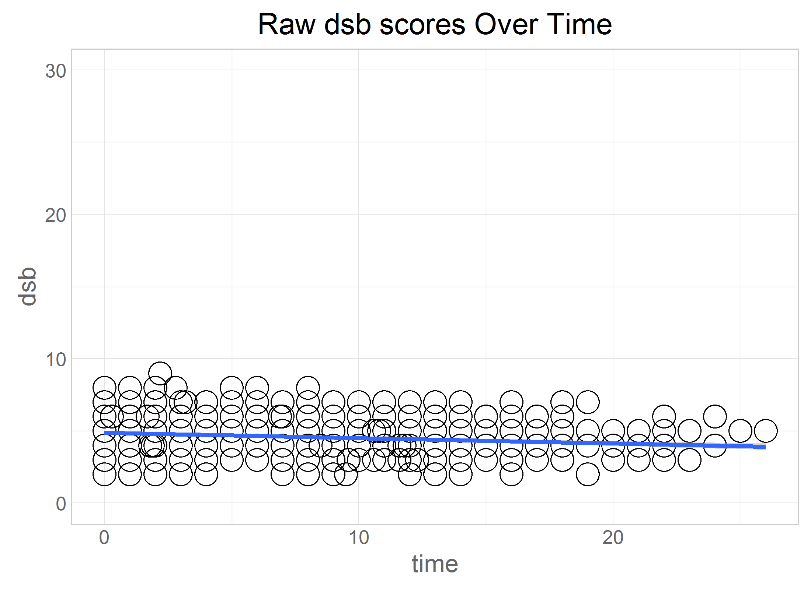
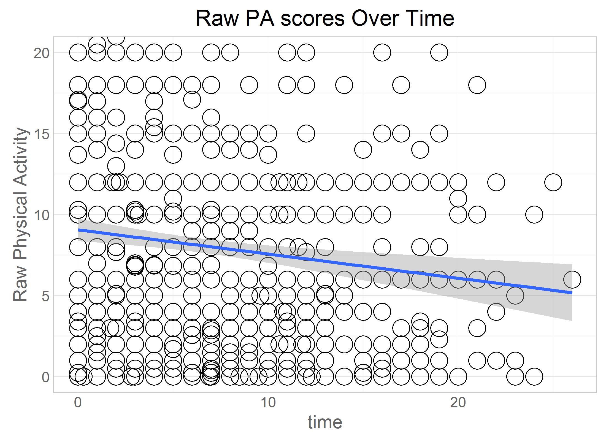
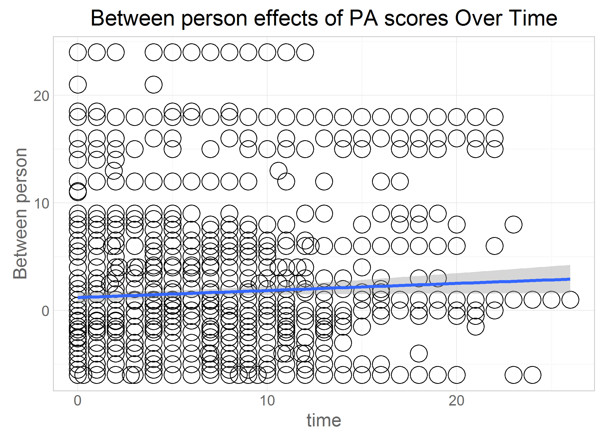
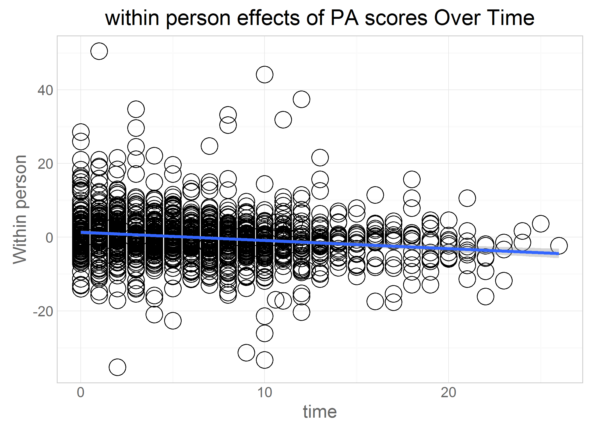
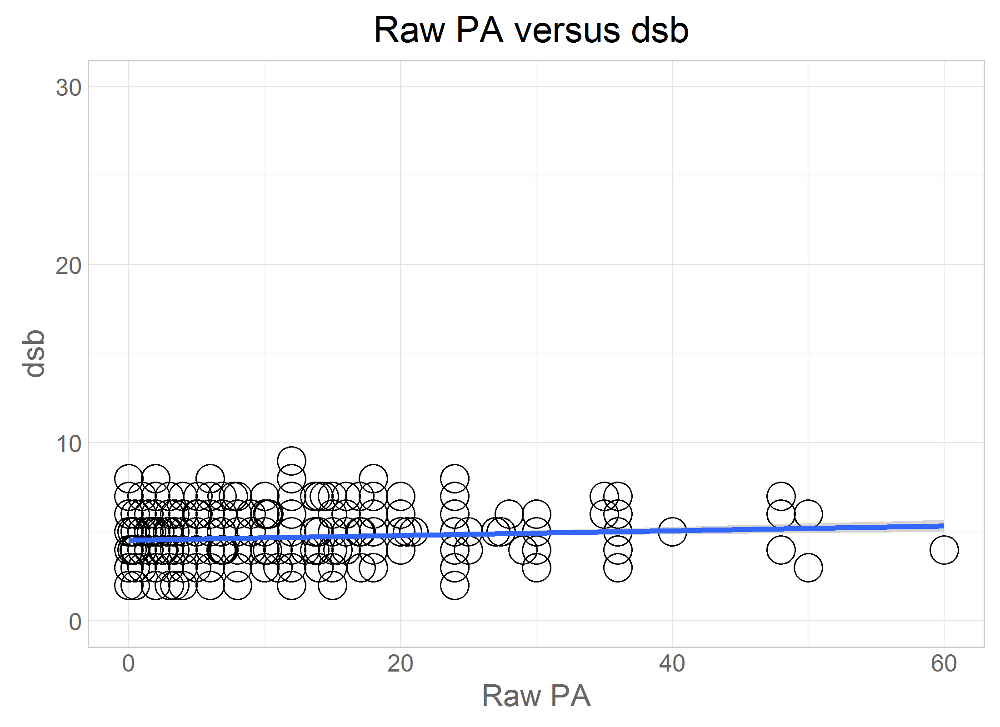
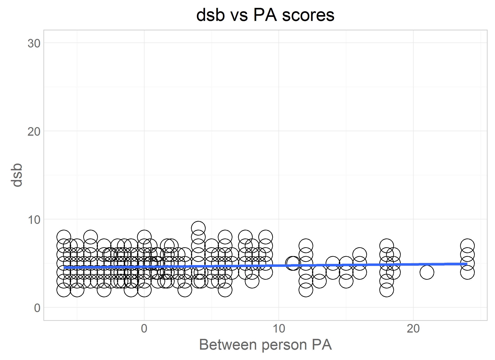
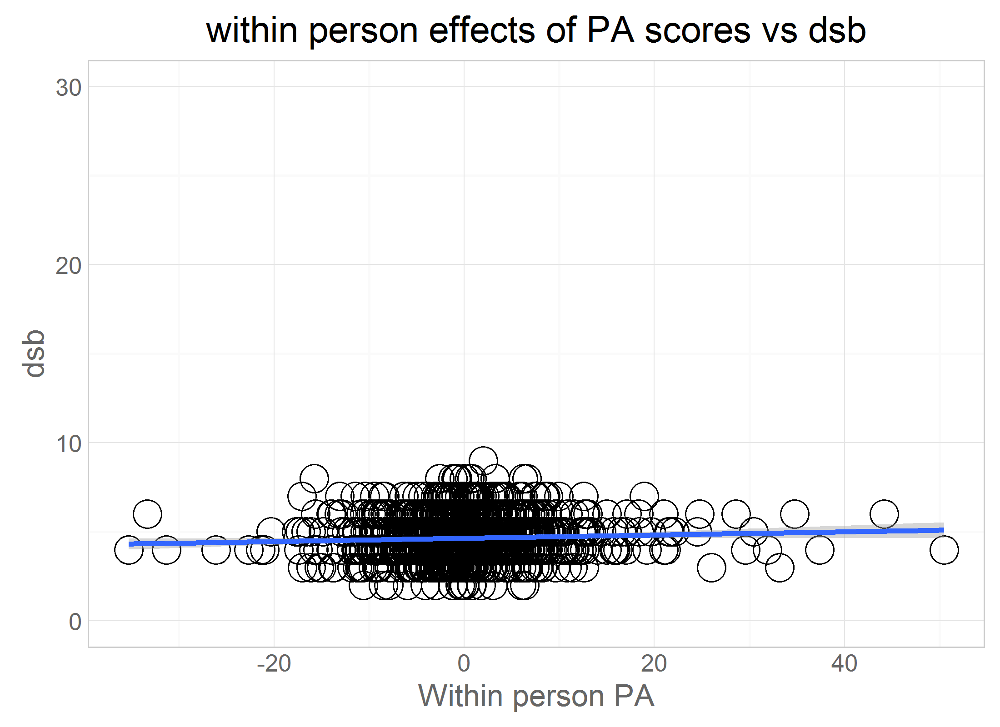

# Exposition- obas

<!-- These two chunks should be added in the beginning of every .Rmd that you want to source an .R script -->
<!--  The 1st mandatory chunck  -->
<!--  Set the working directory to the repository's base directory -->


<!--  The 2nd mandatory chunck  -->
<!-- Set the report-wide options, and point to the external code file. -->




```
[1] "C:/Users/Rebecca/Documents/GitHub/cognition-stress-activity"
```

# Exposition

## Ellis-Island

Loading the data and renaming the variables


## Tweak Data


## Graphs  





