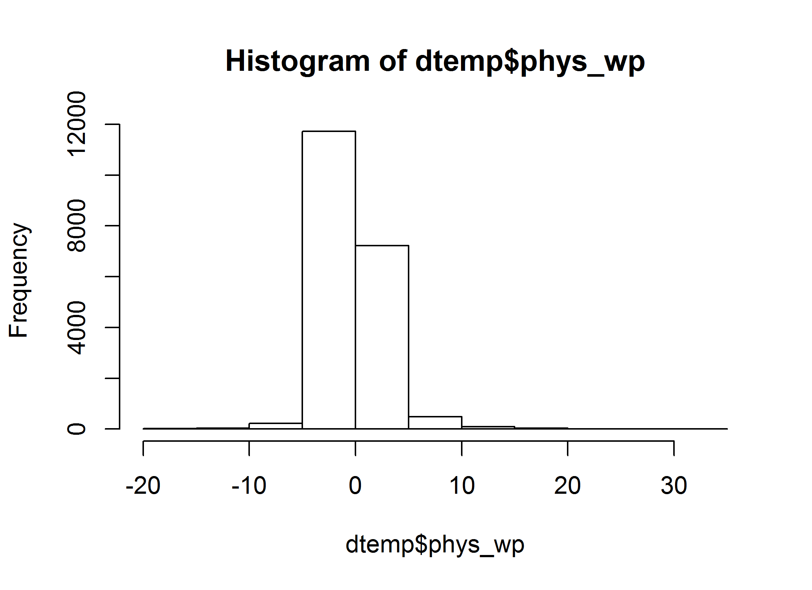
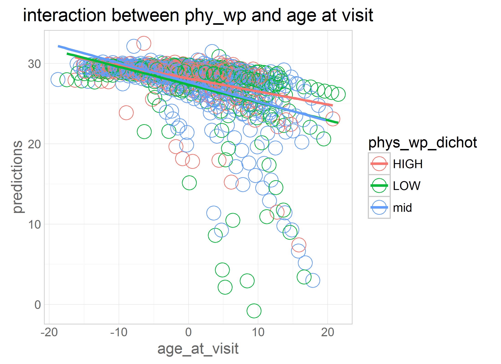

# mmse-map

<!-- These two chunks should be added in the beginning of every .Rmd that you want to source an .R script -->
<!--  The 1st mandatory chunck  -->
<!--  Set the working directory to the repository's base directory -->


<!--  The 2nd mandatory chunck  -->
<!-- Set the report-wide options, and point to the external code file. -->


```
[1] "C:/Users/Rebecca/Documents/GitHub/cognition-stress-activity"
```


```
[1] 76.53754
```

```
[1] 2868
```

```
[1] 2044
```


# **confound Variables initial equations**

```r
eq_0 <- as.formula("mmse ~ 1 + full_year +             
                   (1 + full_year |id)")
###does the outcome change over time? i.e. if so, it makes sense to add predictors.

eq_1 <- as.formula("mmse ~ 1 + full_year + age_bl_centered +    
                   (1 + full_year |id)")

eq_2 <- as.formula("mmse ~ 1 + full_year + age_bl_centered + full_year:age_bl_centered + 
                   (1 + full_year |id)")

####main effect of time in study: when baseline age is at the mean (i.e. 0)
####main effects of age_bl: when year in study is 0 (i.e. at baseline)
####interactioin: Those who are older decline faster over time

eq_3 <- as.formula("mmse ~ 1 + full_year + age_bl_centered + full_year:age_bl_centered + edu +     
                   (1 + full_year |id)")


eq_3int <- as.formula("mmse ~ 1 + full_year + age_bl_centered + full_year:age_bl_centered + edu + full_year:edu +  
                   (1 + full_year |id)")
```

### full data set- confound models

```r
model_0<- lmerTest::lmer(eq_0, data=dwn, REML=TRUE) 
model_1<- lmerTest::lmer(eq_1, data=dwn, REML=TRUE) 
model_2<- lmerTest::lmer(eq_2, data=dwn, REML=TRUE) 
model_3<- lmerTest::lmer(eq_3, data=dwn, REML=TRUE) 
model_3int<- lmerTest::lmer(eq_3int, data=dwn, REML=TRUE) 

lmerTest::summary((model_0)) #time in study is sig
```

```
Linear mixed model fit by REML 
t-tests use  Satterthwaite approximations to degrees of freedom ['lmerMod']
Formula: mmse ~ 1 + full_year + (1 + full_year | id)
   Data: dwn

REML criterion at convergence: 97072.8

Scaled residuals: 
    Min      1Q  Median      3Q     Max 
-8.6517 -0.3424  0.0749  0.3974  5.7269 

Random effects:
 Groups   Name        Variance Std.Dev. Corr
 id       (Intercept) 7.4740   2.7339       
          full_year   0.7737   0.8796   0.40
 Residual             4.2931   2.0720       
Number of obs: 19805, groups:  id, 2846

Fixed effects:
              Estimate Std. Error         df t value Pr(>|t|)    
(Intercept)   28.12022    0.05775 2492.70000  486.92   <2e-16 ***
full_year     -0.59388    0.02022 1737.60000  -29.37   <2e-16 ***
---
Signif. codes:  0 '***' 0.001 '**' 0.01 '*' 0.05 '.' 0.1 ' ' 1

Correlation of Fixed Effects:
          (Intr)
full_year 0.164 
```

```r
lmerTest::summary((model_1)) # "" + age at baseline 
```

```
Linear mixed model fit by REML 
t-tests use  Satterthwaite approximations to degrees of freedom ['lmerMod']
Formula: mmse ~ 1 + full_year + age_bl_centered + (1 + full_year | id)
   Data: dwn

REML criterion at convergence: 96917.5

Scaled residuals: 
    Min      1Q  Median      3Q     Max 
-8.6272 -0.3440  0.0692  0.3994  5.7305 

Random effects:
 Groups   Name        Variance Std.Dev. Corr
 id       (Intercept) 6.8383   2.6150       
          full_year   0.7597   0.8716   0.28
 Residual             4.2953   2.0725       
Number of obs: 19805, groups:  id, 2846

Fixed effects:
                  Estimate Std. Error         df t value Pr(>|t|)    
(Intercept)      2.832e+01  5.769e-02  2.412e+03  490.93   <2e-16 ***
full_year       -5.696e-01  2.022e-02  1.744e+03  -28.17   <2e-16 ***
age_bl_centered -9.862e-02  7.178e-03  2.530e+03  -13.74   <2e-16 ***
---
Signif. codes:  0 '***' 0.001 '**' 0.01 '*' 0.05 '.' 0.1 ' ' 1

Correlation of Fixed Effects:
            (Intr) fll_yr
full_year    0.073       
ag_bl_cntrd -0.252 -0.045
```

```r
lmerTest::summary((model_2)) # "" + interaction - those who are older decline faster over time
```

```
Linear mixed model fit by REML 
t-tests use  Satterthwaite approximations to degrees of freedom ['lmerMod']
Formula: mmse ~ 1 + full_year + age_bl_centered + full_year:age_bl_centered +      (1 + full_year | id)
   Data: dwn

REML criterion at convergence: 96695

Scaled residuals: 
    Min      1Q  Median      3Q     Max 
-8.6390 -0.3450  0.0713  0.4006  5.7253 

Random effects:
 Groups   Name        Variance Std.Dev. Corr
 id       (Intercept) 6.8261   2.6127       
          full_year   0.6617   0.8135   0.33
 Residual             4.3049   2.0748       
Number of obs: 19805, groups:  id, 2846

Fixed effects:
                            Estimate Std. Error         df t value Pr(>|t|)    
(Intercept)                2.836e+01  5.767e-02  2.424e+03  491.74   <2e-16 ***
full_year                 -5.180e-01  1.932e-02  1.623e+03  -26.81   <2e-16 ***
age_bl_centered           -1.033e-01  7.174e-03  2.550e+03  -14.40   <2e-16 ***
full_year:age_bl_centered -3.984e-02  2.534e-03  1.809e+03  -15.72   <2e-16 ***
---
Signif. codes:  0 '***' 0.001 '**' 0.01 '*' 0.05 '.' 0.1 ' ' 1

Correlation of Fixed Effects:
            (Intr) fll_yr ag_bl_
full_year    0.108              
ag_bl_cntrd -0.254 -0.060       
fll_yr:g_b_ -0.058 -0.163  0.069
```

```r
lmerTest::summary((model_3)) # "" + edu and gender are sig
```

```
Linear mixed model fit by REML 
t-tests use  Satterthwaite approximations to degrees of freedom ['lmerMod']
Formula: mmse ~ 1 + full_year + age_bl_centered + full_year:age_bl_centered +      edu + (1 + full_year | id)
   Data: dwn

REML criterion at convergence: 96600.3

Scaled residuals: 
    Min      1Q  Median      3Q     Max 
-8.6512 -0.3465  0.0684  0.4019  5.7253 

Random effects:
 Groups   Name        Variance Std.Dev. Corr
 id       (Intercept) 6.4997   2.5495       
          full_year   0.6666   0.8165   0.35
 Residual             4.3044   2.0747       
Number of obs: 19805, groups:  id, 2846

Fixed effects:
                            Estimate Std. Error         df t value Pr(>|t|)    
(Intercept)                2.592e+01  2.470e-01  2.491e+03  104.96   <2e-16 ***
full_year                 -5.157e-01  1.936e-02  1.618e+03  -26.63   <2e-16 ***
age_bl_centered           -9.015e-02  7.155e-03  2.549e+03  -12.60   <2e-16 ***
edu                        1.502e-01  1.478e-02  2.450e+03   10.17   <2e-16 ***
full_year:age_bl_centered -4.027e-02  2.539e-03  1.804e+03  -15.86   <2e-16 ***
---
Signif. codes:  0 '***' 0.001 '**' 0.01 '*' 0.05 '.' 0.1 ' ' 1

Correlation of Fixed Effects:
            (Intr) fll_yr ag_bl_ edu   
full_year    0.004                     
ag_bl_cntrd -0.231 -0.058              
edu         -0.973  0.024  0.179       
fll_yr:g_b_ -0.004 -0.164  0.076 -0.010
```

```r
lmerTest::summary((model_3int)) # interaction between time and education not sig
```

```
Linear mixed model fit by REML 
t-tests use  Satterthwaite approximations to degrees of freedom ['lmerMod']
Formula: mmse ~ 1 + full_year + age_bl_centered + full_year:age_bl_centered +  
    edu + full_year:edu + (1 + full_year | id)
   Data: dwn

REML criterion at convergence: 96607.5

Scaled residuals: 
    Min      1Q  Median      3Q     Max 
-8.6517 -0.3473  0.0684  0.4025  5.7260 

Random effects:
 Groups   Name        Variance Std.Dev. Corr
 id       (Intercept) 6.5003   2.5496       
          full_year   0.6667   0.8165   0.35
 Residual             4.3041   2.0746       
Number of obs: 19805, groups:  id, 2846

Fixed effects:
                            Estimate Std. Error         df t value Pr(>|t|)    
(Intercept)                2.595e+01  2.479e-01  2.541e+03 104.675  < 2e-16 ***
full_year                 -4.125e-01  8.893e-02  1.751e+03  -4.638 3.77e-06 ***
age_bl_centered           -9.022e-02  7.156e-03  2.549e+03 -12.607  < 2e-16 ***
edu                        1.486e-01  1.484e-02  2.511e+03  10.014  < 2e-16 ***
full_year:age_bl_centered -4.083e-02  2.583e-03  1.815e+03 -15.807  < 2e-16 ***
full_year:edu             -6.272e-03  5.277e-03  1.718e+03  -1.189    0.235    
---
Signif. codes:  0 '***' 0.001 '**' 0.01 '*' 0.05 '.' 0.1 ' ' 1

Correlation of Fixed Effects:
            (Intr) fll_yr ag_bl_ edu    fl_:__
full_year    0.084                            
ag_bl_cntrd -0.231 -0.020                     
edu         -0.974 -0.084  0.179              
fll_yr:g_b_ -0.019 -0.214  0.075  0.007       
full_year:d -0.085 -0.976  0.007  0.092  0.184
```

### male- confound models

```r
model_0<- lmerTest::lmer(eq_0, data=dwn_male, REML=TRUE) 
model_1<- lmerTest::lmer(eq_1, data=dwn_male, REML=TRUE) 
model_2<- lmerTest::lmer(eq_2, data=dwn_male, REML=TRUE) 
model_3<- lmerTest::lmer(eq_3, data=dwn_male, REML=TRUE) 
model_3int<- lmerTest::lmer(eq_3int, data=dwn_male, REML=TRUE) 

lmerTest::summary((model_0)) #time in study is sig
```

```
Linear mixed model fit by REML 
t-tests use  Satterthwaite approximations to degrees of freedom ['lmerMod']
Formula: mmse ~ 1 + full_year + (1 + full_year | id)
   Data: dwn_male

REML criterion at convergence: 27409.3

Scaled residuals: 
    Min      1Q  Median      3Q     Max 
-7.5788 -0.3625  0.0670  0.4154  4.1388 

Random effects:
 Groups   Name        Variance Std.Dev. Corr
 id       (Intercept) 12.4249  3.5249       
          full_year    0.7366  0.8583   0.49
 Residual              4.1648  2.0408       
Number of obs: 5570, groups:  id, 802

Fixed effects:
             Estimate Std. Error        df t value Pr(>|t|)    
(Intercept)  27.44141    0.13408 730.90000  204.66   <2e-16 ***
full_year    -0.57384    0.03741 420.70000  -15.34   <2e-16 ***
---
Signif. codes:  0 '***' 0.001 '**' 0.01 '*' 0.05 '.' 0.1 ' ' 1

Correlation of Fixed Effects:
          (Intr)
full_year 0.265 
```

```r
lmerTest::summary((model_1)) # "" + age at baseline 
```

```
Linear mixed model fit by REML 
t-tests use  Satterthwaite approximations to degrees of freedom ['lmerMod']
Formula: mmse ~ 1 + full_year + age_bl_centered + (1 + full_year | id)
   Data: dwn_male

REML criterion at convergence: 27349.7

Scaled residuals: 
    Min      1Q  Median      3Q     Max 
-7.5480 -0.3565  0.0630  0.4137  4.1341 

Random effects:
 Groups   Name        Variance Std.Dev. Corr
 id       (Intercept) 10.977   3.3131       
          full_year    0.723   0.8503   0.37
 Residual              4.160   2.0395       
Number of obs: 5570, groups:  id, 802

Fixed effects:
                 Estimate Std. Error        df t value Pr(>|t|)    
(Intercept)      27.72678    0.13130 702.50000 211.167   <2e-16 ***
full_year        -0.53828    0.03758 421.40000 -14.324   <2e-16 ***
age_bl_centered  -0.14477    0.01664 699.30000  -8.702   <2e-16 ***
---
Signif. codes:  0 '***' 0.001 '**' 0.01 '*' 0.05 '.' 0.1 ' ' 1

Correlation of Fixed Effects:
            (Intr) fll_yr
full_year    0.172       
ag_bl_cntrd -0.247 -0.070
```

```r
lmerTest::summary((model_2)) # "" + interaction - those who are older decline faster over time
```

```
Linear mixed model fit by REML 
t-tests use  Satterthwaite approximations to degrees of freedom ['lmerMod']
Formula: mmse ~ 1 + full_year + age_bl_centered + full_year:age_bl_centered +      (1 + full_year | id)
   Data: dwn_male

REML criterion at convergence: 27304.7

Scaled residuals: 
    Min      1Q  Median      3Q     Max 
-7.5649 -0.3611  0.0634  0.4159  4.1270 

Random effects:
 Groups   Name        Variance Std.Dev. Corr
 id       (Intercept) 10.9159  3.3039       
          full_year    0.6414  0.8009   0.41
 Residual              4.1767  2.0437       
Number of obs: 5570, groups:  id, 802

Fixed effects:
                           Estimate Std. Error        df t value Pr(>|t|)    
(Intercept)                27.80022    0.13138 707.40000 211.596  < 2e-16 ***
full_year                  -0.50546    0.03588 392.70000 -14.087  < 2e-16 ***
age_bl_centered            -0.16160    0.01676 735.20000  -9.644  < 2e-16 ***
full_year:age_bl_centered  -0.03720    0.00494 441.50000  -7.531 2.87e-13 ***
---
Signif. codes:  0 '***' 0.001 '**' 0.01 '*' 0.05 '.' 0.1 ' ' 1

Correlation of Fixed Effects:
            (Intr) fll_yr ag_bl_
full_year    0.209              
ag_bl_cntrd -0.255 -0.094       
fll_yr:g_b_ -0.090 -0.109  0.166
```

```r
lmerTest::summary((model_3)) # "" + edu and gender are sig
```

```
Linear mixed model fit by REML 
t-tests use  Satterthwaite approximations to degrees of freedom ['lmerMod']
Formula: mmse ~ 1 + full_year + age_bl_centered + full_year:age_bl_centered +      edu + (1 + full_year | id)
   Data: dwn_male

REML criterion at convergence: 27277.4

Scaled residuals: 
    Min      1Q  Median      3Q     Max 
-7.5612 -0.3645  0.0621  0.4146  4.1261 

Random effects:
 Groups   Name        Variance Std.Dev. Corr
 id       (Intercept) 10.4178  3.2277       
          full_year    0.6492  0.8058   0.44
 Residual              4.1767  2.0437       
Number of obs: 5570, groups:  id, 802

Fixed effects:
                            Estimate Std. Error         df t value Pr(>|t|)    
(Intercept)                24.896925   0.519618 657.500000  47.914  < 2e-16 ***
full_year                  -0.504798   0.035998 391.200000 -14.023  < 2e-16 ***
age_bl_centered            -0.145501   0.016659 730.700000  -8.734  < 2e-16 ***
edu                         0.170232   0.029476 643.400000   5.775  1.2e-08 ***
full_year:age_bl_centered  -0.037418   0.004951 440.000000  -7.558  2.4e-13 ***
---
Signif. codes:  0 '***' 0.001 '**' 0.01 '*' 0.05 '.' 0.1 ' ' 1

Correlation of Fixed Effects:
            (Intr) fll_yr ag_bl_ edu   
full_year    0.035                     
ag_bl_cntrd -0.222 -0.095              
edu         -0.969  0.023  0.165       
fll_yr:g_b_ -0.027 -0.110  0.184  0.003
```

```r
lmerTest::summary((model_3int)) # interaction between time and education not sig
```

```
Linear mixed model fit by REML 
t-tests use  Satterthwaite approximations to degrees of freedom ['lmerMod']
Formula: mmse ~ 1 + full_year + age_bl_centered + full_year:age_bl_centered +  
    edu + full_year:edu + (1 + full_year | id)
   Data: dwn_male

REML criterion at convergence: 27284.1

Scaled residuals: 
    Min      1Q  Median      3Q     Max 
-7.5597 -0.3652  0.0618  0.4152  4.1265 

Random effects:
 Groups   Name        Variance Std.Dev. Corr
 id       (Intercept) 10.4195  3.2279       
          full_year    0.6501  0.8063   0.44
 Residual              4.1758  2.0435       
Number of obs: 5570, groups:  id, 802

Fixed effects:
                            Estimate Std. Error         df t value Pr(>|t|)    
(Intercept)                24.996989   0.530054 721.900000  47.159  < 2e-16 ***
full_year                  -0.359965   0.155105 412.100000  -2.321   0.0208 *  
age_bl_centered            -0.146052   0.016670 730.500000  -8.761  < 2e-16 ***
edu                         0.164286   0.030125 718.100000   5.453 6.80e-08 ***
full_year:age_bl_centered  -0.038064   0.005001 438.200000  -7.612 1.67e-13 ***
full_year:edu              -0.008368   0.008720 405.400000  -0.960   0.3378    
---
Signif. codes:  0 '***' 0.001 '**' 0.01 '*' 0.05 '.' 0.1 ' ' 1

Correlation of Fixed Effects:
            (Intr) fll_yr ag_bl_ edu    fl_:__
full_year    0.199                            
ag_bl_cntrd -0.225 -0.055                     
edu         -0.970 -0.194  0.169              
fll_yr:g_b_ -0.053 -0.158  0.185  0.031       
full_year:d -0.196 -0.973  0.034  0.205  0.136
```

### female- confound models

```r
model_0<- lmerTest::lmer(eq_0, data=dwn_female, REML=TRUE) 
model_1<- lmerTest::lmer(eq_1, data=dwn_female, REML=TRUE) 
model_2<- lmerTest::lmer(eq_2, data=dwn_female, REML=TRUE) 
model_3<- lmerTest::lmer(eq_3, data=dwn_female, REML=TRUE) 
model_3int<- lmerTest::lmer(eq_3int, data=dwn_female, REML=TRUE) 


lmerTest::summary((model_0)) ####time in study is sig
```

```
Linear mixed model fit by REML 
t-tests use  Satterthwaite approximations to degrees of freedom ['lmerMod']
Formula: mmse ~ 1 + full_year + (1 + full_year | id)
   Data: dwn_female

REML criterion at convergence: 69486

Scaled residuals: 
    Min      1Q  Median      3Q     Max 
-8.6227 -0.3325  0.0802  0.3892  5.6954 

Random effects:
 Groups   Name        Variance Std.Dev. Corr
 id       (Intercept) 5.3529   2.3136       
          full_year   0.7854   0.8862   0.37
 Residual             4.3474   2.0851       
Number of obs: 14235, groups:  id, 2044

Fixed effects:
              Estimate Std. Error         df t value Pr(>|t|)    
(Intercept)   28.38907    0.06005 1756.10000  472.75   <2e-16 ***
full_year     -0.60189    0.02396 1311.70000  -25.12   <2e-16 ***
---
Signif. codes:  0 '***' 0.001 '**' 0.01 '*' 0.05 '.' 0.1 ' ' 1

Correlation of Fixed Effects:
          (Intr)
full_year 0.111 
```

```r
lmerTest::summary((model_1)) #### "" + age at baseline 
```

```
Linear mixed model fit by REML 
t-tests use  Satterthwaite approximations to degrees of freedom ['lmerMod']
Formula: mmse ~ 1 + full_year + age_bl_centered + (1 + full_year | id)
   Data: dwn_female

REML criterion at convergence: 69386.1

Scaled residuals: 
    Min      1Q  Median      3Q     Max 
-8.5965 -0.3372  0.0724  0.3932  5.6975 

Random effects:
 Groups   Name        Variance Std.Dev. Corr
 id       (Intercept) 4.9218   2.2185       
          full_year   0.7745   0.8801   0.25
 Residual             4.3520   2.0861       
Number of obs: 14235, groups:  id, 2044

Fixed effects:
                  Estimate Std. Error         df t value Pr(>|t|)    
(Intercept)      2.856e+01  6.027e-02  1.701e+03  473.85   <2e-16 ***
full_year       -5.819e-01  2.397e-02  1.315e+03  -24.27   <2e-16 ***
age_bl_centered -8.304e-02  7.445e-03  1.819e+03  -11.15   <2e-16 ***
---
Signif. codes:  0 '***' 0.001 '**' 0.01 '*' 0.05 '.' 0.1 ' ' 1

Correlation of Fixed Effects:
            (Intr) fll_yr
full_year    0.026       
ag_bl_cntrd -0.252 -0.039
```

```r
lmerTest::summary((model_2)) #### "" + interaction - those who are older decline faster over time
```

```
Linear mixed model fit by REML 
t-tests use  Satterthwaite approximations to degrees of freedom ['lmerMod']
Formula: mmse ~ 1 + full_year + age_bl_centered + full_year:age_bl_centered +      (1 + full_year | id)
   Data: dwn_female

REML criterion at convergence: 69220

Scaled residuals: 
    Min      1Q  Median      3Q     Max 
-8.6119 -0.3357  0.0746  0.3952  5.6950 

Random effects:
 Groups   Name        Variance Std.Dev. Corr
 id       (Intercept) 4.9297   2.2203       
          full_year   0.6715   0.8194   0.30
 Residual             4.3578   2.0875       
Number of obs: 14235, groups:  id, 2044

Fixed effects:
                            Estimate Std. Error         df t value Pr(>|t|)    
(Intercept)                2.858e+01  6.028e-02  1.708e+03  474.21   <2e-16 ***
full_year                 -5.226e-01  2.294e-02  1.228e+03  -22.78   <2e-16 ***
age_bl_centered           -8.259e-02  7.441e-03  1.818e+03  -11.10   <2e-16 ***
full_year:age_bl_centered -4.043e-02  2.957e-03  1.366e+03  -13.67   <2e-16 ***
---
Signif. codes:  0 '***' 0.001 '**' 0.01 '*' 0.05 '.' 0.1 ' ' 1

Correlation of Fixed Effects:
            (Intr) fll_yr ag_bl_
full_year    0.057              
ag_bl_cntrd -0.252 -0.045       
fll_yr:g_b_ -0.043 -0.183  0.018
```

```r
lmerTest::summary((model_3)) #### "" + edu and gender are sig
```

```
Linear mixed model fit by REML 
t-tests use  Satterthwaite approximations to degrees of freedom ['lmerMod']
Formula: mmse ~ 1 + full_year + age_bl_centered + full_year:age_bl_centered +      edu + (1 + full_year | id)
   Data: dwn_female

REML criterion at convergence: 69126.5

Scaled residuals: 
    Min      1Q  Median      3Q     Max 
-8.6265 -0.3417  0.0702  0.3969  5.6951 

Random effects:
 Groups   Name        Variance Std.Dev. Corr
 id       (Intercept) 4.5790   2.1399       
          full_year   0.6761   0.8223   0.32
 Residual             4.3575   2.0875       
Number of obs: 14235, groups:  id, 2044

Fixed effects:
                            Estimate Std. Error         df t value Pr(>|t|)    
(Intercept)                2.592e+01  2.698e-01  1.824e+03  96.087   <2e-16 ***
full_year                 -5.189e-01  2.299e-02  1.226e+03 -22.570   <2e-16 ***
age_bl_centered           -6.836e-02  7.382e-03  1.824e+03  -9.261   <2e-16 ***
edu                        1.670e-01  1.650e-02  1.789e+03  10.120   <2e-16 ***
full_year:age_bl_centered -4.095e-02  2.962e-03  1.362e+03 -13.826   <2e-16 ***
---
Signif. codes:  0 '***' 0.001 '**' 0.01 '*' 0.05 '.' 0.1 ' ' 1

Correlation of Fixed Effects:
            (Intr) fll_yr ag_bl_ edu   
full_year   -0.012                     
ag_bl_cntrd -0.237 -0.042              
edu         -0.976  0.027  0.188       
fll_yr:g_b_  0.003 -0.183  0.022 -0.013
```

```r
lmerTest::summary((model_3int)) #### interaction between time and education not sig
```

```
Linear mixed model fit by REML 
t-tests use  Satterthwaite approximations to degrees of freedom ['lmerMod']
Formula: mmse ~ 1 + full_year + age_bl_centered + full_year:age_bl_centered +  
    edu + full_year:edu + (1 + full_year | id)
   Data: dwn_female

REML criterion at convergence: 69134

Scaled residuals: 
    Min      1Q  Median      3Q     Max 
-8.6267 -0.3418  0.0701  0.3967  5.6957 

Random effects:
 Groups   Name        Variance Std.Dev. Corr
 id       (Intercept) 4.5798   2.1401       
          full_year   0.6764   0.8224   0.31
 Residual             4.3573   2.0874       
Number of obs: 14235, groups:  id, 2044

Fixed effects:
                            Estimate Std. Error         df t value Pr(>|t|)    
(Intercept)                2.593e+01  2.700e-01  1.829e+03  96.059  < 2e-16 ***
full_year                 -4.301e-01  1.108e-01  1.336e+03  -3.882 0.000109 ***
age_bl_centered           -6.833e-02  7.382e-03  1.824e+03  -9.256  < 2e-16 ***
edu                        1.665e-01  1.651e-02  1.797e+03  10.081  < 2e-16 ***
full_year:age_bl_centered -4.145e-02  3.024e-03  1.375e+03 -13.704  < 2e-16 ***
full_year:edu             -5.505e-03  6.722e-03  1.308e+03  -0.819 0.412968    
---
Signif. codes:  0 '***' 0.001 '**' 0.01 '*' 0.05 '.' 0.1 ' ' 1

Correlation of Fixed Effects:
            (Intr) fll_yr ag_bl_ edu    fl_:__
full_year    0.028                            
ag_bl_cntrd -0.236 -0.003                     
edu         -0.976 -0.031  0.187              
fll_yr:g_b_ -0.003 -0.234  0.020 -0.005       
full_year:d -0.031 -0.978 -0.006  0.037  0.201
```

```r
#adding exposure variables
```
## **in the whole data set and for males and females separately, the following are significant;  
time in study  
age at baseline  
time in study X age at baseline  
and education are  

time in study X education is not significant.  

# **raw physical activity**

```r
eq_3raw <- as.formula("mmse ~ 1 + full_year + age_bl_centered + full_year:age_bl_centered + edu + physical_activity +
                   (1 + full_year |id)")
```

### full data set - Raw PA

```r
model_rawm<- lmerTest::lmer(eq_3raw, data=dwn, REML=TRUE) 
lmerTest::summary((model_rawm)) #raw PA is sig for males  
```

```
Linear mixed model fit by REML 
t-tests use  Satterthwaite approximations to degrees of freedom ['lmerMod']
Formula: mmse ~ 1 + full_year + age_bl_centered + full_year:age_bl_centered +  
    edu + physical_activity + (1 + full_year | id)
   Data: dwn

REML criterion at convergence: 96580.3

Scaled residuals: 
    Min      1Q  Median      3Q     Max 
-8.6664 -0.3480  0.0652  0.4029  5.7689 

Random effects:
 Groups   Name        Variance Std.Dev. Corr
 id       (Intercept) 6.4912   2.5478       
          full_year   0.6624   0.8139   0.34
 Residual             4.3003   2.0737       
Number of obs: 19805, groups:  id, 2846

Fixed effects:
                            Estimate Std. Error         df t value Pr(>|t|)    
(Intercept)                2.582e+01  2.476e-01  2.519e+03 104.308  < 2e-16 ***
full_year                 -5.111e-01  1.933e-02  1.620e+03 -26.438  < 2e-16 ***
age_bl_centered           -8.963e-02  7.152e-03  2.551e+03 -12.532  < 2e-16 ***
edu                        1.499e-01  1.477e-02  2.455e+03  10.148  < 2e-16 ***
physical_activity          3.345e-02  6.282e-03  1.728e+04   5.325 1.02e-07 ***
full_year:age_bl_centered -3.995e-02  2.533e-03  1.802e+03 -15.770  < 2e-16 ***
---
Signif. codes:  0 '***' 0.001 '**' 0.01 '*' 0.05 '.' 0.1 ' ' 1

Correlation of Fixed Effects:
            (Intr) fll_yr ag_bl_ edu    physc_
full_year    0.000                            
ag_bl_cntrd -0.231 -0.057                     
edu         -0.971  0.023  0.179              
physcl_ctvt -0.074  0.040  0.014 -0.003       
fll_yr:g_b_ -0.005 -0.163  0.072 -0.010  0.020
```

### males - Raw PA

```r
model_rawm<- lmerTest::lmer(eq_3raw, data=dwn_male, REML=TRUE) 
lmerTest::summary((model_rawm)) #raw PA is sig for males
```

```
Linear mixed model fit by REML 
t-tests use  Satterthwaite approximations to degrees of freedom ['lmerMod']
Formula: mmse ~ 1 + full_year + age_bl_centered + full_year:age_bl_centered +  
    edu + physical_activity + (1 + full_year | id)
   Data: dwn_male

REML criterion at convergence: 27278.6

Scaled residuals: 
    Min      1Q  Median      3Q     Max 
-7.5520 -0.3650  0.0622  0.4175  4.1309 

Random effects:
 Groups   Name        Variance Std.Dev. Corr
 id       (Intercept) 10.3788  3.2216       
          full_year    0.6445  0.8028   0.44
 Residual              4.1767  2.0437       
Number of obs: 5570, groups:  id, 802

Fixed effects:
                            Estimate Std. Error         df t value Pr(>|t|)    
(Intercept)                2.480e+01  5.207e-01  6.670e+02  47.626  < 2e-16 ***
full_year                 -4.993e-01  3.595e-02  3.920e+02 -13.888  < 2e-16 ***
age_bl_centered           -1.449e-01  1.664e-02  7.300e+02  -8.710  < 2e-16 ***
edu                        1.705e-01  2.945e-02  6.450e+02   5.788 1.11e-08 ***
physical_activity          2.673e-02  1.091e-02  4.780e+03   2.451   0.0143 *  
full_year:age_bl_centered -3.700e-02  4.941e-03  4.390e+02  -7.490 3.82e-13 ***
---
Signif. codes:  0 '***' 0.001 '**' 0.01 '*' 0.05 '.' 0.1 ' ' 1

Correlation of Fixed Effects:
            (Intr) fll_yr ag_bl_ edu    physc_
full_year    0.030                            
ag_bl_cntrd -0.223 -0.093                     
edu         -0.966  0.023  0.166              
physcl_ctvt -0.077  0.056  0.016  0.005       
fll_yr:g_b_ -0.029 -0.108  0.181  0.003  0.031
```

### females -Raw PA

```r
model_rawf<- lmerTest::lmer(eq_3raw, data=dwn_female, REML=TRUE) 
lmerTest::summary((model_rawf)) #raw PA is sig for females 
```

```
Linear mixed model fit by REML 
t-tests use  Satterthwaite approximations to degrees of freedom ['lmerMod']
Formula: mmse ~ 1 + full_year + age_bl_centered + full_year:age_bl_centered +  
    edu + physical_activity + (1 + full_year | id)
   Data: dwn_female

REML criterion at convergence: 69109.4

Scaled residuals: 
    Min      1Q  Median      3Q     Max 
-8.6452 -0.3434  0.0695  0.3988  5.7450 

Random effects:
 Groups   Name        Variance Std.Dev. Corr
 id       (Intercept) 4.5750   2.1389       
          full_year   0.6721   0.8198   0.31
 Residual             4.3516   2.0861       
Number of obs: 14235, groups:  id, 2044

Fixed effects:
                            Estimate Std. Error         df t value Pr(>|t|)    
(Intercept)                2.582e+01  2.706e-01  1.846e+03  95.417  < 2e-16 ***
full_year                 -5.147e-01  2.295e-02  1.226e+03 -22.430  < 2e-16 ***
age_bl_centered           -6.783e-02  7.379e-03  1.826e+03  -9.193  < 2e-16 ***
edu                        1.669e-01  1.649e-02  1.791e+03  10.118  < 2e-16 ***
physical_activity          3.810e-02  7.616e-03  1.242e+04   5.003 5.72e-07 ***
full_year:age_bl_centered -4.066e-02  2.956e-03  1.361e+03 -13.758  < 2e-16 ***
---
Signif. codes:  0 '***' 0.001 '**' 0.01 '*' 0.05 '.' 0.1 ' ' 1

Correlation of Fixed Effects:
            (Intr) fll_yr ag_bl_ edu    physc_
full_year   -0.015                            
ag_bl_cntrd -0.237 -0.040                     
edu         -0.973  0.027  0.188              
physcl_ctvt -0.080  0.033  0.015 -0.001       
fll_yr:g_b_  0.002 -0.182  0.019 -0.013  0.017
```

```r
#between person and within person effects 
```

## ** Raw scores of Physical activity are sig in the full data set and for males and females separately. 
## **higher levels of PA are associated with higher mmse scores**

# **Between-and-within-effects**
### below are 2 outputs each for the full data set, males only and females only. One is just between person (BP) effects, the other includes BP and within person (WP) effects 

```r
eq_5 <- as.formula("mmse ~ 1 + full_year + age_bl_centered + full_year:age_bl_centered + edu + phys_bp_median  +
                   (1 + full_year |id)")
####bp effects: are people with higher values than other people (on average, over time)
####also higher in mmse (on average over time) (hoffman pdf page 72)

eq_6 <- as.formula("mmse ~ 1 + full_year + age_bl_centered + full_year:age_bl_centered + edu + phys_bp_median  + phys_wp +
                   (1 + full_year |id)")
```


### full- bp and wp

```r
model_5<- lmerTest::lmer(eq_5, data=dwn, REML=TRUE) 
model_6<- lmerTest::lmer(eq_6, data=dwn, REML=TRUE) 

lmerTest::summary((model_5))  #NS between person effects 
```

```
Linear mixed model fit by REML 
t-tests use  Satterthwaite approximations to degrees of freedom ['lmerMod']
Formula: mmse ~ 1 + full_year + age_bl_centered + full_year:age_bl_centered +  
    edu + phys_bp_median + (1 + full_year | id)
   Data: dwn

REML criterion at convergence: 96605.1

Scaled residuals: 
    Min      1Q  Median      3Q     Max 
-8.6521 -0.3463  0.0686  0.4023  5.7255 

Random effects:
 Groups   Name        Variance Std.Dev. Corr
 id       (Intercept) 6.500    2.5494       
          full_year   0.666    0.8161   0.34
 Residual             4.304    2.0747       
Number of obs: 19805, groups:  id, 2846

Fixed effects:
                            Estimate Std. Error         df t value Pr(>|t|)    
(Intercept)                2.591e+01  2.473e-01  2.494e+03 104.773   <2e-16 ***
full_year                 -5.157e-01  1.936e-02  1.618e+03 -26.633   <2e-16 ***
age_bl_centered           -8.975e-02  7.168e-03  2.550e+03 -12.522   <2e-16 ***
edu                        1.501e-01  1.478e-02  2.452e+03  10.155   <2e-16 ***
phys_bp_median             2.146e-02  2.152e-02  2.558e+03   0.998    0.319    
full_year:age_bl_centered -4.023e-02  2.539e-03  1.804e+03 -15.848   <2e-16 ***
---
Signif. codes:  0 '***' 0.001 '**' 0.01 '*' 0.05 '.' 0.1 ' ' 1

Correlation of Fixed Effects:
            (Intr) fll_yr ag_bl_ edu    phys__
full_year    0.004                            
ag_bl_cntrd -0.233 -0.059                     
edu         -0.972  0.024  0.178              
phys_bp_mdn -0.046 -0.017  0.059 -0.005       
fll_yr:g_b_ -0.004 -0.164  0.073 -0.010  0.003
```

```r
lmerTest::summary((model_6)) #WP effects are sig (those who walk
```

```
Linear mixed model fit by REML 
t-tests use  Satterthwaite approximations to degrees of freedom ['lmerMod']
Formula: mmse ~ 1 + full_year + age_bl_centered + full_year:age_bl_centered +  
    edu + phys_bp_median + phys_wp + (1 + full_year | id)
   Data: dwn

REML criterion at convergence: 96587.3

Scaled residuals: 
    Min      1Q  Median      3Q     Max 
-8.6659 -0.3477  0.0655  0.4029  5.7692 

Random effects:
 Groups   Name        Variance Std.Dev. Corr
 id       (Intercept) 6.4981   2.5491       
          full_year   0.6628   0.8141   0.34
 Residual             4.3003   2.0737       
Number of obs: 19805, groups:  id, 2846

Fixed effects:
                            Estimate Std. Error         df t value Pr(>|t|)    
(Intercept)                2.590e+01  2.472e-01  2.493e+03 104.785  < 2e-16 ***
full_year                 -5.112e-01  1.934e-02  1.620e+03 -26.432  < 2e-16 ***
age_bl_centered           -9.020e-02  7.167e-03  2.550e+03 -12.586  < 2e-16 ***
edu                        1.498e-01  1.478e-02  2.450e+03  10.139  < 2e-16 ***
phys_bp_median             1.900e-02  2.151e-02  2.560e+03   0.883    0.377    
phys_wp                    3.379e-02  6.625e-03  1.624e+04   5.101 3.42e-07 ***
full_year:age_bl_centered -3.997e-02  2.534e-03  1.802e+03 -15.774  < 2e-16 ***
---
Signif. codes:  0 '***' 0.001 '**' 0.01 '*' 0.05 '.' 0.1 ' ' 1

Correlation of Fixed Effects:
            (Intr) fll_yr ag_bl_ edu    phys__ phys_w
full_year    0.004                                   
ag_bl_cntrd -0.233 -0.059                            
edu         -0.972  0.024  0.178                     
phys_bp_mdn -0.046 -0.018  0.059 -0.005              
phys_wp     -0.004  0.045 -0.012 -0.004 -0.021       
fll_yr:g_b_ -0.004 -0.162  0.074 -0.011  0.002  0.021
```
### male -bp and wp

```r
model_5<- lmerTest::lmer(eq_5, data=dwn_male, REML=TRUE) 
model_6<- lmerTest::lmer(eq_6, data=dwn_male, REML=TRUE) 

lmerTest::summary((model_5))  #NS between person effects 
```

```
Linear mixed model fit by REML 
t-tests use  Satterthwaite approximations to degrees of freedom ['lmerMod']
Formula: mmse ~ 1 + full_year + age_bl_centered + full_year:age_bl_centered +  
    edu + phys_bp_median + (1 + full_year | id)
   Data: dwn_male

REML criterion at convergence: 27278.5

Scaled residuals: 
    Min      1Q  Median      3Q     Max 
-7.5615 -0.3653  0.0611  0.4154  4.1240 

Random effects:
 Groups   Name        Variance Std.Dev. Corr
 id       (Intercept) 10.3608  3.2188       
          full_year    0.6469  0.8043   0.43
 Residual              4.1765  2.0436       
Number of obs: 5570, groups:  id, 802

Fixed effects:
                           Estimate Std. Error        df t value Pr(>|t|)    
(Intercept)                24.81112    0.52192 664.00000  47.539  < 2e-16 ***
full_year                  -0.50417    0.03598 391.20000 -14.013  < 2e-16 ***
age_bl_centered            -0.14348    0.01666 729.40000  -8.611  < 2e-16 ***
edu                         0.17100    0.02949 648.40000   5.800 1.04e-08 ***
phys_bp_median              0.07955    0.04343 665.20000   1.832   0.0674 .  
full_year:age_bl_centered  -0.03728    0.00495 440.00000  -7.532 2.86e-13 ***
---
Signif. codes:  0 '***' 0.001 '**' 0.01 '*' 0.05 '.' 0.1 ' ' 1

Correlation of Fixed Effects:
            (Intr) fll_yr ag_bl_ edu    phys__
full_year    0.033                            
ag_bl_cntrd -0.228 -0.093                     
edu         -0.966  0.022  0.167              
phys_bp_mdn -0.094 -0.008  0.068  0.019       
fll_yr:g_b_ -0.026 -0.110  0.173  0.003  0.003
```

```r
lmerTest::summary((model_6)) #WP effects are sig (those who walk higher than average have higher mmse scores at that time)
```

```
Linear mixed model fit by REML 
t-tests use  Satterthwaite approximations to degrees of freedom ['lmerMod']
Formula: mmse ~ 1 + full_year + age_bl_centered + full_year:age_bl_centered +  
    edu + phys_bp_median + phys_wp + (1 + full_year | id)
   Data: dwn_male

REML criterion at convergence: 27281.5

Scaled residuals: 
    Min      1Q  Median      3Q     Max 
-7.5532 -0.3674  0.0594  0.4156  4.1289 

Random effects:
 Groups   Name        Variance Std.Dev. Corr
 id       (Intercept) 10.3598  3.2187       
          full_year    0.6435  0.8022   0.43
 Residual              4.1761  2.0435       
Number of obs: 5570, groups:  id, 802

Fixed effects:
                            Estimate Std. Error         df t value Pr(>|t|)    
(Intercept)                2.481e+01  5.219e-01  6.640e+02  47.533  < 2e-16 ***
full_year                 -4.997e-01  3.596e-02  3.920e+02 -13.898  < 2e-16 ***
age_bl_centered           -1.438e-01  1.666e-02  7.300e+02  -8.630  < 2e-16 ***
edu                        1.707e-01  2.948e-02  6.480e+02   5.791 1.09e-08 ***
phys_bp_median             7.879e-02  4.342e-02  6.650e+02   1.814   0.0701 .  
phys_wp                    2.297e-02  1.132e-02  4.523e+03   2.030   0.0424 *  
full_year:age_bl_centered -3.696e-02  4.941e-03  4.390e+02  -7.480 4.09e-13 ***
---
Signif. codes:  0 '***' 0.001 '**' 0.01 '*' 0.05 '.' 0.1 ' ' 1

Correlation of Fixed Effects:
            (Intr) fll_yr ag_bl_ edu    phys__ phys_w
full_year    0.033                                   
ag_bl_cntrd -0.228 -0.093                            
edu         -0.966  0.022  0.167                     
phys_bp_mdn -0.094 -0.008  0.068  0.019              
phys_wp     -0.004  0.058 -0.009 -0.005 -0.008       
fll_yr:g_b_ -0.026 -0.107  0.173  0.003  0.003  0.031
```
### female - bp and wp

```r
model_5<- lmerTest::lmer(eq_5, data=dwn_female, REML=TRUE) #NS between person effects
model_6<- lmerTest::lmer(eq_6, data=dwn_female, REML=TRUE) #NS between person and within person effects for females! 

lmerTest::summary((model_5)) #bp sig at .1
```

```
Linear mixed model fit by REML 
t-tests use  Satterthwaite approximations to degrees of freedom ['lmerMod']
Formula: mmse ~ 1 + full_year + age_bl_centered + full_year:age_bl_centered +  
    edu + phys_bp_median + (1 + full_year | id)
   Data: dwn_female

REML criterion at convergence: 69132

Scaled residuals: 
    Min      1Q  Median      3Q     Max 
-8.6269 -0.3414  0.0699  0.3970  5.6952 

Random effects:
 Groups   Name        Variance Std.Dev. Corr
 id       (Intercept) 4.5826   2.1407       
          full_year   0.6759   0.8221   0.31
 Residual             4.3575   2.0875       
Number of obs: 14235, groups:  id, 2044

Fixed effects:
                            Estimate Std. Error         df t value Pr(>|t|)    
(Intercept)                2.592e+01  2.701e-01  1.824e+03  95.969   <2e-16 ***
full_year                 -5.190e-01  2.300e-02  1.226e+03 -22.568   <2e-16 ***
age_bl_centered           -6.821e-02  7.395e-03  1.823e+03  -9.224   <2e-16 ***
edu                        1.670e-01  1.650e-02  1.789e+03  10.115   <2e-16 ***
phys_bp_median             8.902e-03  2.366e-02  1.895e+03   0.376    0.707    
full_year:age_bl_centered -4.094e-02  2.962e-03  1.362e+03 -13.821   <2e-16 ***
---
Signif. codes:  0 '***' 0.001 '**' 0.01 '*' 0.05 '.' 0.1 ' ' 1

Correlation of Fixed Effects:
            (Intr) fll_yr ag_bl_ edu    phys__
full_year   -0.011                            
ag_bl_cntrd -0.238 -0.042                     
edu         -0.975  0.027  0.187              
phys_bp_mdn -0.039 -0.021  0.056 -0.001       
fll_yr:g_b_  0.003 -0.183  0.021 -0.013  0.004
```

```r
lmerTest::summary((model_6)) #wp sig at .1
```

```
Linear mixed model fit by REML 
t-tests use  Satterthwaite approximations to degrees of freedom ['lmerMod']
Formula: mmse ~ 1 + full_year + age_bl_centered + full_year:age_bl_centered +  
    edu + phys_bp_median + phys_wp + (1 + full_year | id)
   Data: dwn_female

REML criterion at convergence: 69115.4

Scaled residuals: 
    Min      1Q  Median      3Q     Max 
-8.6438 -0.3430  0.0687  0.3990  5.7472 

Random effects:
 Groups   Name        Variance Std.Dev. Corr
 id       (Intercept) 4.5772   2.1394       
          full_year   0.6727   0.8202   0.32
 Residual             4.3518   2.0861       
Number of obs: 14235, groups:  id, 2044

Fixed effects:
                            Estimate Std. Error         df t value Pr(>|t|)    
(Intercept)                2.591e+01  2.699e-01  1.822e+03  96.006  < 2e-16 ***
full_year                 -5.145e-01  2.296e-02  1.227e+03 -22.406  < 2e-16 ***
age_bl_centered           -6.873e-02  7.391e-03  1.823e+03  -9.299  < 2e-16 ***
edu                        1.669e-01  1.649e-02  1.787e+03  10.117  < 2e-16 ***
phys_bp_median             5.193e-03  2.365e-02  1.898e+03   0.220    0.826    
phys_wp                    4.024e-02  8.146e-03  1.177e+04   4.941 7.89e-07 ***
full_year:age_bl_centered -4.070e-02  2.956e-03  1.361e+03 -13.768  < 2e-16 ***
---
Signif. codes:  0 '***' 0.001 '**' 0.01 '*' 0.05 '.' 0.1 ' ' 1

Correlation of Fixed Effects:
            (Intr) fll_yr ag_bl_ edu    phys__ phys_w
full_year   -0.011                                   
ag_bl_cntrd -0.238 -0.044                            
edu         -0.975  0.027  0.187                     
phys_bp_mdn -0.039 -0.022  0.056 -0.001              
phys_wp     -0.006  0.041 -0.014 -0.001 -0.029       
fll_yr:g_b_  0.003 -0.182  0.023 -0.013  0.004  0.018
```

```r
#allowing the effect of the TVC to vary over tiem (interaction term) -page 171 singer and willett
```

## **BP effects are only significant for males. When males average physical activity is average than the average male, they have higher mmse scores.** 
## **WP are NS across all 3 analyses. Thus, those who walk more than their average at a specific wave, also score higher on mmse at that time**

### ??Is this a function of time in study- i.e. people walk more than "usual" earlier in the study, therefore have higher mmse because they are younger- or is that controlled for by including the wave variable in the model first??


# **TVC-interaction**


### physical activity (TVC) interaction with time equation

```r
eq_tv_intxn <- as.formula("mmse ~ 1 + full_year + age_bl_centered + full_year:age_bl_centered + edu + phys_bp_median  + phys_wp + phys_wp:full_year +
                          (1 + full_year |id)")
```

### full - tvc interaction

```r
model_tv_intx<- lmerTest::lmer(eq_tv_intxn, data=dwn, REML=TRUE) #significant interaction term
lmerTest::summary((model_tv_intx)) 
```

```
Linear mixed model fit by REML 
t-tests use  Satterthwaite approximations to degrees of freedom ['lmerMod']
Formula: mmse ~ 1 + full_year + age_bl_centered + full_year:age_bl_centered +  
    edu + phys_bp_median + phys_wp + phys_wp:full_year + (1 +      full_year | id)
   Data: dwn

REML criterion at convergence: 96550.6

Scaled residuals: 
    Min      1Q  Median      3Q     Max 
-8.6655 -0.3467  0.0666  0.4036  5.7956 

Random effects:
 Groups   Name        Variance Std.Dev. Corr
 id       (Intercept) 6.4843   2.5464       
          full_year   0.6655   0.8158   0.35
 Residual             4.2871   2.0705       
Number of obs: 19805, groups:  id, 2846

Fixed effects:
                            Estimate Std. Error         df t value Pr(>|t|)    
(Intercept)                2.591e+01  2.469e-01  2.489e+03 104.952  < 2e-16 ***
full_year                 -5.128e-01  1.937e-02  1.620e+03 -26.477  < 2e-16 ***
age_bl_centered           -8.970e-02  7.159e-03  2.549e+03 -12.530  < 2e-16 ***
edu                        1.497e-01  1.476e-02  2.447e+03  10.146  < 2e-16 ***
phys_bp_median             1.765e-02  2.149e-02  2.557e+03   0.821   0.4115    
phys_wp                   -1.789e-02  9.973e-03  1.641e+04  -1.794   0.0729 .  
full_year:age_bl_centered -4.020e-02  2.537e-03  1.802e+03 -15.847  < 2e-16 ***
full_year:phys_wp          1.054e-02  1.523e-03  1.558e+04   6.922 4.64e-12 ***
---
Signif. codes:  0 '***' 0.001 '**' 0.01 '*' 0.05 '.' 0.1 ' ' 1

Correlation of Fixed Effects:
            (Intr) fll_yr ag_bl_ edu    phys__ phys_w fl_:__
full_year    0.005                                          
ag_bl_cntrd -0.233 -0.060                                   
edu         -0.972  0.024  0.178                            
phys_bp_mdn -0.046 -0.018  0.059 -0.005                     
phys_wp     -0.006  0.037 -0.016 -0.002 -0.008              
fll_yr:g_b_ -0.004 -0.163  0.075 -0.010  0.002  0.023       
fll_yr:phy_  0.005 -0.010  0.010 -0.001 -0.008 -0.748 -0.012
```
### male - tvc interaction

```r
model_tv_intx<- lmerTest::lmer(eq_tv_intxn, data=dwn_male, REML=TRUE) #significant interaction term
lmerTest::summary((model_tv_intx)) 
```

```
Linear mixed model fit by REML 
t-tests use  Satterthwaite approximations to degrees of freedom ['lmerMod']
Formula: mmse ~ 1 + full_year + age_bl_centered + full_year:age_bl_centered +  
    edu + phys_bp_median + phys_wp + phys_wp:full_year + (1 +      full_year | id)
   Data: dwn_male

REML criterion at convergence: 27278.4

Scaled residuals: 
    Min      1Q  Median      3Q     Max 
-7.5382 -0.3682  0.0618  0.4188  4.1056 

Random effects:
 Groups   Name        Variance Std.Dev. Corr
 id       (Intercept) 10.3455  3.2164       
          full_year    0.6486  0.8053   0.43
 Residual              4.1620  2.0401       
Number of obs: 5570, groups:  id, 802

Fixed effects:
                            Estimate Std. Error         df t value Pr(>|t|)    
(Intercept)                2.481e+01  5.213e-01  6.630e+02  47.585  < 2e-16 ***
full_year                 -5.026e-01  3.607e-02  3.920e+02 -13.934  < 2e-16 ***
age_bl_centered           -1.431e-01  1.665e-02  7.290e+02  -8.594  < 2e-16 ***
edu                        1.714e-01  2.945e-02  6.470e+02   5.819 9.30e-09 ***
phys_bp_median             7.601e-02  4.338e-02  6.640e+02   1.752 0.080225 .  
phys_wp                   -2.341e-02  1.697e-02  4.580e+03  -1.380 0.167736    
full_year:age_bl_centered -3.743e-02  4.956e-03  4.400e+02  -7.551 2.51e-13 ***
full_year:phys_wp          8.832e-03  2.412e-03  4.310e+03   3.661 0.000254 ***
---
Signif. codes:  0 '***' 0.001 '**' 0.01 '*' 0.05 '.' 0.1 ' ' 1

Correlation of Fixed Effects:
            (Intr) fll_yr ag_bl_ edu    phys__ phys_w fl_:__
full_year    0.033                                          
ag_bl_cntrd -0.227 -0.094                                   
edu         -0.966  0.022  0.167                            
phys_bp_mdn -0.094 -0.008  0.068  0.019                     
phys_wp     -0.003  0.052 -0.015 -0.007  0.007              
fll_yr:g_b_ -0.026 -0.108  0.174  0.003  0.003  0.039       
fll_yr:phy_  0.000 -0.018  0.012  0.006 -0.016 -0.746 -0.024
```
### female - tvc interaction

```r
model_tv_intx<- lmerTest::lmer(eq_tv_intxn, data=dwn_female, REML=TRUE) #significant interaction term, but loose within person effects
lmerTest::summary((model_tv_intx))
```

```
Linear mixed model fit by REML 
t-tests use  Satterthwaite approximations to degrees of freedom ['lmerMod']
Formula: mmse ~ 1 + full_year + age_bl_centered + full_year:age_bl_centered +  
    edu + phys_bp_median + phys_wp + phys_wp:full_year + (1 +      full_year | id)
   Data: dwn_female

REML criterion at convergence: 69090.7

Scaled residuals: 
    Min      1Q  Median      3Q     Max 
-8.6427 -0.3416  0.0697  0.4011  5.7776 

Random effects:
 Groups   Name        Variance Std.Dev. Corr
 id       (Intercept) 4.5679   2.1373       
          full_year   0.6744   0.8212   0.32
 Residual             4.3387   2.0830       
Number of obs: 14235, groups:  id, 2044

Fixed effects:
                            Estimate Std. Error         df t value Pr(>|t|)    
(Intercept)                2.593e+01  2.696e-01  1.821e+03  96.177  < 2e-16 ***
full_year                 -5.156e-01  2.298e-02  1.226e+03 -22.435  < 2e-16 ***
age_bl_centered           -6.834e-02  7.383e-03  1.822e+03  -9.257  < 2e-16 ***
edu                        1.661e-01  1.647e-02  1.785e+03  10.084  < 2e-16 ***
phys_bp_median             4.693e-03  2.363e-02  1.896e+03   0.199    0.843    
phys_wp                   -1.479e-02  1.231e-02  1.190e+04  -1.201    0.230    
full_year:age_bl_centered -4.085e-02  2.958e-03  1.360e+03 -13.809  < 2e-16 ***
full_year:phys_wp          1.165e-02  1.958e-03  1.132e+04   5.950 2.77e-09 ***
---
Signif. codes:  0 '***' 0.001 '**' 0.01 '*' 0.05 '.' 0.1 ' ' 1

Correlation of Fixed Effects:
            (Intr) fll_yr ag_bl_ edu    phys__ phys_w fl_:__
full_year   -0.011                                          
ag_bl_cntrd -0.238 -0.044                                   
edu         -0.975  0.027  0.187                            
phys_bp_mdn -0.039 -0.022  0.056 -0.001                     
phys_wp     -0.012  0.032 -0.016  0.005 -0.017              
fll_yr:g_b_  0.002 -0.183  0.024 -0.013  0.004  0.017       
fll_yr:phy_  0.011 -0.007  0.009 -0.008 -0.003 -0.751 -0.008
```

## **wp person PA X years in study** is sig. across all 3 analyses. The graph below helps to explain this interaction.
## Overtime, the effects of PA are more pronounced. specifically, exercising becomes increasingly important with age. With increasing age, if you walk more than your own average, you are expected to have higher mmse scores at that occasion.

# hypothetical graph

```
      Min.    1st Qu.     Median       Mean    3rd Qu.       Max. 
-18.170000  -1.104000  -0.230000   0.001103   0.776100  31.200000 
```



```
Source: local data frame [9 x 3]
Groups: id [1]

        id    phys_wp phys_wp_dichot
     <int>      <dbl>          <chr>
1 43596435  1.5148148           HIGH
2 43596435 -1.4018519            LOW
3 43596435  1.4648148           HIGH
4 43596435 -1.1518519            LOW
5 43596435 -2.9018519            LOW
6 43596435 -0.3185185            mid
7 43596435  6.1814815           HIGH
8 43596435 -1.9851852            LOW
9 43596435 -1.4018519            LOW
```

```
Classes 'tbl_df', 'tbl' and 'data.frame':	1046 obs. of  15 variables:
 $ id                   : int  4127190 4127190 4127190 4127190 4127190 4127190 4127190 4127190 4127190 6608444 ...
 $ full_year            : int  0 1 2 3 4 5 6 7 8 0 ...
 $ age_bl               : num  79.7 79.7 79.7 79.7 79.7 ...
 $ age_at_visit_centered: num  -0.7 0.343 1.52 2.333 3.343 ...
 $ physical_activity    : num  1 0.667 1.25 2.25 0 ...
 $ phys_bl_bp           : num  -2.08 -2.08 -2.08 -2.08 -2.08 ...
 $ phys_bp_mean         : num  -1.95 -1.95 -1.95 -1.95 -1.95 ...
 $ phys_bp_median       : num  -1.08 -1.08 -1.08 -1.08 -1.08 ...
 $ phys_wp              : num  0.32407 -0.00926 0.57407 1.57407 -0.67593 ...
 $ mmse                 : num  26 30 30 28 28 30 26 27 29 30 ...
 $ age_bl_centered      : num  3.86 3.86 3.86 3.86 3.86 ...
 $ female               : logi  TRUE TRUE TRUE TRUE TRUE TRUE ...
 $ edu                  : int  20 20 20 20 20 20 20 20 20 20 ...
 $ pred                 : num  28.8 28.6 28.5 28.4 28.2 ...
 $ phys_wp_dichot       : chr  "mid" "mid" "mid" "HIGH" ...
 - attr(*, "na.action")=Class 'omit'  Named int [1:552] 8 21 22 23 293 294 295 296 297 298 ...
  .. ..- attr(*, "names")= chr [1:552] "8" "21" "22" "23" ...
```


# **TVC by age-at-visit interaction**
## Using age at visit as the outcome, we see the same effects as above 

```r
eq_tv_intxn <- as.formula("mmse ~ 1 + full_year + age_bl_centered + full_year:age_bl_centered + age_at_visit_centered + edu + phys_bp_median  + phys_wp + phys_wp:age_at_visit_centered +
                          (1 + full_year |id)")
```


```r
model_tv_intx<- lmerTest::lmer(eq_tv_intxn, data=dwn, REML=TRUE) #significant interaction term
lmerTest::summary((model_tv_intx)) 
```

```
Linear mixed model fit by REML 
t-tests use  Satterthwaite approximations to degrees of freedom ['lmerMod']
Formula: mmse ~ 1 + full_year + age_bl_centered + full_year:age_bl_centered +  
    age_at_visit_centered + edu + phys_bp_median + phys_wp +      phys_wp:age_at_visit_centered + (1 + full_year | id)
   Data: dwn

REML criterion at convergence: 96523.7

Scaled residuals: 
    Min      1Q  Median      3Q     Max 
-8.5182 -0.3498  0.0671  0.4052  5.7897 

Random effects:
 Groups   Name        Variance Std.Dev. Corr
 id       (Intercept) 6.480    2.5456       
          full_year   0.664    0.8149   0.34
 Residual             4.281    2.0690       
Number of obs: 19805, groups:  id, 2846

Fixed effects:
                                Estimate Std. Error         df t value Pr(>|t|)    
(Intercept)                    2.080e+01  7.864e-01  1.957e+04  26.449  < 2e-16 ***
full_year                      6.196e-01  1.665e-01  1.861e+04   3.721 0.000199 ***
age_bl_centered                1.029e+00  1.643e-01  1.859e+04   6.263 3.85e-10 ***
age_at_visit_centered         -1.121e+00  1.642e-01  1.854e+04  -6.826 9.00e-12 ***
edu                            1.482e-01  1.476e-02  2.451e+03  10.041  < 2e-16 ***
phys_bp_median                 1.767e-02  2.148e-02  2.559e+03   0.822 0.410881    
phys_wp                        3.466e-02  6.621e-03  1.622e+04   5.236 1.66e-07 ***
full_year:age_bl_centered     -4.041e-02  2.542e-03  1.817e+03 -15.898  < 2e-16 ***
age_at_visit_centered:phys_wp  4.953e-03  8.889e-04  1.631e+04   5.572 2.55e-08 ***
---
Signif. codes:  0 '***' 0.001 '**' 0.01 '*' 0.05 '.' 0.1 ' ' 1

Correlation of Fixed Effects:
            (Intr) fll_yr ag_bl_ ag_t__ edu    phys__ phys_w fl_:__
full_year   -0.943                                                 
ag_bl_cntrd -0.952  0.992                                          
ag_t_vst_cn  0.949 -0.993 -0.999                                   
edu         -0.285 -0.018 -0.014  0.021                            
phys_bp_mdn -0.013 -0.004  0.001  0.002 -0.005                     
phys_wp      0.019 -0.016 -0.022  0.022 -0.003 -0.021              
fll_yr:g_b_  0.058 -0.080 -0.059  0.062 -0.009  0.002  0.025       
ag_t_vst_:_  0.000  0.000 -0.003  0.002  0.006 -0.008  0.051  0.046
```

```r
dtemp$pred<- predict(model_tv_intx)
```




# **Fluctuation in MMSE**

##Here, I explore the effects of using deviations from your average mmse score, to see if within person changes in PA also predict mmse changes at that occasion 
## ? mostly this was exploratory and I wanted to know if you think it makes sense ?? 
##In the following models, WP effects of PA are significant across all 3 analyses. Thus, those who walk more than usual, also have higher mmse scores than their average at that occasion. 


# **random effects**
## Here, I include the random effects of the within person PA variable.
### random effects equation

```r
eq_re<- as.formula("mmse ~ 1 + full_year + age_bl_centered + full_year:age_bl_centered + edu + phys_bp_median  + phys_wp + 
                          (1 + full_year + phys_wp |id)")
```
### full- random effects 

```r
model_re<- lmerTest::lmer(eq_re, data=dwn, REML=TRUE) 
lmerTest::summary((model_re)) 
```

```
Linear mixed model fit by REML 
t-tests use  Satterthwaite approximations to degrees of freedom ['lmerMod']
Formula: mmse ~ 1 + full_year + age_bl_centered + full_year:age_bl_centered +  
    edu + phys_bp_median + phys_wp + (1 + full_year + phys_wp |      id)
   Data: dwn

REML criterion at convergence: 96471.8

Scaled residuals: 
    Min      1Q  Median      3Q     Max 
-8.8130 -0.3468  0.0669  0.4004  6.0128 

Random effects:
 Groups   Name        Variance Std.Dev. Corr       
 id       (Intercept) 6.53480  2.5563              
          full_year   0.63331  0.7958    0.38      
          phys_wp     0.01953  0.1397   -0.03 -0.69
 Residual             4.22156  2.0546              
Number of obs: 19805, groups:  id, 2846

Fixed effects:
                            Estimate Std. Error         df t value Pr(>|t|)    
(Intercept)                2.591e+01  2.469e-01  2.430e+03 104.942  < 2e-16 ***
full_year                 -5.088e-01  1.885e-02  1.568e+03 -26.996  < 2e-16 ***
age_bl_centered           -9.095e-02  7.170e-03  2.531e+03 -12.685  < 2e-16 ***
edu                        1.488e-01  1.476e-02  2.385e+03  10.087  < 2e-16 ***
phys_bp_median             1.613e-02  2.156e-02  2.509e+03   0.748    0.455    
phys_wp                    4.723e-02  8.220e-03  3.934e+02   5.745 1.84e-08 ***
full_year:age_bl_centered -3.838e-02  2.439e-03  1.646e+03 -15.734  < 2e-16 ***
---
Signif. codes:  0 '***' 0.001 '**' 0.01 '*' 0.05 '.' 0.1 ' ' 1

Correlation of Fixed Effects:
            (Intr) fll_yr ag_bl_ edu    phys__ phys_w
full_year    0.009                                   
ag_bl_cntrd -0.233 -0.065                            
edu         -0.972  0.025  0.178                     
phys_bp_mdn -0.046 -0.019  0.057 -0.005              
phys_wp     -0.003 -0.207 -0.014 -0.004  0.009       
fll_yr:g_b_ -0.007 -0.150  0.092 -0.010  0.001  0.081
```
### male - random effects 

```r
model_re<- lmerTest::lmer(eq_re, data=dwn_male, REML=TRUE) 
lmerTest::summary((model_re)) #no bp or wp effects
```

```
Linear mixed model fit by REML 
t-tests use  Satterthwaite approximations to degrees of freedom ['lmerMod']
Formula: mmse ~ 1 + full_year + age_bl_centered + full_year:age_bl_centered +  
    edu + phys_bp_median + phys_wp + (1 + full_year + phys_wp |      id)
   Data: dwn_male

REML criterion at convergence: 27247.7

Scaled residuals: 
    Min      1Q  Median      3Q     Max 
-7.4606 -0.3614  0.0627  0.4190  4.1767 

Random effects:
 Groups   Name        Variance Std.Dev. Corr       
 id       (Intercept) 10.48093 3.2374              
          full_year    0.58936 0.7677    0.46      
          phys_wp      0.01368 0.1170   -0.22 -0.87
 Residual              4.13506 2.0335              
Number of obs: 5570, groups:  id, 802

Fixed effects:
                            Estimate Std. Error         df t value Pr(>|t|)    
(Intercept)                24.788713   0.521665 649.200000  47.518  < 2e-16 ***
full_year                  -0.489348   0.034328 367.000000 -14.255  < 2e-16 ***
age_bl_centered            -0.143585   0.016671 726.200000  -8.613  < 2e-16 ***
edu                         0.170929   0.029465 633.500000   5.801 1.04e-08 ***
phys_bp_median              0.069851   0.043453 617.500000   1.607  0.10846    
phys_wp                     0.037350   0.013329  72.400000   2.802  0.00651 ** 
full_year:age_bl_centered  -0.035666   0.004661 351.900000  -7.652 1.92e-13 ***
---
Signif. codes:  0 '***' 0.001 '**' 0.01 '*' 0.05 '.' 0.1 ' ' 1

Correlation of Fixed Effects:
            (Intr) fll_yr ag_bl_ edu    phys__ phys_w
full_year    0.040                                   
ag_bl_cntrd -0.229 -0.093                            
edu         -0.966  0.020  0.168                     
phys_bp_mdn -0.094 -0.004  0.066  0.019              
phys_wp     -0.011 -0.260  0.013 -0.013  0.018       
fll_yr:g_b_ -0.031 -0.084  0.177  0.006 -0.006  0.147
```
### female - random effects 

```r
model_re<- lmerTest::lmer(eq_re, data=dwn_female, REML=TRUE) 
lmerTest::summary((model_re)) #no bp or wp effects  
```

```
Linear mixed model fit by REML 
t-tests use  Satterthwaite approximations to degrees of freedom ['lmerMod']
Formula: mmse ~ 1 + full_year + age_bl_centered + full_year:age_bl_centered +  
    edu + phys_bp_median + phys_wp + (1 + full_year + phys_wp |      id)
   Data: dwn_female

REML criterion at convergence: 69030.4

Scaled residuals: 
    Min      1Q  Median      3Q     Max 
-8.7976 -0.3414  0.0684  0.3961  5.9933 

Random effects:
 Groups   Name        Variance Std.Dev. Corr       
 id       (Intercept) 4.61962  2.1493              
          full_year   0.64779  0.8049    0.35      
          phys_wp     0.02318  0.1523   -0.03 -0.65
 Residual             4.25858  2.0636              
Number of obs: 14235, groups:  id, 2044

Fixed effects:
                            Estimate Std. Error         df t value Pr(>|t|)    
(Intercept)                2.591e+01  2.699e-01  1.784e+03  95.990  < 2e-16 ***
full_year                 -5.138e-01  2.246e-02  1.196e+03 -22.871  < 2e-16 ***
age_bl_centered           -6.960e-02  7.398e-03  1.795e+03  -9.408  < 2e-16 ***
edu                        1.663e-01  1.649e-02  1.746e+03  10.084  < 2e-16 ***
phys_bp_median             5.464e-03  2.375e-02  1.891e+03   0.230    0.818    
phys_wp                    5.560e-02  1.022e-02  3.227e+02   5.439 1.06e-07 ***
full_year:age_bl_centered -3.884e-02  2.853e-03  1.267e+03 -13.614  < 2e-16 ***
---
Signif. codes:  0 '***' 0.001 '**' 0.01 '*' 0.05 '.' 0.1 ' ' 1

Correlation of Fixed Effects:
            (Intr) fll_yr ag_bl_ edu    phys__ phys_w
full_year   -0.007                                   
ag_bl_cntrd -0.238 -0.050                            
edu         -0.975  0.029  0.187                     
phys_bp_mdn -0.040 -0.025  0.055  0.000              
phys_wp     -0.006 -0.201 -0.017  0.001 -0.002       
fll_yr:g_b_  0.000 -0.171  0.043 -0.014  0.005  0.064
```
## When the random effects are included, Males between person main effect of PA is no longer significant
##? I am struggling to understand why allowing the slope of PA for males to vary across people results in non-sig results, when this effect was sig. in the restricted slope model
##Moreover, WP effects are sig. across all 3 analyses. People vary in how much they fluctuate from their average over time, and this fluctuation is sig associated with mmse  
(??)Am I interpreting this right??

# ** allostatic load models**

```r
eq_bmk<- as.formula("mmse ~ 1 + full_year + age_bl_centered + full_year:age_bl_centered + edu + phys_bp_median  + phys_wp  + al_catg_wave +
                   (1 + full_year + phys_wp |id)")
```
### full

```r
model_bmk<- lmerTest::lmer(eq_bmk, data=dbio, REML=TRUE) 
lmerTest::summary((model_bmk)) #al category is sig related to mmse score
```

```
Linear mixed model fit by REML 
t-tests use  Satterthwaite approximations to degrees of freedom ['lmerMod']
Formula: mmse ~ 1 + full_year + age_bl_centered + full_year:age_bl_centered +  
    edu + phys_bp_median + phys_wp + al_catg_wave + (1 + full_year +      phys_wp | id)
   Data: dbio

REML criterion at convergence: 20561.5

Scaled residuals: 
    Min      1Q  Median      3Q     Max 
-7.7956 -0.3285  0.0397  0.3854  4.7178 

Random effects:
 Groups   Name        Variance Std.Dev. Corr       
 id       (Intercept) 11.95800 3.4580              
          full_year    0.45381 0.6737   -0.32      
          phys_wp      0.01066 0.1033    0.40 -0.50
 Residual              3.27655 1.8101              
Number of obs: 4082, groups:  id, 1142

Fixed effects:
                            Estimate Std. Error         df t value Pr(>|t|)    
(Intercept)                2.582e+01  6.010e-01  6.420e+02  42.966  < 2e-16 ***
full_year                 -4.436e-01  2.797e-02  6.720e+02 -15.859  < 2e-16 ***
age_bl_centered           -4.864e-02  2.125e-02  3.750e+02  -2.289   0.0226 *  
edu                        1.907e-01  3.745e-02  6.250e+02   5.091 4.71e-07 ***
phys_bp_median             5.167e-02  4.680e-02  5.400e+02   1.104   0.2700    
phys_wp                    2.103e-02  1.629e-02  1.200e+02   1.291   0.1990    
al_catg_waveLOW            5.713e-01  1.437e-01  3.182e+03   3.977 7.15e-05 ***
al_catg_waveMED            4.875e-01  1.226e-01  3.009e+03   3.976 7.17e-05 ***
full_year:age_bl_centered -3.037e-02  3.817e-03  7.110e+02  -7.956 7.11e-15 ***
---
Signif. codes:  0 '***' 0.001 '**' 0.01 '*' 0.05 '.' 0.1 ' ' 1

Correlation of Fixed Effects:
            (Intr) fll_yr ag_bl_ edu    phys__ phys_w a__LOW a__MED
full_year   -0.127                                                 
ag_bl_cntrd -0.155  0.102                                          
edu         -0.943 -0.057  0.089                                   
phys_bp_mdn -0.030  0.080  0.020 -0.054                            
phys_wp      0.014 -0.012 -0.008 -0.010  0.015                     
al_ctg_wLOW -0.134  0.038 -0.003 -0.021 -0.029 -0.012              
al_ctg_wMED -0.140  0.026 -0.011 -0.016 -0.013 -0.014  0.717       
fll_yr:g_b_ -0.035 -0.100 -0.603  0.062  0.011  0.026  0.012  0.009
```
### male

```r
model_bmk<- lmerTest::lmer(eq_bmk, data=dbio_male, REML=TRUE) 
lmerTest::summary((model_bmk)) #al category is sig related to mmse score
```

```
Linear mixed model fit by REML 
t-tests use  Satterthwaite approximations to degrees of freedom ['lmerMod']
Formula: mmse ~ 1 + full_year + age_bl_centered + full_year:age_bl_centered +  
    edu + phys_bp_median + phys_wp + al_catg_wave + (1 + full_year +      phys_wp | id)
   Data: dbio_male

REML criterion at convergence: 4497.9

Scaled residuals: 
    Min      1Q  Median      3Q     Max 
-5.1600 -0.3511  0.0526  0.4176  4.6157 

Random effects:
 Groups   Name        Variance Std.Dev. Corr       
 id       (Intercept) 8.34914  2.8895              
          full_year   0.21118  0.4595    0.12      
          phys_wp     0.05928  0.2435   -0.16 -0.48
 Residual             3.29092  1.8141              
Number of obs: 901, groups:  id, 249

Fixed effects:
                            Estimate Std. Error         df t value Pr(>|t|)    
(Intercept)                24.197153   1.158604 150.900000  20.885  < 2e-16 ***
full_year                  -0.314192   0.049454 123.400000  -6.353 3.68e-09 ***
age_bl_centered            -0.129285   0.043952  97.900000  -2.942  0.00408 ** 
edu                         0.203757   0.070449 144.900000   2.892  0.00441 ** 
phys_bp_median              0.112075   0.088068 107.500000   1.273  0.20591    
phys_wp                     0.029975   0.039382  78.500000   0.761  0.44886    
al_catg_waveLOW             0.950753   0.330891 727.800000   2.873  0.00418 ** 
al_catg_waveMED             0.924189   0.247191 699.100000   3.739  0.00020 ***
full_year:age_bl_centered  -0.016362   0.006915 127.300000  -2.366  0.01949 *  
---
Signif. codes:  0 '***' 0.001 '**' 0.01 '*' 0.05 '.' 0.1 ' ' 1

Correlation of Fixed Effects:
            (Intr) fll_yr ag_bl_ edu    phys__ phys_w a__LOW a__MED
full_year   -0.121                                                 
ag_bl_cntrd -0.054  0.174                                          
edu         -0.937 -0.051 -0.070                                   
phys_bp_mdn -0.009  0.082  0.089 -0.113                            
phys_wp     -0.029 -0.034  0.023  0.010 -0.059                     
al_ctg_wLOW -0.088 -0.005 -0.019 -0.041 -0.070 -0.037              
al_ctg_wMED -0.116  0.022 -0.033 -0.035 -0.029 -0.027  0.651       
fll_yr:g_b_ -0.048 -0.113 -0.547  0.093 -0.009  0.017  0.024  0.023
```
### female

```r
model_bmk<- lmerTest::lmer(eq_bmk, data=dbio_female, REML=TRUE) 
lmerTest::summary((model_bmk)) #al category is sig related to mmse 
```

```
Linear mixed model fit by REML 
t-tests use  Satterthwaite approximations to degrees of freedom ['lmerMod']
Formula: mmse ~ 1 + full_year + age_bl_centered + full_year:age_bl_centered +  
    edu + phys_bp_median + phys_wp + al_catg_wave + (1 + full_year +      phys_wp | id)
   Data: dbio_female

REML criterion at convergence: 16046.9

Scaled residuals: 
    Min      1Q  Median      3Q     Max 
-7.4754 -0.3196  0.0344  0.3830  3.8459 

Random effects:
 Groups   Name        Variance  Std.Dev. Corr       
 id       (Intercept) 13.180436 3.6305              
          full_year    0.513969 0.7169   -0.39      
          phys_wp      0.000729 0.0270    0.79 -0.87
 Residual              3.242660 1.8007              
Number of obs: 3181, groups:  id, 893

Fixed effects:
                            Estimate Std. Error         df t value Pr(>|t|)    
(Intercept)                2.590e+01  7.066e-01  5.085e+02  36.658  < 2e-16 ***
full_year                 -4.818e-01  3.282e-02  5.426e+02 -14.680  < 2e-16 ***
age_bl_centered           -1.968e-02  2.451e-02  2.956e+02  -0.803  0.42279    
edu                        2.132e-01  4.446e-02  4.974e+02   4.796 2.14e-06 ***
phys_bp_median             4.072e-02  5.529e-02  4.261e+02   0.737  0.46182    
phys_wp                    1.823e-02  1.726e-02  1.496e+03   1.056  0.29128    
al_catg_waveLOW            4.276e-01  1.597e-01  2.414e+03   2.677  0.00747 ** 
al_catg_waveMED            3.386e-01  1.399e-01  2.295e+03   2.421  0.01556 *  
full_year:age_bl_centered -3.449e-02  4.446e-03  5.796e+02  -7.758 3.91e-14 ***
---
Signif. codes:  0 '***' 0.001 '**' 0.01 '*' 0.05 '.' 0.1 ' ' 1

Correlation of Fixed Effects:
            (Intr) fll_yr ag_bl_ edu    phys__ phys_w a__LOW a__MED
full_year   -0.125                                                 
ag_bl_cntrd -0.193  0.087                                          
edu         -0.945 -0.060  0.141                                   
phys_bp_mdn -0.049  0.084  0.014 -0.024                            
phys_wp      0.005  0.018 -0.010 -0.006  0.016                     
al_ctg_wLOW -0.136  0.044 -0.003 -0.020 -0.023 -0.006              
al_ctg_wMED -0.140  0.027 -0.008 -0.015 -0.010 -0.007  0.732       
fll_yr:g_b_ -0.030 -0.097 -0.614  0.054  0.014  0.022  0.009  0.004
```
# **graph**

```
Classes 'tbl_df', 'tbl' and 'data.frame':	438 obs. of  30 variables:
 $ id                   : int  2495739 2495739 2495739 2495739 2495739 3902977 3902977 3902977 3902977 9896826 ...
 $ full_year            : int  2 3 5 6 7 6 7 8 9 7 ...
 $ age_bl               : num  82.4 82.4 82.4 82.4 82.4 ...
 $ physical_activity    : num  15 16.5 11.2 18.5 0 ...
 $ phys_bl_bp           : num  12.7 12.7 12.7 12.7 12.7 ...
 $ phys_bp_mean         : num  8.55 8.55 8.55 8.55 8.55 ...
 $ phys_bp_median       : num  12 12 12 12 12 ...
 $ phys_wp              : num  3.8229 5.3229 -0.0104 7.3229 -11.1771 ...
 $ mmse                 : num  28 29 29 28 29 26 29 29 30 29 ...
 $ age_bl_centered      : num  6.54 6.54 6.54 6.54 6.54 ...
 $ female               : logi  TRUE TRUE TRUE TRUE TRUE TRUE ...
 $ edu                  : int  16 16 16 16 16 16 16 16 16 13 ...
 $ apoe                 : int  34 34 34 34 34 33 33 33 33 33 ...
 $ cholesterol          : int  218 200 190 198 229 241 236 246 212 202 ...
 $ hemoglobin           : num  5.7 5.9 5.8 5.7 5.8 5.7 5.7 5.5 5.6 7.5 ...
 $ hdlratio             : num  2.8 2.8 2.9 2.8 2.7 2.6 2.7 2.6 2.1 3.8 ...
 $ hdl                  : int  77 72 65 70 84 92 89 93 100 53 ...
 $ ldl                  : int  121 105 102 112 128 122 121 126 100 126 ...
 $ glucose              : int  90 97 84 84 89 89 87 114 81 90 ...
 $ creatine             : num  0.8 0.77 0.8 0.8 0.75 0.75 0.81 0.93 0.78 0.98 ...
 $ cholesterol_HIGH_wave: logi  TRUE FALSE FALSE FALSE TRUE TRUE ...
 $ hemoglobin_HIGH_wave : logi  FALSE FALSE FALSE FALSE FALSE FALSE ...
 $ hdlratio_HIGH_wave   : logi  FALSE FALSE FALSE FALSE FALSE FALSE ...
 $ hdl_LOW_wave         : logi  FALSE FALSE FALSE FALSE FALSE FALSE ...
 $ ldl_HIGH_wave        : logi  FALSE FALSE FALSE FALSE TRUE FALSE ...
 $ glucose_HIGH_wave    : logi  FALSE FALSE FALSE FALSE FALSE FALSE ...
 $ creatine_HIGH_wave   : logi  FALSE FALSE FALSE FALSE FALSE FALSE ...
 $ al_count_wave        : num  1 0 0 0 2 1 1 2 0 2 ...
 $ al_catg_wave         : chr  "MED" "LOW" "LOW" "LOW" ...
 $ pred                 : num  28.8 28.7 28.6 28.2 28.6 ...
 - attr(*, "na.action")=Class 'omit'  Named int [1:16275] 2 6 7 8 9 12 15 16 17 18 ...
  .. ..- attr(*, "names")= chr [1:16275] "2" "6" "7" "8" ...
```


## The higher the Allostatic load composite score, the lower your mmse score across all 3 analyses 

# **AL score X physical Activity

```r
eq_bmk<- as.formula("mmse ~ 1 + full_year + age_bl_centered + full_year:age_bl_centered + edu + phys_bp_median  + phys_wp + al_catg_wave + al_catg_wave:phys_wp +
                   (1 + full_year + phys_wp |id)")

model_bmk<- lmerTest::lmer(eq_bmk, data=dbio, REML=TRUE) 
lmerTest::summary((model_bmk))

model_bmk<- lmerTest::lmer(eq_bmk, data=dbio_male, REML=TRUE) 
lmerTest::summary((model_bmk)) #no interaction between walking more than usual and AL category at that time

model_bmk<- lmerTest::lmer(eq_bmk, data=dbio_female, REML=TRUE) 
lmerTest::summary((model_bmk)) #no interaction between walking more than usual and AL category at that time
```
# *explore*

```r
##does-AL-predict_fluctuations-in-PA---------------------------------------

eq_pwp<- as.formula("phys_wp ~ 1 + full_year + age_bl_centered + full_year:age_bl_centered + edu + al_catg_wave + 
                   (1 + full_year |id)")

model_pwp<- lmerTest::lmer(eq_pwp, data=dbio, REML=TRUE) 
lmerTest::summary((model_pwp)) 


model_pwp<- lmerTest::lmer(eq_pwp, data=dbio_male, REML=TRUE) 
lmerTest::summary((model_pwp)) 

model_pwp<- lmerTest::lmer(eq_pwp, data=dbio_female, REML=TRUE) 
lmerTest::summary((model_pwp)) 
```


```r
#do fluctuations in PA predict fluctuations in AL variables 
str(dbio_male)
```

```
Classes 'tbl_df', 'tbl' and 'data.frame':	901 obs. of  29 variables:
 $ id                   : int  204228 204228 204228 204228 668310 709354 709354 709354 709354 709354 ...
 $ full_year            : int  2 3 5 6 5 0 1 2 3 4 ...
 $ age_bl               : num  65.2 65.2 65.2 65.2 88.2 ...
 $ physical_activity    : num  0 0 3.88 0 1.17 ...
 $ phys_bl_bp           : num  -2.834 -2.834 -2.834 -2.834 -0.751 ...
 $ phys_bp_mean         : num  -1.69 -1.69 -1.69 -1.69 -1.69 ...
 $ phys_bp_median       : num  -1.62 -1.62 -1.62 -1.62 -1.04 ...
 $ phys_wp              : num  -0.938 -0.938 2.938 -0.938 0.229 ...
 $ mmse                 : num  25 28 27 29 8 29 28 29 30 29 ...
 $ age_bl_centered      : num  -10.6 -10.6 -10.6 -10.6 12.3 ...
 $ female               : logi  FALSE FALSE FALSE FALSE FALSE FALSE ...
 $ edu                  : int  8 8 8 8 15 21 21 21 21 21 ...
 $ apoe                 : int  33 33 33 33 33 33 33 33 33 33 ...
 $ cholesterol          : int  153 191 118 120 188 170 186 167 181 177 ...
 $ hemoglobin           : num  7 6.8 7.4 8.3 6.3 5.8 5.7 5.7 5.7 5.7 ...
 $ hdlratio             : num  4.1 4.8 2.7 2.8 5.1 4 3.8 3.6 3.9 3.4 ...
 $ hdl                  : int  37 40 43 43 37 43 49 47 46 52 ...
 $ ldl                  : int  48 77 39 36 133 103 112 98 109 105 ...
 $ glucose              : int  203 90 151 135 118 99 87 85 86 65 ...
 $ creatine             : num  0.94 0.91 1 0.9 1.6 1 0.9 0.9 0.86 0.83 ...
 $ cholesterol_HIGH_wave: logi  FALSE FALSE FALSE FALSE FALSE FALSE ...
 $ hemoglobin_HIGH_wave : logi  TRUE TRUE TRUE TRUE TRUE FALSE ...
 $ hdlratio_HIGH_wave   : logi  TRUE TRUE FALSE FALSE TRUE TRUE ...
 $ hdl_LOW_wave         : logi  TRUE TRUE TRUE TRUE TRUE TRUE ...
 $ ldl_HIGH_wave        : logi  FALSE FALSE FALSE FALSE TRUE FALSE ...
 $ glucose_HIGH_wave    : logi  TRUE FALSE TRUE TRUE FALSE FALSE ...
 $ creatine_HIGH_wave   : logi  FALSE FALSE FALSE FALSE TRUE FALSE ...
 $ al_count_wave        : num  4 3 3 3 5 2 0 1 2 0 ...
 $ al_catg_wave         : chr  "HIGH" "HIGH" "HIGH" "HIGH" ...
```

```r
for(i in unique(dbio_male$id)) {
  for (j in 1:length(dbio_male$al_count_wave[dbio_male$id==i])) {
    
    dbio_male$al_wp[dbio_male$id==i][j]<- (dbio_male$al_count_wave[dbio_male$id==i][j]) - (mean(dbio_male$al_count_wave[dbio_male$id==i], na.rm =TRUE))
  } }


for(i in unique(dbio_female$id)) {
  for (j in 1:length(dbio_female$al_count_wave[dbio_female$id==i])) {
    
    dbio_female$al_wp[dbio_female$id==i][j]<- (dbio_female$al_count_wave[dbio_female$id==i][j]) - (mean(dbio_female$al_count_wave[dbio_female$id==i], na.rm =TRUE))
  } }

#keep re-reunning this to see different people in the sample - IT WORKED
ids <- sample(unique(dbio_male$id),1)
dbio_male %>%
  dplyr::filter(id %in% ids ) %>%
  dplyr::group_by(id) %>%
  dplyr::select(id,al_count_wave, al_wp)
```

```
Source: local data frame [6 x 3]
Groups: id [1]

        id al_count_wave al_wp
     <int>         <dbl> <dbl>
1 53533437             0     0
2 53533437             0     0
3 53533437             0     0
4 53533437             0     0
5 53533437             0     0
6 53533437             0     0
```

## fluctuations in allostatic load score are not predcited by fluctuations in physical activity.

```r
##al_wp is each persons total alostatic load score at that time, minus their mean alostatic load score
##to see if fluctuation in biomarkers predict physicl activity 
# eq_pwp<- as.formula("phys_wp ~ 1 + full_year + age_bl_centered + full_year:age_bl_centered + edu + al_wp + 
#                    (1 + full_year |id)")
eq_pwp<- as.formula("al_wp ~ 1 + full_year + age_bl_centered + full_year:age_bl_centered + edu + phys_bp_median + phys_wp + 
                   (1 + full_year |id)")
model_pwp<- lmerTest::lmer(eq_pwp, data=dbio_male, REML=TRUE) 
lmerTest::summary((model_pwp)) 
```

```
Linear mixed model fit by REML 
t-tests use  Satterthwaite approximations to degrees of freedom ['lmerMod']
Formula: al_wp ~ 1 + full_year + age_bl_centered + full_year:age_bl_centered +  
    edu + phys_bp_median + phys_wp + (1 + full_year | id)
   Data: dbio_male

REML criterion at convergence: 1840.5

Scaled residuals: 
    Min      1Q  Median      3Q     Max 
-4.2898 -0.5139 -0.0095  0.4334  4.8348 

Random effects:
 Groups   Name        Variance  Std.Dev.  Corr 
 id       (Intercept) 1.672e-12 1.293e-06      
          full_year   1.823e-14 1.350e-07 -1.00
 Residual             4.253e-01 6.522e-01      
Number of obs: 901, groups:  id, 249

Fixed effects:
                            Estimate Std. Error         df t value Pr(>|t|)
(Intercept)                1.681e-02  1.053e-01  8.940e+02   0.160    0.873
full_year                 -2.323e-03  5.445e-03  8.940e+02  -0.427    0.670
age_bl_centered            1.334e-03  5.955e-03  8.940e+02   0.224    0.823
edu                       -1.547e-04  6.049e-03  8.940e+02  -0.026    0.980
phys_bp_median            -5.737e-04  7.671e-03  8.940e+02  -0.075    0.940
phys_wp                   -7.505e-03  8.379e-03  8.940e+02  -0.896    0.371
full_year:age_bl_centered -2.874e-04  7.416e-04  8.940e+02  -0.388    0.698

Correlation of Fixed Effects:
            (Intr) fll_yr ag_bl_ edu    phys__ phys_w
full_year   -0.335                                   
ag_bl_cntrd -0.024  0.081                            
edu         -0.889 -0.051 -0.122                     
phys_bp_mdn -0.107  0.123  0.082 -0.057              
phys_wp     -0.041  0.105  0.000  0.003  0.061       
fll_yr:g_b_ -0.093  0.163 -0.825  0.127 -0.043  0.048
```

```r
model_pwp<- lmerTest::lmer(eq_pwp, data=dbio_female, REML=TRUE) 
lmerTest::summary((model_pwp)) 
```

```
Linear mixed model fit by REML 
t-tests use  Satterthwaite approximations to degrees of freedom ['lmerMod']
Formula: al_wp ~ 1 + full_year + age_bl_centered + full_year:age_bl_centered +  
    edu + phys_bp_median + phys_wp + (1 + full_year | id)
   Data: dbio_female

REML criterion at convergence: 7073

Scaled residuals: 
    Min      1Q  Median      3Q     Max 
-4.1296 -0.5262 -0.0061  0.4522  6.0266 

Random effects:
 Groups   Name        Variance  Std.Dev.  Corr 
 id       (Intercept) 1.051e-14 1.025e-07      
          full_year   3.284e-16 1.812e-08 -1.00
 Residual             5.308e-01 7.286e-01      
Number of obs: 3181, groups:  id, 893

Fixed effects:
                            Estimate Std. Error         df t value Pr(>|t|)
(Intercept)               -1.364e-02  6.714e-02  3.174e+03  -0.203    0.839
full_year                  2.850e-03  3.171e-03  3.174e+03   0.899    0.369
age_bl_centered           -5.022e-04  3.270e-03  3.174e+03  -0.154    0.878
edu                       -4.893e-04  4.229e-03  3.174e+03  -0.116    0.908
phys_bp_median             2.378e-04  5.354e-03  3.174e+03   0.044    0.965
phys_wp                   -6.888e-03  5.637e-03  3.174e+03  -1.222    0.222
full_year:age_bl_centered  1.314e-04  4.391e-04  3.174e+03   0.299    0.765

Correlation of Fixed Effects:
            (Intr) fll_yr ag_bl_ edu    phys__ phys_w
full_year   -0.181                                   
ag_bl_cntrd -0.133  0.006                            
edu         -0.918 -0.164  0.077                     
phys_bp_mdn -0.078  0.150  0.007 -0.028              
phys_wp      0.012  0.086 -0.035 -0.026  0.081       
fll_yr:g_b_ -0.043  0.136 -0.824  0.044  0.021  0.062
```


```r
eq_bmk<- as.formula("mmse ~ 1 + full_year + age_bl_centered + full_year:age_bl_centered + edu + phys_bp_median  + phys_wp + al_wp + al_wp:phys_wp +
                    (1 + full_year + phys_wp |id)")


model_bmk<- lmerTest::lmer(eq_bmk, data=dbio_male, REML=TRUE) 
lmerTest::summary((model_bmk)) 
```

```
Linear mixed model fit by REML 
t-tests use  Satterthwaite approximations to degrees of freedom ['lmerMod']
Formula: mmse ~ 1 + full_year + age_bl_centered + full_year:age_bl_centered +  
    edu + phys_bp_median + phys_wp + al_wp + al_wp:phys_wp +      (1 + full_year + phys_wp | id)
   Data: dbio_male

REML criterion at convergence: 4515.9

Scaled residuals: 
    Min      1Q  Median      3Q     Max 
-5.2942 -0.3445  0.0521  0.4192  4.5814 

Random effects:
 Groups   Name        Variance Std.Dev. Corr       
 id       (Intercept) 7.70887  2.7765              
          full_year   0.21875  0.4677    0.19      
          phys_wp     0.05823  0.2413    0.06 -0.55
 Residual             3.33162  1.8253              
Number of obs: 901, groups:  id, 249

Fixed effects:
                            Estimate Std. Error         df t value Pr(>|t|)    
(Intercept)                24.766713   1.154610 145.200000  21.450  < 2e-16 ***
full_year                  -0.321771   0.049874 123.600000  -6.452 2.26e-09 ***
age_bl_centered            -0.122687   0.043379  92.000000  -2.828  0.00574 ** 
edu                         0.211011   0.070739 144.300000   2.983  0.00335 ** 
phys_bp_median              0.127023   0.088429 118.200000   1.436  0.15352    
phys_wp                     0.028292   0.039651  77.700000   0.714  0.47766    
al_wp                      -0.101504   0.100035 580.800000  -1.015  0.31067    
full_year:age_bl_centered  -0.017246   0.006977 127.800000  -2.472  0.01476 *  
phys_wp:al_wp               0.008753   0.047526 411.800000   0.184  0.85397    
---
Signif. codes:  0 '***' 0.001 '**' 0.01 '*' 0.05 '.' 0.1 ' ' 1

Correlation of Fixed Effects:
            (Intr) fll_yr ag_bl_ edu    phys__ phys_w al_wp  fl_:__
full_year   -0.115                                                 
ag_bl_cntrd -0.056  0.168                                          
edu         -0.950 -0.047 -0.071                                   
phys_bp_mdn -0.006  0.079  0.089 -0.123                            
phys_wp     -0.016 -0.056  0.018  0.004 -0.034                     
al_wp       -0.003  0.026 -0.005 -0.002 -0.007  0.043              
fll_yr:g_b_ -0.050 -0.114 -0.528  0.097 -0.008  0.019  0.006       
phys_wp:l_w -0.021  0.026 -0.008  0.020 -0.021 -0.004  0.104  0.012
```

```r
model_bmk<- lmerTest::lmer(eq_bmk, data=dbio_female, REML=TRUE) 
lmerTest::summary((model_bmk)) 
```

```
Linear mixed model fit by REML 
t-tests use  Satterthwaite approximations to degrees of freedom ['lmerMod']
Formula: mmse ~ 1 + full_year + age_bl_centered + full_year:age_bl_centered +  
    edu + phys_bp_median + phys_wp + al_wp + al_wp:phys_wp +      (1 + full_year + phys_wp | id)
   Data: dbio_female

REML criterion at convergence: 16051.3

Scaled residuals: 
    Min      1Q  Median      3Q     Max 
-7.4668 -0.3210  0.0394  0.3780  3.7784 

Random effects:
 Groups   Name        Variance  Std.Dev. Corr       
 id       (Intercept) 1.326e+01 3.64153             
          full_year   5.190e-01 0.72044  -0.39      
          phys_wp     8.207e-04 0.02865   0.80 -0.86
 Residual             3.228e+00 1.79672             
Number of obs: 3181, groups:  id, 893

Fixed effects:
                            Estimate Std. Error         df t value Pr(>|t|)    
(Intercept)                2.616e+01  7.003e-01  4.836e+02  37.359  < 2e-16 ***
full_year                 -4.826e-01  3.290e-02  5.437e+02 -14.667  < 2e-16 ***
age_bl_centered           -1.944e-02  2.455e-02  2.948e+02  -0.792   0.4290    
edu                        2.164e-01  4.454e-02  4.955e+02   4.858 1.60e-06 ***
phys_bp_median             4.290e-02  5.538e-02  4.252e+02   0.775   0.4390    
phys_wp                    1.863e-02  1.725e-02  1.453e+03   1.080   0.2803    
al_wp                     -1.093e-01  4.831e-02  2.022e+03  -2.263   0.0237 *  
full_year:age_bl_centered -3.453e-02  4.458e-03  5.809e+02  -7.746 4.26e-14 ***
phys_wp:al_wp              3.994e-02  2.282e-02  1.588e+03   1.750   0.0804 .  
---
Signif. codes:  0 '***' 0.001 '**' 0.01 '*' 0.05 '.' 0.1 ' ' 1

Correlation of Fixed Effects:
            (Intr) fll_yr ag_bl_ edu    phys__ phys_w al_wp  fl_:__
full_year   -0.121                                                 
ag_bl_cntrd -0.196  0.087                                          
edu         -0.959 -0.059  0.141                                   
phys_bp_mdn -0.052  0.085  0.014 -0.025                            
phys_wp      0.004  0.016 -0.010 -0.006  0.017                     
al_wp        0.005 -0.026  0.004  0.003 -0.008  0.010              
fll_yr:g_b_ -0.029 -0.098 -0.614  0.054  0.014  0.023 -0.001       
phys_wp:l_w -0.017  0.026  0.003  0.011 -0.011  0.013  0.032  0.009
```

```r
dtemp<-dbio_female
dtemp$pred<- predict(model_bmk)
hist(dtemp$phys_wp)
```


```r
# set.seed(1)
# ids <- sample(dtemp$id,100)
# d <- dtemp %>%  dplyr::filter( id %in% ids)

for (i in 1: length(dtemp$phys_wp)) {
  
  if (isTRUE(dtemp$phys_wp[i] > 0.77 )) {
    dtemp$phys_wp_dichot[i] <- "HIGH" }
  
  else if (isTRUE(dtemp$phys_wp[i] < (-1.1 ))){
    dtemp$phys_wp_dichot[i] <- "LOW"  }
  
  else {
    dtemp$phys_wp_dichot[i] <- "mid"
  }
  
}

ids <- sample(unique(dtemp$id),1)
dtemp %>%
  dplyr::filter(id %in% ids ) %>%
  dplyr::group_by(id) %>%
  dplyr::select(id,phys_wp, phys_wp_dichot)
```

```
Source: local data frame [1 x 3]
Groups: id [1]

        id    phys_wp phys_wp_dichot
     <int>      <dbl>          <chr>
1 22201855 -0.3589744            mid
```

```r
g<- ggplot2::ggplot(dtemp, aes_string(x= "al_wp", y="pred", colour="phys_wp_dichot")) +
  geom_point(shape=21, size=5)+
  stat_smooth(method=lm, se=FALSE)+
  main_theme
# stat_smooth(method=lm, level=0.95, fullrange=FALSE)
# g <- g + labs(list(
#   title="interaction between phy_wp and age at visit",
#   x="age_at_visit", y="predictions"))

g
```


