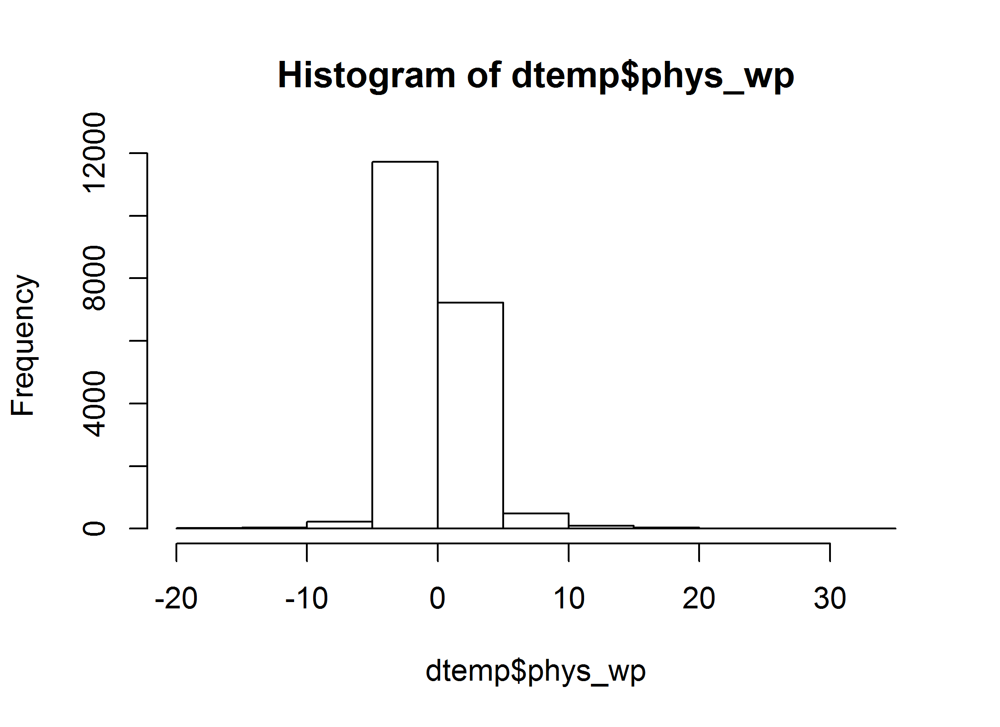
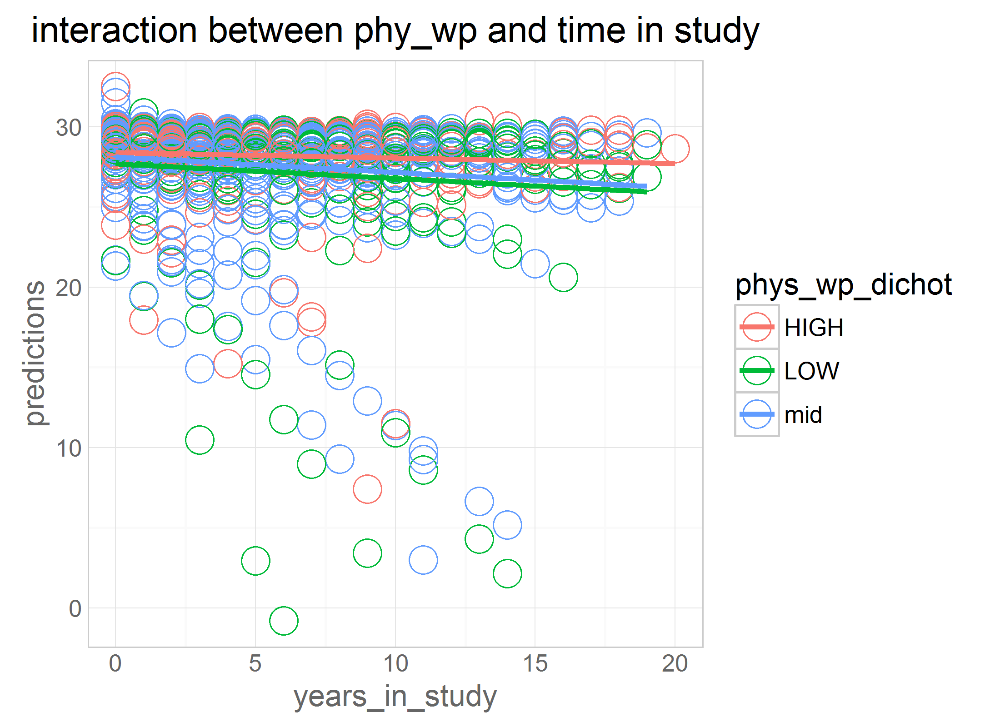
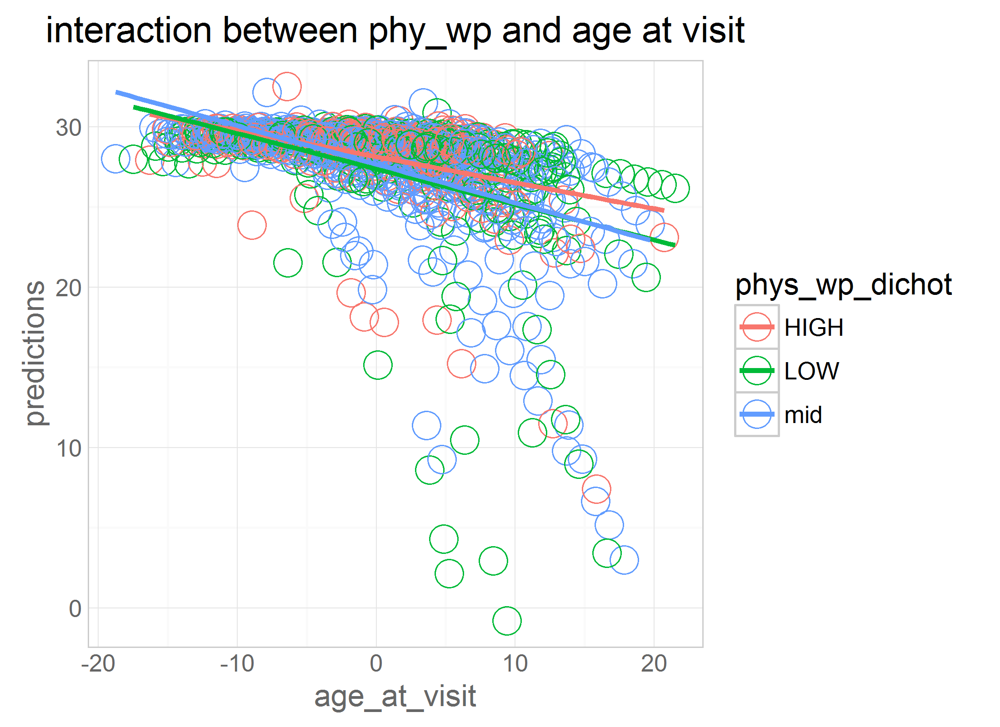
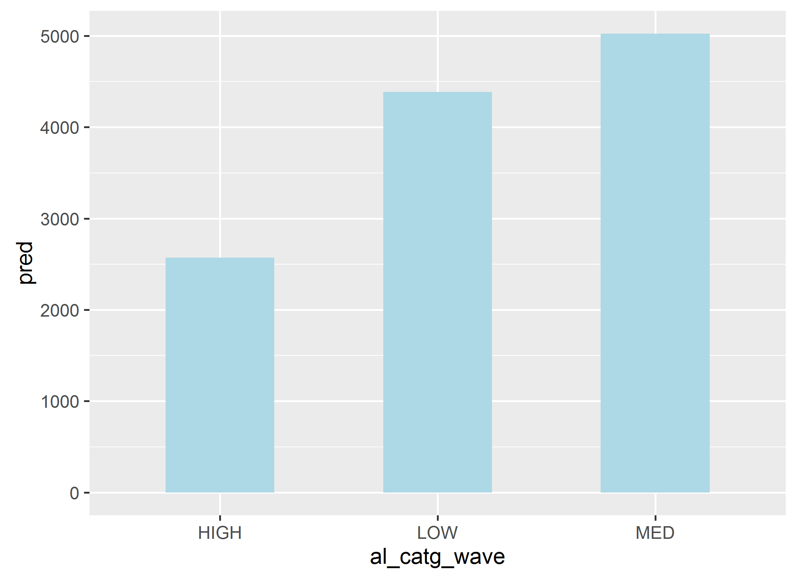
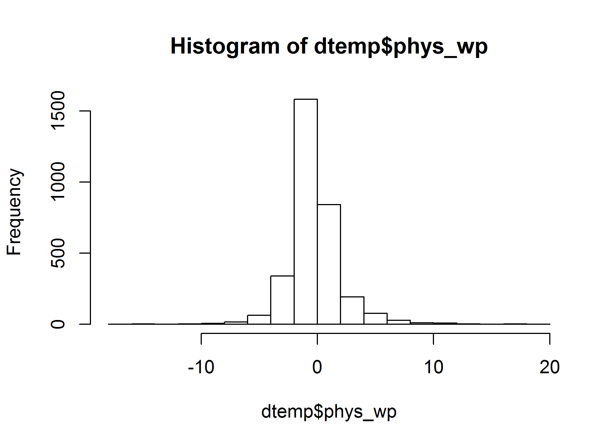

# dsb-map

<!-- These two chunks should be added in the beginning of every .Rmd that you want to source an .R script -->
<!--  The 1st mandatory chunck  -->
<!--  Set the working directory to the repository's base directory -->


<!--  The 2nd mandatory chunck  -->
<!-- Set the report-wide options, and point to the external code file. -->


```
[1] "C:/Users/Rebecca/Documents/GitHub/cognition-stress-activity"
```


```
[1] 76.53754
```

```
[1] 802
```

```
[1] 2039
```


# **confound Variables initial equations**

```r
eq_0 <- as.formula("dsb ~ 1 + full_year +             
                   (1 + full_year |id)")
###does the outcome change over time? i.e. if so, it makes sense to add predictors.

eq_1 <- as.formula("dsb ~ 1 + full_year + age_bl_centered +    
                   (1 + full_year |id)")

eq_2 <- as.formula("dsb ~ 1 + full_year + age_bl_centered + full_year:age_bl_centered + 
                   (1 + full_year |id)")

####main effect of time in study: when baseline age is at the mean (i.e. 0)
####main effects of age_bl: when year in study is 0 (i.e. at baseline)
####interactioin: Those who are older decline faster over time

eq_3 <- as.formula("dsb ~ 1 + full_year + age_bl_centered + full_year:age_bl_centered + edu +     
                   (1 + full_year |id)")


eq_3int <- as.formula("dsb ~ 1 + full_year + age_bl_centered + full_year:age_bl_centered + edu + full_year:edu +  
                   (1 + full_year |id)")
```

### full data set- confound models

```r
model_0<- lmerTest::lmer(eq_0, data=dwn, REML=TRUE) 
model_1<- lmerTest::lmer(eq_1, data=dwn, REML=TRUE) 
model_2<- lmerTest::lmer(eq_2, data=dwn, REML=TRUE) 
model_3<- lmerTest::lmer(eq_3, data=dwn, REML=TRUE) 
model_3int<- lmerTest::lmer(eq_3int, data=dwn, REML=TRUE) 

lmerTest::summary((model_0)) 
```

```
Linear mixed model fit by REML 
t-tests use  Satterthwaite approximations to degrees of freedom ['lmerMod']
Formula: dsb ~ 1 + full_year + (1 + full_year | id)
   Data: dwn

REML criterion at convergence: 76571.9

Scaled residuals: 
    Min      1Q  Median      3Q     Max 
-5.3228 -0.5739  0.0035  0.5736  4.9350 

Random effects:
 Groups   Name        Variance Std.Dev. Corr 
 id       (Intercept) 2.96650  1.7224        
          full_year   0.01312  0.1145   -0.04
 Residual             1.84383  1.3579        
Number of obs: 19998, groups:  id, 2841

Fixed effects:
              Estimate Std. Error         df t value Pr(>|t|)    
(Intercept)    6.19545    0.03619 2811.60000  171.17   <2e-16 ***
full_year     -0.09697    0.00439  962.50000  -22.09   <2e-16 ***
---
Signif. codes:  0 '***' 0.001 '**' 0.01 '*' 0.05 '.' 0.1 ' ' 1

Correlation of Fixed Effects:
          (Intr)
full_year -0.255
```

```r
lmerTest::summary((model_1)) 
```

```
Linear mixed model fit by REML 
t-tests use  Satterthwaite approximations to degrees of freedom ['lmerMod']
Formula: dsb ~ 1 + full_year + age_bl_centered + (1 + full_year | id)
   Data: dwn

REML criterion at convergence: 76444.5

Scaled residuals: 
    Min      1Q  Median      3Q     Max 
-5.3385 -0.5703  0.0056  0.5745  4.9377 

Random effects:
 Groups   Name        Variance Std.Dev. Corr 
 id       (Intercept) 2.86108  1.6915        
          full_year   0.01289  0.1135   -0.11
 Residual             1.84518  1.3584        
Number of obs: 19998, groups:  id, 2841

Fixed effects:
                  Estimate Std. Error         df t value Pr(>|t|)    
(Intercept)      6.308e+00  3.694e-02  2.767e+03  170.75   <2e-16 ***
full_year       -9.658e-02  4.359e-03  9.634e+02  -22.16   <2e-16 ***
age_bl_centered -5.239e-02  4.390e-03  2.838e+03  -11.93   <2e-16 ***
---
Signif. codes:  0 '***' 0.001 '**' 0.01 '*' 0.05 '.' 0.1 ' ' 1

Correlation of Fixed Effects:
            (Intr) fll_yr
full_year   -0.289       
ag_bl_cntrd -0.260  0.037
```

```r
lmerTest::summary((model_2)) 
```

```
Linear mixed model fit by REML 
t-tests use  Satterthwaite approximations to degrees of freedom ['lmerMod']
Formula: dsb ~ 1 + full_year + age_bl_centered + full_year:age_bl_centered +      (1 + full_year | id)
   Data: dwn

REML criterion at convergence: 76392.2

Scaled residuals: 
    Min      1Q  Median      3Q     Max 
-5.4027 -0.5730  0.0060  0.5804  4.9771 

Random effects:
 Groups   Name        Variance Std.Dev. Corr 
 id       (Intercept) 2.86359  1.692         
          full_year   0.01167  0.108    -0.10
 Residual             1.84458  1.358         
Number of obs: 19998, groups:  id, 2841

Fixed effects:
                            Estimate Std. Error         df t value Pr(>|t|)    
(Intercept)                6.303e+00  3.694e-02  2.766e+03 170.625  < 2e-16 ***
full_year                 -9.848e-02  4.266e-03  9.747e+02 -23.087  < 2e-16 ***
age_bl_centered           -4.181e-02  4.585e-03  2.875e+03  -9.119  < 2e-16 ***
full_year:age_bl_centered -4.893e-03  6.003e-04  1.164e+03  -8.151 8.88e-16 ***
---
Signif. codes:  0 '***' 0.001 '**' 0.01 '*' 0.05 '.' 0.1 ' ' 1

Correlation of Fixed Effects:
            (Intr) fll_yr ag_bl_
full_year   -0.284              
ag_bl_cntrd -0.252  0.017       
fll_yr:g_b_  0.012  0.066 -0.285
```

```r
lmerTest::summary((model_3)) 
```

```
Linear mixed model fit by REML 
t-tests use  Satterthwaite approximations to degrees of freedom ['lmerMod']
Formula: dsb ~ 1 + full_year + age_bl_centered + full_year:age_bl_centered +      edu + (1 + full_year | id)
   Data: dwn

REML criterion at convergence: 76238.7

Scaled residuals: 
    Min      1Q  Median      3Q     Max 
-5.4093 -0.5720  0.0076  0.5798  4.9946 

Random effects:
 Groups   Name        Variance Std.Dev. Corr 
 id       (Intercept) 2.66103  1.6313        
          full_year   0.01176  0.1085   -0.07
 Residual             1.84358  1.3578        
Number of obs: 19998, groups:  id, 2841

Fixed effects:
                            Estimate Std. Error         df t value Pr(>|t|)    
(Intercept)                4.417e+00  1.508e-01  2.868e+03  29.290  < 2e-16 ***
full_year                 -9.963e-02  4.277e-03  9.755e+02 -23.296  < 2e-16 ***
age_bl_centered           -3.217e-02  4.518e-03  2.906e+03  -7.121 1.35e-12 ***
edu                        1.163e-01  9.026e-03  2.833e+03  12.885  < 2e-16 ***
full_year:age_bl_centered -4.876e-03  6.018e-04  1.165e+03  -8.102 1.33e-15 ***
---
Signif. codes:  0 '***' 0.001 '**' 0.01 '*' 0.05 '.' 0.1 ' ' 1

Correlation of Fixed Effects:
            (Intr) fll_yr ag_bl_ edu   
full_year   -0.052                     
ag_bl_cntrd -0.220  0.011              
edu         -0.971 -0.015  0.166       
fll_yr:g_b_  0.001  0.065 -0.278  0.001
```

```r
lmerTest::summary((model_3int)) 
```

```
Linear mixed model fit by REML 
t-tests use  Satterthwaite approximations to degrees of freedom ['lmerMod']
Formula: dsb ~ 1 + full_year + age_bl_centered + full_year:age_bl_centered +  
    edu + full_year:edu + (1 + full_year | id)
   Data: dwn

REML criterion at convergence: 76242.9

Scaled residuals: 
    Min      1Q  Median      3Q     Max 
-5.4031 -0.5711  0.0080  0.5818  4.9814 

Random effects:
 Groups   Name        Variance Std.Dev. Corr 
 id       (Intercept) 2.6622   1.6316        
          full_year   0.0117   0.1082   -0.08
 Residual             1.8434   1.3577        
Number of obs: 19998, groups:  id, 2841

Fixed effects:
                            Estimate Std. Error         df t value Pr(>|t|)    
(Intercept)                4.298e+00  1.570e-01  2.897e+03  27.373  < 2e-16 ***
full_year                 -4.468e-02  2.052e-02  1.026e+03  -2.177  0.02970 *  
age_bl_centered           -3.140e-02  4.527e-03  2.897e+03  -6.936 4.96e-12 ***
edu                        1.235e-01  9.403e-03  2.868e+03  13.132  < 2e-16 ***
full_year:age_bl_centered -5.237e-03  6.156e-04  1.178e+03  -8.508  < 2e-16 ***
full_year:edu             -3.276e-03  1.199e-03  9.776e+02  -2.734  0.00638 ** 
---
Signif. codes:  0 '***' 0.001 '**' 0.01 '*' 0.05 '.' 0.1 ' ' 1

Correlation of Fixed Effects:
            (Intr) fll_yr ag_bl_ edu    fl_:__
full_year   -0.283                            
ag_bl_cntrd -0.228  0.064                     
edu         -0.974  0.272  0.176              
fll_yr:g_b_  0.061 -0.199 -0.285 -0.060       
full_year:d  0.279 -0.978 -0.063 -0.281  0.217
```

### male- confound models

```r
model_0<- lmerTest::lmer(eq_0, data=dwn_male, REML=TRUE) 
model_1<- lmerTest::lmer(eq_1, data=dwn_male, REML=TRUE) 
model_2<- lmerTest::lmer(eq_2, data=dwn_male, REML=TRUE) 
model_3<- lmerTest::lmer(eq_3, data=dwn_male, REML=TRUE) 
model_3int<- lmerTest::lmer(eq_3int, data=dwn_male, REML=TRUE) 

lmerTest::summary((model_0)) 
```

```
Linear mixed model fit by REML 
t-tests use  Satterthwaite approximations to degrees of freedom ['lmerMod']
Formula: dsb ~ 1 + full_year + (1 + full_year | id)
   Data: dwn_male

REML criterion at convergence: 21642.5

Scaled residuals: 
    Min      1Q  Median      3Q     Max 
-5.3381 -0.5666  0.0008  0.5840  5.0667 

Random effects:
 Groups   Name        Variance Std.Dev. Corr 
 id       (Intercept) 3.410834 1.84684       
          full_year   0.006554 0.08096  -0.20
 Residual             1.844705 1.35820       
Number of obs: 5667, groups:  id, 802

Fixed effects:
              Estimate Std. Error         df t value Pr(>|t|)    
(Intercept)   6.070520   0.071951 792.600000   84.37   <2e-16 ***
full_year    -0.075239   0.006977 234.300000  -10.78   <2e-16 ***
---
Signif. codes:  0 '***' 0.001 '**' 0.01 '*' 0.05 '.' 0.1 ' ' 1

Correlation of Fixed Effects:
          (Intr)
full_year -0.303
```

```r
lmerTest::summary((model_1)) 
```

```
Linear mixed model fit by REML 
t-tests use  Satterthwaite approximations to degrees of freedom ['lmerMod']
Formula: dsb ~ 1 + full_year + age_bl_centered + (1 + full_year | id)
   Data: dwn_male

REML criterion at convergence: 21587.2

Scaled residuals: 
    Min      1Q  Median      3Q     Max 
-5.3329 -0.5678  0.0028  0.5830  5.0733 

Random effects:
 Groups   Name        Variance Std.Dev. Corr 
 id       (Intercept) 3.159373 1.77746       
          full_year   0.006455 0.08035  -0.23
 Residual             1.844160 1.35800       
Number of obs: 5667, groups:  id, 802

Fixed effects:
                  Estimate Std. Error         df t value Pr(>|t|)    
(Intercept)       6.223744   0.072243 780.100000  86.150  < 2e-16 ***
full_year        -0.079228   0.006963 239.000000 -11.378  < 2e-16 ***
age_bl_centered  -0.070929   0.008784 810.900000  -8.075 2.44e-15 ***
---
Signif. codes:  0 '***' 0.001 '**' 0.01 '*' 0.05 '.' 0.1 ' ' 1

Correlation of Fixed Effects:
            (Intr) fll_yr
full_year   -0.331       
ag_bl_cntrd -0.262  0.091
```

```r
lmerTest::summary((model_2)) 
```

```
Linear mixed model fit by REML 
t-tests use  Satterthwaite approximations to degrees of freedom ['lmerMod']
Formula: dsb ~ 1 + full_year + age_bl_centered + full_year:age_bl_centered +      (1 + full_year | id)
   Data: dwn_male

REML criterion at convergence: 21597.2

Scaled residuals: 
    Min      1Q  Median      3Q     Max 
-5.3306 -0.5672  0.0023  0.5831  5.0820 

Random effects:
 Groups   Name        Variance Std.Dev. Corr 
 id       (Intercept) 3.159643 1.77754       
          full_year   0.006439 0.08025  -0.22
 Residual             1.843200 1.35764       
Number of obs: 5667, groups:  id, 802

Fixed effects:
                            Estimate Std. Error         df t value Pr(>|t|)    
(Intercept)                 6.224620   0.072244 782.000000  86.161  < 2e-16 ***
full_year                  -0.082003   0.007230 325.100000 -11.342  < 2e-16 ***
age_bl_centered            -0.067136   0.009218 811.700000  -7.283 7.72e-13 ***
full_year:age_bl_centered  -0.001435   0.001051 324.700000  -1.365    0.173    
---
Signif. codes:  0 '***' 0.001 '**' 0.01 '*' 0.05 '.' 0.1 ' ' 1

Correlation of Fixed Effects:
            (Intr) fll_yr ag_bl_
full_year   -0.317              
ag_bl_cntrd -0.248  0.001       
fll_yr:g_b_ -0.008  0.269 -0.300
```

```r
lmerTest::summary((model_3)) 
```

```
Linear mixed model fit by REML 
t-tests use  Satterthwaite approximations to degrees of freedom ['lmerMod']
Formula: dsb ~ 1 + full_year + age_bl_centered + full_year:age_bl_centered +      edu + (1 + full_year | id)
   Data: dwn_male

REML criterion at convergence: 21560.8

Scaled residuals: 
    Min      1Q  Median      3Q     Max 
-5.3405 -0.5709  0.0040  0.5882  5.1017 

Random effects:
 Groups   Name        Variance Std.Dev. Corr 
 id       (Intercept) 2.927304 1.71094       
          full_year   0.006606 0.08127  -0.15
 Residual             1.841340 1.35696       
Number of obs: 5667, groups:  id, 802

Fixed effects:
                            Estimate Std. Error         df t value Pr(>|t|)    
(Intercept)                 4.446049   0.275924 797.200000  16.113  < 2e-16 ***
full_year                  -0.083847   0.007291 323.500000 -11.500  < 2e-16 ***
age_bl_centered            -0.057478   0.009056 815.100000  -6.347 3.65e-10 ***
edu                         0.104378   0.015644 784.900000   6.672 4.77e-11 ***
full_year:age_bl_centered  -0.001548   0.001061 324.600000  -1.460    0.145    
---
Signif. codes:  0 '***' 0.001 '**' 0.01 '*' 0.05 '.' 0.1 ' ' 1

Correlation of Fixed Effects:
            (Intr) fll_yr ag_bl_ edu   
full_year   -0.052                     
ag_bl_cntrd -0.216 -0.010              
edu         -0.967 -0.025  0.159       
fll_yr:g_b_  0.008  0.267 -0.284 -0.012
```

```r
lmerTest::summary((model_3int)) 
```

```
Linear mixed model fit by REML 
t-tests use  Satterthwaite approximations to degrees of freedom ['lmerMod']
Formula: dsb ~ 1 + full_year + age_bl_centered + full_year:age_bl_centered +  
    edu + full_year:edu + (1 + full_year | id)
   Data: dwn_male

REML criterion at convergence: 21564.4

Scaled residuals: 
    Min      1Q  Median      3Q     Max 
-5.3278 -0.5747  0.0064  0.5885  5.0838 

Random effects:
 Groups   Name        Variance Std.Dev. Corr 
 id       (Intercept) 2.935383 1.71330       
          full_year   0.006235 0.07896  -0.17
 Residual             1.842447 1.35737       
Number of obs: 5667, groups:  id, 802

Fixed effects:
                            Estimate Std. Error         df t value Pr(>|t|)    
(Intercept)                 4.221320   0.288357 799.600000  14.639  < 2e-16 ***
full_year                  -0.003560   0.029938 214.800000  -0.119  0.90545    
age_bl_centered            -0.056180   0.009078 812.500000  -6.189 9.61e-10 ***
edu                         0.117422   0.016385 795.200000   7.166 1.76e-12 ***
full_year:age_bl_centered  -0.001932   0.001059 320.500000  -1.825  0.06895 .  
full_year:edu              -0.004578   0.001663 212.700000  -2.753  0.00642 ** 
---
Signif. codes:  0 '***' 0.001 '**' 0.01 '*' 0.05 '.' 0.1 ' ' 1

Correlation of Fixed Effects:
            (Intr) fll_yr ag_bl_ edu    fl_:__
full_year   -0.298                            
ag_bl_cntrd -0.222  0.051                     
edu         -0.970  0.287  0.168              
fll_yr:g_b_  0.049 -0.072 -0.294 -0.054       
full_year:d  0.294 -0.971 -0.055 -0.302  0.141
```

### female- confound models

```r
model_0<- lmerTest::lmer(eq_0, data=dwn_female, REML=TRUE) 
model_1<- lmerTest::lmer(eq_1, data=dwn_female, REML=TRUE) 
model_2<- lmerTest::lmer(eq_2, data=dwn_female, REML=TRUE) 
model_3<- lmerTest::lmer(eq_3, data=dwn_female, REML=TRUE) 
model_3int<- lmerTest::lmer(eq_3int, data=dwn_female, REML=TRUE) 


lmerTest::summary((model_0)) ####time in study is sig
```

```
Linear mixed model fit by REML 
t-tests use  Satterthwaite approximations to degrees of freedom ['lmerMod']
Formula: dsb ~ 1 + full_year + (1 + full_year | id)
   Data: dwn_female

REML criterion at convergence: 54905.8

Scaled residuals: 
    Min      1Q  Median      3Q     Max 
-5.3128 -0.5734  0.0030  0.5731  4.4601 

Random effects:
 Groups   Name        Variance Std.Dev. Corr 
 id       (Intercept) 2.79698  1.6724        
          full_year   0.01602  0.1266   -0.01
 Residual             1.84244  1.3574        
Number of obs: 14331, groups:  id, 2039

Fixed effects:
              Estimate Std. Error         df t value Pr(>|t|)    
(Intercept)  6.246e+00  4.176e-02  2.019e+03  149.58   <2e-16 ***
full_year   -1.058e-01  5.446e-03  7.565e+02  -19.43   <2e-16 ***
---
Signif. codes:  0 '***' 0.001 '**' 0.01 '*' 0.05 '.' 0.1 ' ' 1

Correlation of Fixed Effects:
          (Intr)
full_year -0.245
```

```r
lmerTest::summary((model_1)) #### "" + age at baseline 
```

```
Linear mixed model fit by REML 
t-tests use  Satterthwaite approximations to degrees of freedom ['lmerMod']
Formula: dsb ~ 1 + full_year + age_bl_centered + (1 + full_year | id)
   Data: dwn_female

REML criterion at convergence: 54839.5

Scaled residuals: 
    Min      1Q  Median      3Q     Max 
-5.3274 -0.5737  0.0055  0.5703  4.4192 

Random effects:
 Groups   Name        Variance Std.Dev. Corr 
 id       (Intercept) 2.73041  1.6524        
          full_year   0.01581  0.1258   -0.08
 Residual             1.84380  1.3579        
Number of obs: 14331, groups:  id, 2039

Fixed effects:
                  Estimate Std. Error         df t value Pr(>|t|)    
(Intercept)      6.342e+00  4.283e-02  1.988e+03 148.073   <2e-16 ***
full_year       -1.047e-01  5.416e-03  7.568e+02 -19.328   <2e-16 ***
age_bl_centered -4.476e-02  5.046e-03  2.031e+03  -8.871   <2e-16 ***
---
Signif. codes:  0 '***' 0.001 '**' 0.01 '*' 0.05 '.' 0.1 ' ' 1

Correlation of Fixed Effects:
            (Intr) fll_yr
full_year   -0.276       
ag_bl_cntrd -0.259  0.024
```

```r
lmerTest::summary((model_2)) #### "" + interaction - those who are older decline faster over time
```

```
Linear mixed model fit by REML 
t-tests use  Satterthwaite approximations to degrees of freedom ['lmerMod']
Formula: dsb ~ 1 + full_year + age_bl_centered + full_year:age_bl_centered +      (1 + full_year | id)
   Data: dwn_female

REML criterion at convergence: 54786.3

Scaled residuals: 
    Min      1Q  Median      3Q     Max 
-5.3443 -0.5718  0.0026  0.5767  4.4040 

Random effects:
 Groups   Name        Variance Std.Dev. Corr 
 id       (Intercept) 2.73534  1.6539        
          full_year   0.01386  0.1177   -0.08
 Residual             1.84409  1.3580        
Number of obs: 14331, groups:  id, 2039

Fixed effects:
                            Estimate Std. Error         df t value Pr(>|t|)    
(Intercept)                6.333e+00  4.285e-02  1.986e+03 147.822  < 2e-16 ***
full_year                 -1.038e-01  5.238e-03  7.181e+02 -19.820  < 2e-16 ***
age_bl_centered           -3.283e-02  5.262e-03  2.066e+03  -6.239 5.32e-10 ***
full_year:age_bl_centered -5.959e-03  7.254e-04  8.916e+02  -8.215 8.88e-16 ***
---
Signif. codes:  0 '***' 0.001 '**' 0.01 '*' 0.05 '.' 0.1 ' ' 1

Correlation of Fixed Effects:
            (Intr) fll_yr ag_bl_
full_year   -0.276              
ag_bl_cntrd -0.255  0.024       
fll_yr:g_b_  0.020  0.001 -0.283
```

```r
lmerTest::summary((model_3)) #### "" + edu and gender are sig
```

```
Linear mixed model fit by REML 
t-tests use  Satterthwaite approximations to degrees of freedom ['lmerMod']
Formula: dsb ~ 1 + full_year + age_bl_centered + full_year:age_bl_centered +      edu + (1 + full_year | id)
   Data: dwn_female

REML criterion at convergence: 54667.1

Scaled residuals: 
    Min      1Q  Median      3Q     Max 
-5.3509 -0.5707  0.0039  0.5765  4.4093 

Random effects:
 Groups   Name        Variance Std.Dev. Corr 
 id       (Intercept) 2.52821  1.5900        
          full_year   0.01395  0.1181   -0.05
 Residual             1.84302  1.3576        
Number of obs: 14331, groups:  id, 2039

Fixed effects:
                            Estimate Std. Error         df t value Pr(>|t|)    
(Intercept)                4.303e+00  1.828e-01  2.074e+03  23.543  < 2e-16 ***
full_year                 -1.048e-01  5.249e-03  7.178e+02 -19.966  < 2e-16 ***
age_bl_centered           -2.273e-02  5.181e-03  2.093e+03  -4.388 1.20e-05 ***
edu                        1.278e-01  1.119e-02  2.049e+03  11.418  < 2e-16 ***
full_year:age_bl_centered -5.915e-03  7.269e-04  8.903e+02  -8.138 1.33e-15 ***
---
Signif. codes:  0 '***' 0.001 '**' 0.01 '*' 0.05 '.' 0.1 ' ' 1

Correlation of Fixed Effects:
            (Intr) fll_yr ag_bl_ edu   
full_year   -0.051                     
ag_bl_cntrd -0.224  0.020              
edu         -0.974 -0.011  0.171       
fll_yr:g_b_  0.000  0.001 -0.277  0.004
```

```r
lmerTest::summary((model_3int)) #### interaction between time and education not sig
```

```
Linear mixed model fit by REML 
t-tests use  Satterthwaite approximations to degrees of freedom ['lmerMod']
Formula: dsb ~ 1 + full_year + age_bl_centered + full_year:age_bl_centered +  
    edu + full_year:edu + (1 + full_year | id)
   Data: dwn_female

REML criterion at convergence: 54674.2

Scaled residuals: 
    Min      1Q  Median      3Q     Max 
-5.3401 -0.5697  0.0034  0.5770  4.4091 

Random effects:
 Groups   Name        Variance Std.Dev. Corr 
 id       (Intercept) 2.528    1.5900        
          full_year   0.014    0.1183   -0.06
 Residual             1.842    1.3574        
Number of obs: 14331, groups:  id, 2039

Fixed effects:
                            Estimate Std. Error         df t value Pr(>|t|)    
(Intercept)                4.198e+00  1.903e-01  2.106e+03  22.065  < 2e-16 ***
full_year                 -5.238e-02  2.701e-02  8.624e+02  -1.939   0.0528 .  
age_bl_centered           -2.205e-02  5.192e-03  2.088e+03  -4.248 2.26e-05 ***
edu                        1.342e-01  1.165e-02  2.080e+03  11.519  < 2e-16 ***
full_year:age_bl_centered -6.271e-03  7.491e-04  9.120e+02  -8.372 2.22e-16 ***
full_year:edu             -3.186e-03  1.610e-03  8.086e+02  -1.979   0.0482 *  
---
Signif. codes:  0 '***' 0.001 '**' 0.01 '*' 0.05 '.' 0.1 ' ' 1

Correlation of Fixed Effects:
            (Intr) fll_yr ag_bl_ edu    fl_:__
full_year   -0.283                            
ag_bl_cntrd -0.233  0.069                     
edu         -0.976  0.271  0.183              
fll_yr:g_b_  0.067 -0.235 -0.285 -0.063       
full_year:d  0.279 -0.981 -0.066 -0.278  0.240
```

```r
#adding exposure variables
```

# **raw physical activity**

```r
eq_3raw <- as.formula("dsb ~ 1 + full_year + age_bl_centered + full_year:age_bl_centered + edu + physical_activity +
                   (1 + full_year |id)")
```

### full data set - Raw PA

```r
model_rawm<- lmerTest::lmer(eq_3raw, data=dwn, REML=TRUE) 
lmerTest::summary((model_rawm)) #raw PA is sig for males  
```

```
Linear mixed model fit by REML 
t-tests use  Satterthwaite approximations to degrees of freedom ['lmerMod']
Formula: dsb ~ 1 + full_year + age_bl_centered + full_year:age_bl_centered +  
    edu + physical_activity + (1 + full_year | id)
   Data: dwn

REML criterion at convergence: 76232.8

Scaled residuals: 
    Min      1Q  Median      3Q     Max 
-5.4171 -0.5704  0.0066  0.5806  4.9542 

Random effects:
 Groups   Name        Variance Std.Dev. Corr 
 id       (Intercept) 2.66459  1.632         
          full_year   0.01167  0.108    -0.08
 Residual             1.84289  1.358         
Number of obs: 19998, groups:  id, 2841

Fixed effects:
                            Estimate Std. Error         df t value Pr(>|t|)    
(Intercept)                4.375e+00  1.512e-01  2.898e+03  28.944  < 2e-16 ***
full_year                 -9.805e-02  4.282e-03  9.860e+02 -22.897  < 2e-16 ***
age_bl_centered           -3.191e-02  4.520e-03  2.907e+03  -7.060 2.07e-12 ***
edu                        1.160e-01  9.021e-03  2.833e+03  12.863  < 2e-16 ***
physical_activity          1.530e-02  3.920e-03  1.918e+04   3.904 9.50e-05 ***
full_year:age_bl_centered -4.780e-03  6.009e-04  1.168e+03  -7.955 4.22e-15 ***
---
Signif. codes:  0 '***' 0.001 '**' 0.01 '*' 0.05 '.' 0.1 ' ' 1

Correlation of Fixed Effects:
            (Intr) fll_yr ag_bl_ edu    physc_
full_year   -0.058                            
ag_bl_cntrd -0.220  0.013                     
edu         -0.968 -0.016  0.166              
physcl_ctvt -0.074  0.085  0.015 -0.004       
fll_yr:g_b_ -0.002  0.069 -0.280  0.001  0.039
```

### males - Raw PA

```r
model_rawm<- lmerTest::lmer(eq_3raw, data=dwn_male, REML=TRUE) 
lmerTest::summary((model_rawm)) #raw PA is sig for males
```

```
Linear mixed model fit by REML 
t-tests use  Satterthwaite approximations to degrees of freedom ['lmerMod']
Formula: dsb ~ 1 + full_year + age_bl_centered + full_year:age_bl_centered +  
    edu + physical_activity + (1 + full_year | id)
   Data: dwn_male

REML criterion at convergence: 21564.5

Scaled residuals: 
    Min      1Q  Median      3Q     Max 
-5.3236 -0.5639  0.0038  0.5897  5.0602 

Random effects:
 Groups   Name        Variance Std.Dev. Corr 
 id       (Intercept) 2.929135 1.71147       
          full_year   0.006622 0.08138  -0.17
 Residual             1.840607 1.35669       
Number of obs: 5667, groups:  id, 802

Fixed effects:
                            Estimate Std. Error         df t value Pr(>|t|)    
(Intercept)                4.398e+00  2.767e-01  8.090e+02  15.899  < 2e-16 ***
full_year                 -8.198e-02  7.332e-03  3.300e+02 -11.181  < 2e-16 ***
age_bl_centered           -5.712e-02  9.060e-03  8.160e+02  -6.305 4.72e-10 ***
edu                        1.043e-01  1.562e-02  7.840e+02   6.673 4.73e-11 ***
physical_activity          1.436e-02  6.764e-03  5.340e+03   2.122   0.0338 *  
full_year:age_bl_centered -1.428e-03  1.061e-03  3.270e+02  -1.346   0.1793    
---
Signif. codes:  0 '***' 0.001 '**' 0.01 '*' 0.05 '.' 0.1 ' ' 1

Correlation of Fixed Effects:
            (Intr) fll_yr ag_bl_ edu    physc_
full_year   -0.062                            
ag_bl_cntrd -0.216 -0.007                     
edu         -0.964 -0.025  0.159              
physcl_ctvt -0.088  0.110  0.020  0.004       
fll_yr:g_b_  0.004  0.270 -0.287 -0.012  0.048
```

### females -Raw PA

```r
model_rawf<- lmerTest::lmer(eq_3raw, data=dwn_female, REML=TRUE) 
lmerTest::summary((model_rawf)) #raw PA is sig for females 
```

```
Linear mixed model fit by REML 
t-tests use  Satterthwaite approximations to degrees of freedom ['lmerMod']
Formula: dsb ~ 1 + full_year + age_bl_centered + full_year:age_bl_centered +  
    edu + physical_activity + (1 + full_year | id)
   Data: dwn_female

REML criterion at convergence: 54664.6

Scaled residuals: 
    Min      1Q  Median      3Q     Max 
-5.3609 -0.5689  0.0029  0.5758  4.3812 

Random effects:
 Groups   Name        Variance Std.Dev. Corr 
 id       (Intercept) 2.53118  1.5910        
          full_year   0.01379  0.1175   -0.06
 Residual             1.84252  1.3574        
Number of obs: 14331, groups:  id, 2039

Fixed effects:
                            Estimate Std. Error         df t value Pr(>|t|)    
(Intercept)                4.259e+00  1.832e-01  2.094e+03  23.251  < 2e-16 ***
full_year                 -1.033e-01  5.248e-03  7.220e+02 -19.687  < 2e-16 ***
age_bl_centered           -2.251e-02  5.183e-03  2.094e+03  -4.342 1.48e-05 ***
edu                        1.276e-01  1.119e-02  2.049e+03  11.407  < 2e-16 ***
physical_activity          1.622e-02  4.799e-03  1.372e+04   3.381 0.000725 ***
full_year:age_bl_centered -5.822e-03  7.252e-04  8.910e+02  -8.028 3.11e-15 ***
---
Signif. codes:  0 '***' 0.001 '**' 0.01 '*' 0.05 '.' 0.1 ' ' 1

Correlation of Fixed Effects:
            (Intr) fll_yr ag_bl_ edu    physc_
full_year   -0.056                            
ag_bl_cntrd -0.224  0.021                     
edu         -0.971 -0.012  0.171              
physcl_ctvt -0.072  0.075  0.013 -0.002       
fll_yr:g_b_ -0.002  0.004 -0.278  0.004  0.037
```

```r
#between person and within person effects 
```


# **Between-and-within-effects**


```r
eq_5 <- as.formula("dsb ~ 1 + full_year + age_bl_centered + full_year:age_bl_centered + edu + phys_bp_median  +
                   (1 + full_year |id)")
####bp effects: are people with higher values than other people (on average, over time)
####also higher in dsb (on average over time) (hoffman pdf page 72)

eq_6 <- as.formula("dsb ~ 1 + full_year + age_bl_centered + full_year:age_bl_centered + edu + phys_bp_median  + phys_wp +
                   (1 + full_year |id)")
```


### full- bp and wp

```r
model_5<- lmerTest::lmer(eq_5, data=dwn, REML=TRUE) 
model_6<- lmerTest::lmer(eq_6, data=dwn, REML=TRUE) 

lmerTest::summary((model_5))  #NS between person effects 
```

```
Linear mixed model fit by REML 
t-tests use  Satterthwaite approximations to degrees of freedom ['lmerMod']
Formula: dsb ~ 1 + full_year + age_bl_centered + full_year:age_bl_centered +  
    edu + phys_bp_median + (1 + full_year | id)
   Data: dwn

REML criterion at convergence: 76241.6

Scaled residuals: 
    Min      1Q  Median      3Q     Max 
-5.4062 -0.5724  0.0086  0.5791  4.9912 

Random effects:
 Groups   Name        Variance Std.Dev. Corr 
 id       (Intercept) 2.66427  1.6323        
          full_year   0.01173  0.1083   -0.08
 Residual             1.84380  1.3579        
Number of obs: 19998, groups:  id, 2841

Fixed effects:
                            Estimate Std. Error         df t value Pr(>|t|)    
(Intercept)                4.405e+00  1.509e-01  2.867e+03  29.196  < 2e-16 ***
full_year                 -9.933e-02  4.273e-03  9.754e+02 -23.246  < 2e-16 ***
age_bl_centered           -3.167e-02  4.527e-03  2.902e+03  -6.996 3.25e-12 ***
edu                        1.161e-01  9.021e-03  2.831e+03  12.865  < 2e-16 ***
phys_bp_median             2.619e-02  1.315e-02  2.941e+03   1.992   0.0465 *  
full_year:age_bl_centered -4.867e-03  6.012e-04  1.164e+03  -8.096 1.33e-15 ***
---
Signif. codes:  0 '***' 0.001 '**' 0.01 '*' 0.05 '.' 0.1 ' ' 1

Correlation of Fixed Effects:
            (Intr) fll_yr ag_bl_ edu    phys__
full_year   -0.053                            
ag_bl_cntrd -0.222  0.013                     
edu         -0.970 -0.016  0.165              
phys_bp_mdn -0.045  0.016  0.057 -0.008       
fll_yr:g_b_  0.001  0.065 -0.280  0.001  0.003
```

```r
lmerTest::summary((model_6)) #WP effects are sig (those who walk
```

```
Linear mixed model fit by REML 
t-tests use  Satterthwaite approximations to degrees of freedom ['lmerMod']
Formula: dsb ~ 1 + full_year + age_bl_centered + full_year:age_bl_centered +  
    edu + phys_bp_median + phys_wp + (1 + full_year | id)
   Data: dwn

REML criterion at convergence: 76238.3

Scaled residuals: 
    Min      1Q  Median      3Q     Max 
-5.4152 -0.5707  0.0062  0.5806  4.9552 

Random effects:
 Groups   Name        Variance Std.Dev. Corr 
 id       (Intercept) 2.66720  1.633         
          full_year   0.01166  0.108    -0.09
 Residual             1.84300  1.358         
Number of obs: 19998, groups:  id, 2841

Fixed effects:
                            Estimate Std. Error         df t value Pr(>|t|)    
(Intercept)                4.404e+00  1.509e-01  2.868e+03  29.189  < 2e-16 ***
full_year                 -9.795e-02  4.282e-03  9.860e+02 -22.877  < 2e-16 ***
age_bl_centered           -3.183e-02  4.529e-03  2.903e+03  -7.028  2.6e-12 ***
edu                        1.159e-01  9.021e-03  2.832e+03  12.843  < 2e-16 ***
phys_bp_median             2.624e-02  1.315e-02  2.942e+03   1.996 0.046079 *  
phys_wp                    1.455e-02  4.111e-03  1.723e+04   3.539 0.000403 ***
full_year:age_bl_centered -4.779e-03  6.006e-04  1.168e+03  -7.957  4.0e-15 ***
---
Signif. codes:  0 '***' 0.001 '**' 0.01 '*' 0.05 '.' 0.1 ' ' 1

Correlation of Fixed Effects:
            (Intr) fll_yr ag_bl_ edu    phys__ phys_w
full_year   -0.053                                   
ag_bl_cntrd -0.222  0.012                            
edu         -0.970 -0.016  0.165                     
phys_bp_mdn -0.045  0.016  0.057 -0.008              
phys_wp     -0.003  0.086 -0.010 -0.005 -0.002       
fll_yr:g_b_  0.001  0.069 -0.281  0.001  0.003  0.040
```
### male -bp and wp

```r
model_5<- lmerTest::lmer(eq_5, data=dwn_male, REML=TRUE) 
model_6<- lmerTest::lmer(eq_6, data=dwn_male, REML=TRUE) 

lmerTest::summary((model_5))  #NS between person effects 
```

```
Linear mixed model fit by REML 
t-tests use  Satterthwaite approximations to degrees of freedom ['lmerMod']
Formula: dsb ~ 1 + full_year + age_bl_centered + full_year:age_bl_centered +  
    edu + phys_bp_median + (1 + full_year | id)
   Data: dwn_male

REML criterion at convergence: 21562.7

Scaled residuals: 
    Min      1Q  Median      3Q     Max 
-5.3355 -0.5691  0.0036  0.5874  5.0969 

Random effects:
 Groups   Name        Variance Std.Dev. Corr 
 id       (Intercept) 2.927774 1.71107       
          full_year   0.006567 0.08104  -0.17
 Residual             1.841863 1.35715       
Number of obs: 5667, groups:  id, 802

Fixed effects:
                            Estimate Std. Error         df t value Pr(>|t|)    
(Intercept)                 4.402745   0.276471 796.500000  15.925  < 2e-16 ***
full_year                  -0.083492   0.007275 325.300000 -11.476  < 2e-16 ***
age_bl_centered            -0.056330   0.009076 813.400000  -6.206 8.64e-10 ***
edu                         0.104459   0.015610 782.800000   6.692 4.20e-11 ***
phys_bp_median              0.045615   0.023080 807.700000   1.976   0.0485 *  
full_year:age_bl_centered  -0.001529   0.001058 326.200000  -1.446   0.1492    
---
Signif. codes:  0 '***' 0.001 '**' 0.01 '*' 0.05 '.' 0.1 ' ' 1

Correlation of Fixed Effects:
            (Intr) fll_yr ag_bl_ edu    phys__
full_year   -0.053                            
ag_bl_cntrd -0.220 -0.008                     
edu         -0.964 -0.026  0.159              
phys_bp_mdn -0.091  0.007  0.067  0.015       
fll_yr:g_b_  0.008  0.267 -0.290 -0.012 -0.001
```

```r
lmerTest::summary((model_6)) #WP effects are sig (those who walk higher than average have higher dsb scores at that time)
```

```
Linear mixed model fit by REML 
t-tests use  Satterthwaite approximations to degrees of freedom ['lmerMod']
Formula: dsb ~ 1 + full_year + age_bl_centered + full_year:age_bl_centered +  
    edu + phys_bp_median + phys_wp + (1 + full_year | id)
   Data: dwn_male

REML criterion at convergence: 21567.8

Scaled residuals: 
    Min      1Q  Median      3Q     Max 
-5.3221 -0.5664  0.0039  0.5877  5.0634 

Random effects:
 Groups   Name        Variance Std.Dev. Corr 
 id       (Intercept) 2.931768 1.71224       
          full_year   0.006592 0.08119  -0.18
 Residual             1.841009 1.35684       
Number of obs: 5667, groups:  id, 802

Fixed effects:
                            Estimate Std. Error         df t value Pr(>|t|)    
(Intercept)                4.402e+00  2.764e-01  7.970e+02  15.925  < 2e-16 ***
full_year                 -8.196e-02  7.325e-03  3.320e+02 -11.190  < 2e-16 ***
age_bl_centered           -5.645e-02  9.081e-03  8.130e+02  -6.216 8.13e-10 ***
edu                        1.042e-01  1.561e-02  7.830e+02   6.676 4.65e-11 ***
phys_bp_median             4.586e-02  2.308e-02  8.080e+02   1.987   0.0472 *  
phys_wp                    1.218e-02  7.069e-03  4.761e+03   1.723   0.0849 .  
full_year:age_bl_centered -1.431e-03  1.059e-03  3.280e+02  -1.351   0.1777    
---
Signif. codes:  0 '***' 0.001 '**' 0.01 '*' 0.05 '.' 0.1 ' ' 1

Correlation of Fixed Effects:
            (Intr) fll_yr ag_bl_ edu    phys__ phys_w
full_year   -0.054                                   
ag_bl_cntrd -0.220 -0.008                            
edu         -0.964 -0.027  0.159                     
phys_bp_mdn -0.091  0.007  0.066  0.016              
phys_wp     -0.004  0.116 -0.007 -0.006  0.003       
fll_yr:g_b_  0.008  0.270 -0.292 -0.012 -0.001  0.051
```
### female - bp and wp

```r
model_5<- lmerTest::lmer(eq_5, data=dwn_female, REML=TRUE) #NS between person effects
model_6<- lmerTest::lmer(eq_6, data=dwn_female, REML=TRUE) #NS between person and within person effects for females! 

lmerTest::summary((model_5)) #bp sig at .1
```

```
Linear mixed model fit by REML 
t-tests use  Satterthwaite approximations to degrees of freedom ['lmerMod']
Formula: dsb ~ 1 + full_year + age_bl_centered + full_year:age_bl_centered +  
    edu + phys_bp_median + (1 + full_year | id)
   Data: dwn_female

REML criterion at convergence: 54671.8

Scaled residuals: 
    Min      1Q  Median      3Q     Max 
-5.3487 -0.5710  0.0050  0.5769  4.4106 

Random effects:
 Groups   Name        Variance Std.Dev. Corr 
 id       (Intercept) 2.53190  1.591         
          full_year   0.01393  0.118    -0.06
 Residual             1.84315  1.358         
Number of obs: 14331, groups:  id, 2039

Fixed effects:
                            Estimate Std. Error         df t value Pr(>|t|)    
(Intercept)                4.294e+00  1.829e-01  2.073e+03  23.482  < 2e-16 ***
full_year                 -1.046e-01  5.247e-03  7.175e+02 -19.927  < 2e-16 ***
age_bl_centered           -2.237e-02  5.191e-03  2.090e+03  -4.308 1.72e-05 ***
edu                        1.277e-01  1.119e-02  2.048e+03  11.410  < 2e-16 ***
phys_bp_median             2.108e-02  1.600e-02  2.134e+03   1.317    0.188    
full_year:age_bl_centered -5.911e-03  7.264e-04  8.898e+02  -8.137 1.33e-15 ***
---
Signif. codes:  0 '***' 0.001 '**' 0.01 '*' 0.05 '.' 0.1 ' ' 1

Correlation of Fixed Effects:
            (Intr) fll_yr ag_bl_ edu    phys__
full_year   -0.052                            
ag_bl_cntrd -0.225  0.021                     
edu         -0.973 -0.012  0.171              
phys_bp_mdn -0.039  0.018  0.054 -0.003       
fll_yr:g_b_  0.000  0.001 -0.279  0.004  0.004
```

```r
lmerTest::summary((model_6)) #wp sig at .1
```

```
Linear mixed model fit by REML 
t-tests use  Satterthwaite approximations to degrees of freedom ['lmerMod']
Formula: dsb ~ 1 + full_year + age_bl_centered + full_year:age_bl_centered +  
    edu + phys_bp_median + phys_wp + (1 + full_year | id)
   Data: dwn_female

REML criterion at convergence: 54670.8

Scaled residuals: 
    Min      1Q  Median      3Q     Max 
-5.3600 -0.5694  0.0038  0.5758  4.3822 

Random effects:
 Groups   Name        Variance Std.Dev. Corr 
 id       (Intercept) 2.53372  1.5918        
          full_year   0.01379  0.1174   -0.06
 Residual             1.84258  1.3574        
Number of obs: 14331, groups:  id, 2039

Fixed effects:
                            Estimate Std. Error         df t value Pr(>|t|)    
(Intercept)                4.293e+00  1.829e-01  2.073e+03  23.473  < 2e-16 ***
full_year                 -1.032e-01  5.248e-03  7.220e+02 -19.672  < 2e-16 ***
age_bl_centered           -2.255e-02  5.193e-03  2.091e+03  -4.343 1.47e-05 ***
edu                        1.275e-01  1.119e-02  2.048e+03  11.397  < 2e-16 ***
phys_bp_median             2.090e-02  1.600e-02  2.134e+03   1.306  0.19167    
phys_wp                    1.581e-02  5.042e-03  1.236e+04   3.135  0.00172 ** 
full_year:age_bl_centered -5.823e-03  7.252e-04  8.910e+02  -8.029 3.11e-15 ***
---
Signif. codes:  0 '***' 0.001 '**' 0.01 '*' 0.05 '.' 0.1 ' ' 1

Correlation of Fixed Effects:
            (Intr) fll_yr ag_bl_ edu    phys__ phys_w
full_year   -0.052                                   
ag_bl_cntrd -0.225  0.020                            
edu         -0.973 -0.012  0.171                     
phys_bp_mdn -0.039  0.018  0.054 -0.003              
phys_wp     -0.004  0.076 -0.011 -0.003 -0.006       
fll_yr:g_b_  0.000  0.004 -0.279  0.004  0.003  0.038
```

```r
#allowing the effect of the TVC to vary over tiem (interaction term) -page 171 singer and willett
```


# **TVC-interaction**


### physical activity (TVC) interaction with time equation

```r
eq_tv_intxn <- as.formula("dsb ~ 1 + full_year + age_bl_centered + full_year:age_bl_centered + edu + phys_bp_median  + phys_wp + phys_wp:full_year +
                          (1 + full_year |id)")
```

### full - tvc interaction

```r
model_tv_intx<- lmerTest::lmer(eq_tv_intxn, data=dwn, REML=TRUE) #significant interaction term
lmerTest::summary((model_tv_intx)) 
```

```
Linear mixed model fit by REML 
t-tests use  Satterthwaite approximations to degrees of freedom ['lmerMod']
Formula: dsb ~ 1 + full_year + age_bl_centered + full_year:age_bl_centered +  
    edu + phys_bp_median + phys_wp + phys_wp:full_year + (1 +      full_year | id)
   Data: dwn

REML criterion at convergence: 76247

Scaled residuals: 
    Min      1Q  Median      3Q     Max 
-5.4190 -0.5721  0.0070  0.5791  4.9599 

Random effects:
 Groups   Name        Variance Std.Dev. Corr 
 id       (Intercept) 2.66639  1.6329        
          full_year   0.01169  0.1081   -0.09
 Residual             1.84267  1.3575        
Number of obs: 19998, groups:  id, 2841

Fixed effects:
                            Estimate Std. Error         df t value Pr(>|t|)    
(Intercept)                4.405e+00  1.509e-01  2.868e+03  29.195  < 2e-16 ***
full_year                 -9.787e-02  4.284e-03  9.880e+02 -22.846  < 2e-16 ***
age_bl_centered           -3.176e-02  4.528e-03  2.903e+03  -7.014 2.88e-12 ***
edu                        1.159e-01  9.019e-03  2.832e+03  12.847  < 2e-16 ***
phys_bp_median             2.626e-02  1.315e-02  2.942e+03   1.998   0.0458 *  
phys_wp                    5.882e-03  6.295e-03  1.717e+04   0.934   0.3501    
full_year:age_bl_centered -4.794e-03  6.010e-04  1.168e+03  -7.977 3.55e-15 ***
full_year:phys_wp          1.751e-03  9.632e-04  1.730e+04   1.818   0.0691 .  
---
Signif. codes:  0 '***' 0.001 '**' 0.01 '*' 0.05 '.' 0.1 ' ' 1

Correlation of Fixed Effects:
            (Intr) fll_yr ag_bl_ edu    phys__ phys_w fl_:__
full_year   -0.053                                          
ag_bl_cntrd -0.222  0.012                                   
edu         -0.970 -0.016  0.165                            
phys_bp_mdn -0.045  0.016  0.057 -0.008                     
phys_wp     -0.003  0.048 -0.013 -0.004 -0.002              
fll_yr:g_b_  0.001  0.069 -0.282  0.001  0.003  0.036       
fll_yr:phy_  0.001  0.011  0.008  0.001  0.001 -0.757 -0.013
```
### male - tvc interaction

```r
model_tv_intx<- lmerTest::lmer(eq_tv_intxn, data=dwn_male, REML=TRUE) #significant interaction term
lmerTest::summary((model_tv_intx)) 
```

```
Linear mixed model fit by REML 
t-tests use  Satterthwaite approximations to degrees of freedom ['lmerMod']
Formula: dsb ~ 1 + full_year + age_bl_centered + full_year:age_bl_centered +  
    edu + phys_bp_median + phys_wp + phys_wp:full_year + (1 +      full_year | id)
   Data: dwn_male

REML criterion at convergence: 21572.5

Scaled residuals: 
    Min      1Q  Median      3Q     Max 
-5.3204 -0.5685  0.0061  0.5821  5.0788 

Random effects:
 Groups   Name        Variance Std.Dev. Corr 
 id       (Intercept) 2.929637 1.712         
          full_year   0.006724 0.082    -0.18
 Residual             1.838139 1.356         
Number of obs: 5667, groups:  id, 802

Fixed effects:
                            Estimate Std. Error         df t value Pr(>|t|)    
(Intercept)                4.401e+00  2.763e-01  7.960e+02  15.926  < 2e-16 ***
full_year                 -8.173e-02  7.348e-03  3.330e+02 -11.123  < 2e-16 ***
age_bl_centered           -5.620e-02  9.078e-03  8.130e+02  -6.191 9.46e-10 ***
edu                        1.044e-01  1.560e-02  7.830e+02   6.691 4.22e-11 ***
phys_bp_median             4.568e-02  2.307e-02  8.080e+02   1.980   0.0480 *  
phys_wp                   -8.297e-03  1.076e-02  4.912e+03  -0.771   0.4405    
full_year:age_bl_centered -1.504e-03  1.063e-03  3.290e+02  -1.415   0.1580    
full_year:phys_wp          3.891e-03  1.540e-03  4.897e+03   2.526   0.0116 *  
---
Signif. codes:  0 '***' 0.001 '**' 0.01 '*' 0.05 '.' 0.1 ' ' 1

Correlation of Fixed Effects:
            (Intr) fll_yr ag_bl_ edu    phys__ phys_w fl_:__
full_year   -0.054                                          
ag_bl_cntrd -0.220 -0.008                                   
edu         -0.964 -0.027  0.159                            
phys_bp_mdn -0.091  0.007  0.066  0.015                     
phys_wp     -0.002  0.065 -0.012 -0.006  0.003              
fll_yr:g_b_  0.008  0.268 -0.292 -0.012 -0.001  0.053       
fll_yr:phy_ -0.001  0.014  0.010  0.004 -0.002 -0.754 -0.026
```
### female - tvc interaction

```r
model_tv_intx<- lmerTest::lmer(eq_tv_intxn, data=dwn_female, REML=TRUE) 
lmerTest::summary((model_tv_intx))
```

```
Linear mixed model fit by REML 
t-tests use  Satterthwaite approximations to degrees of freedom ['lmerMod']
Formula: dsb ~ 1 + full_year + age_bl_centered + full_year:age_bl_centered +  
    edu + phys_bp_median + phys_wp + phys_wp:full_year + (1 +      full_year | id)
   Data: dwn_female

REML criterion at convergence: 54682.3

Scaled residuals: 
    Min      1Q  Median      3Q     Max 
-5.3605 -0.5696  0.0036  0.5756  4.3828 

Random effects:
 Groups   Name        Variance Std.Dev. Corr 
 id       (Intercept) 2.53360  1.5917        
          full_year   0.01379  0.1174   -0.06
 Residual             1.84273  1.3575        
Number of obs: 14331, groups:  id, 2039

Fixed effects:
                            Estimate Std. Error         df t value Pr(>|t|)    
(Intercept)                4.293e+00  1.829e-01  2.073e+03  23.474  < 2e-16 ***
full_year                 -1.032e-01  5.249e-03  7.230e+02 -19.668  < 2e-16 ***
age_bl_centered           -2.254e-02  5.193e-03  2.091e+03  -4.342 1.48e-05 ***
edu                        1.275e-01  1.119e-02  2.048e+03  11.396  < 2e-16 ***
phys_bp_median             2.093e-02  1.600e-02  2.134e+03   1.307   0.1912    
phys_wp                    1.434e-02  7.771e-03  1.225e+04   1.845   0.0651 .  
full_year:age_bl_centered -5.823e-03  7.252e-04  8.910e+02  -8.030 3.11e-15 ***
full_year:phys_wp          3.061e-04  1.232e-03  1.231e+04   0.248   0.8038    
---
Signif. codes:  0 '***' 0.001 '**' 0.01 '*' 0.05 '.' 0.1 ' ' 1

Correlation of Fixed Effects:
            (Intr) fll_yr ag_bl_ edu    phys__ phys_w fl_:__
full_year   -0.052                                          
ag_bl_cntrd -0.225  0.021                                   
edu         -0.973 -0.012  0.171                            
phys_bp_mdn -0.039  0.018  0.054 -0.003                     
phys_wp     -0.005  0.042 -0.012  0.000 -0.008              
fll_yr:g_b_  0.000  0.004 -0.279  0.004  0.003  0.029       
fll_yr:phy_  0.004  0.009  0.006 -0.002  0.005 -0.761 -0.006
```


# hypothetical graph

```
Source: local data frame [3 x 3]
Groups: id [1]

        id   phys_wp phys_wp_dichot
     <int>     <dbl>          <chr>
1 90661046  2.333333           HIGH
2 90661046 -1.166667            LOW
3 90661046 -1.166667            LOW
```



```

   0    1    2    3    4    5    6    7    8    9   10   11   12   13   14   15   16   17   18   19   20 
2037 1788 1617 1444 1226 1076  907  879  747  618  502  395  276  243  160  120  103   78   72   35    8 
```

```

  0   1   2   3   4   5   6   7   8   9  10  11  12  13  14  15  16  17  18  19  20 
802 694 607 537 483 408 366 333 294 245 208 150 118  97  82  80  63  48  35  11   6 
```


# **TVC by age-at-visit interaction**


```r
eq_tv_intxn <- as.formula("dsb ~ 1 + full_year + age_bl_centered + full_year:age_bl_centered + age_at_visit_centered + edu + phys_bp_median  + phys_wp + phys_wp:age_at_visit_centered +
                          (1 + full_year |id)")
```


```r
model_tv_intx<- lmerTest::lmer(eq_tv_intxn, data=dwn, REML=TRUE) #significant interaction term
lmerTest::summary((model_tv_intx))
```

```
Linear mixed model fit by REML 
t-tests use  Satterthwaite approximations to degrees of freedom ['lmerMod']
Formula: dsb ~ 1 + full_year + age_bl_centered + full_year:age_bl_centered +  
    age_at_visit_centered + edu + phys_bp_median + phys_wp +      phys_wp:age_at_visit_centered + (1 + full_year | id)
   Data: dwn

REML criterion at convergence: 76248.4

Scaled residuals: 
    Min      1Q  Median      3Q     Max 
-5.4107 -0.5703  0.0095  0.5818  4.9835 

Random effects:
 Groups   Name        Variance Std.Dev. Corr 
 id       (Intercept) 2.66341  1.6320        
          full_year   0.01168  0.1081   -0.09
 Residual             1.84290  1.3575        
Number of obs: 19998, groups:  id, 2841

Fixed effects:
                                Estimate Std. Error         df t value Pr(>|t|)    
(Intercept)                    3.628e+00  4.150e-01  1.432e+04   8.743  < 2e-16 ***
full_year                      7.429e-02  8.574e-02  1.338e+04   0.866 0.386242    
age_bl_centered                1.384e-01  8.504e-02  1.355e+04   1.628 0.103550    
age_at_visit_centered         -1.706e-01  8.502e-02  1.352e+04  -2.007 0.044754 *  
edu                            1.156e-01  9.015e-03  2.831e+03  12.820  < 2e-16 ***
phys_bp_median                 2.575e-02  1.314e-02  2.942e+03   1.959 0.050152 .  
phys_wp                        1.471e-02  4.118e-03  1.723e+04   3.572 0.000355 ***
full_year:age_bl_centered     -4.841e-03  6.063e-04  1.190e+03  -7.984 3.33e-15 ***
age_at_visit_centered:phys_wp  8.066e-04  5.557e-04  1.733e+04   1.452 0.146644    
---
Signif. codes:  0 '***' 0.001 '**' 0.01 '*' 0.05 '.' 0.1 ' ' 1

Correlation of Fixed Effects:
            (Intr) fll_yr ag_bl_ ag_t__ edu    phys__ phys_w fl_:__
full_year   -0.931                                                 
ag_bl_cntrd -0.935  0.997                                          
ag_t_vst_cn  0.932 -0.999 -0.999                                   
edu         -0.339 -0.016 -0.006  0.015                            
phys_bp_mdn  0.002 -0.019 -0.017  0.020 -0.007                     
phys_wp      0.016 -0.015 -0.020  0.019 -0.004 -0.002              
fll_yr:g_b_  0.101 -0.105 -0.123  0.108  0.003  0.005  0.046       
ag_t_vst_:_  0.001  0.001 -0.003  0.002  0.000  0.000  0.053  0.079
```

```r
dtemp$pred<- predict(model_tv_intx)
```




# **Fluctuation in MMSE**

##Here, I explore the effects of using deviations from your average mmse score, to see if within person changes in PA also predict mmse changes at that occasion 
 


# **random effects**
## Here, I include the random effects of the within person PA variable.
### random effects equation

```r
eq_re<- as.formula("dsb ~ 1 + full_year + age_bl_centered + full_year:age_bl_centered + edu + phys_bp_median  + phys_wp + 
                          (1 + full_year + phys_wp |id)")
```
### full- random effects 

```r
model_re<- lmerTest::lmer(eq_re, data=dwn, REML=TRUE) 
lmerTest::summary((model_re)) 
```

```
Linear mixed model fit by REML 
t-tests use  Satterthwaite approximations to degrees of freedom ['lmerMod']
Formula: dsb ~ 1 + full_year + age_bl_centered + full_year:age_bl_centered +  
    edu + phys_bp_median + phys_wp + (1 + full_year + phys_wp |      id)
   Data: dwn

REML criterion at convergence: 76236.8

Scaled residuals: 
    Min      1Q  Median      3Q     Max 
-5.4354 -0.5702  0.0073  0.5812  4.9865 

Random effects:
 Groups   Name        Variance  Std.Dev. Corr       
 id       (Intercept) 2.6675591 1.63327             
          full_year   0.0114730 0.10711  -0.08      
          phys_wp     0.0004146 0.02036  -0.04 -0.33
 Residual             1.8407008 1.35672             
Number of obs: 19998, groups:  id, 2841

Fixed effects:
                            Estimate Std. Error         df t value Pr(>|t|)    
(Intercept)                4.406e+00  1.509e-01  2.868e+03  29.201  < 2e-16 ***
full_year                 -9.791e-02  4.266e-03  9.646e+02 -22.952  < 2e-16 ***
age_bl_centered           -3.188e-02  4.528e-03  2.903e+03  -7.039 2.41e-12 ***
edu                        1.158e-01  9.020e-03  2.832e+03  12.832  < 2e-16 ***
phys_bp_median             2.613e-02  1.315e-02  2.940e+03   1.988 0.046938 *  
phys_wp                    1.539e-02  4.246e-03  3.409e+02   3.625 0.000333 ***
full_year:age_bl_centered -4.757e-03  5.998e-04  1.163e+03  -7.930 5.11e-15 ***
---
Signif. codes:  0 '***' 0.001 '**' 0.01 '*' 0.05 '.' 0.1 ' ' 1

Correlation of Fixed Effects:
            (Intr) fll_yr ag_bl_ edu    phys__ phys_w
full_year   -0.053                                   
ag_bl_cntrd -0.222  0.012                            
edu         -0.970 -0.016  0.165                     
phys_bp_mdn -0.045  0.015  0.056 -0.008              
phys_wp     -0.004  0.059 -0.010 -0.004 -0.008       
fll_yr:g_b_  0.001  0.071 -0.281  0.001  0.003  0.048
```
### male - random effects 

```r
model_re<- lmerTest::lmer(eq_re, data=dwn_male, REML=TRUE) 
lmerTest::summary((model_re)) 
```

```
Linear mixed model fit by REML 
t-tests use  Satterthwaite approximations to degrees of freedom ['lmerMod']
Formula: dsb ~ 1 + full_year + age_bl_centered + full_year:age_bl_centered +  
    edu + phys_bp_median + phys_wp + (1 + full_year + phys_wp |      id)
   Data: dwn_male

REML criterion at convergence: 21563.6

Scaled residuals: 
    Min      1Q  Median      3Q     Max 
-5.3099 -0.5649  0.0037  0.5834  5.0090 

Random effects:
 Groups   Name        Variance  Std.Dev. Corr       
 id       (Intercept) 2.9088416 1.70553             
          full_year   0.0066006 0.08124  -0.15      
          phys_wp     0.0004222 0.02055   0.74  0.01
 Residual             1.8379192 1.35570             
Number of obs: 5667, groups:  id, 802

Fixed effects:
                            Estimate Std. Error         df t value Pr(>|t|)    
(Intercept)                 4.372966   0.275569 792.500000  15.869  < 2e-16 ***
full_year                  -0.082284   0.007335 316.300000 -11.218  < 2e-16 ***
age_bl_centered            -0.056303   0.009058 810.500000  -6.216 8.15e-10 ***
edu                         0.106120   0.015562 779.600000   6.819 1.83e-11 ***
phys_bp_median              0.042352   0.022873 697.900000   1.852   0.0645 .  
phys_wp                     0.013517   0.007252  56.100000   1.864   0.0676 .  
full_year:age_bl_centered  -0.001412   0.001060 328.100000  -1.332   0.1838    
---
Signif. codes:  0 '***' 0.001 '**' 0.01 '*' 0.05 '.' 0.1 ' ' 1

Correlation of Fixed Effects:
            (Intr) fll_yr ag_bl_ edu    phys__ phys_w
full_year   -0.050                                   
ag_bl_cntrd -0.219 -0.016                            
edu         -0.964 -0.029  0.159                     
phys_bp_mdn -0.093  0.014  0.069  0.017              
phys_wp      0.022  0.124 -0.038 -0.019  0.071       
fll_yr:g_b_  0.008  0.269 -0.294 -0.012  0.001  0.050
```
### female - random effects 

```r
model_re<- lmerTest::lmer(eq_re, data=dwn_female, REML=TRUE) 
lmerTest::summary((model_re)) 
```

```
Linear mixed model fit by REML 
t-tests use  Satterthwaite approximations to degrees of freedom ['lmerMod']
Formula: dsb ~ 1 + full_year + age_bl_centered + full_year:age_bl_centered +  
    edu + phys_bp_median + phys_wp + (1 + full_year + phys_wp |      id)
   Data: dwn_female

REML criterion at convergence: 54665.6

Scaled residuals: 
    Min      1Q  Median      3Q     Max 
-5.3776 -0.5703  0.0042  0.5762  4.3571 

Random effects:
 Groups   Name        Variance  Std.Dev. Corr       
 id       (Intercept) 2.5423543 1.59448             
          full_year   0.0135011 0.11619  -0.06      
          phys_wp     0.0005507 0.02347  -0.43 -0.37
 Residual             1.8400951 1.35650             
Number of obs: 14331, groups:  id, 2039

Fixed effects:
                            Estimate Std. Error         df t value Pr(>|t|)    
(Intercept)                4.294e+00  1.827e-01  2.071e+03  23.509  < 2e-16 ***
full_year                 -1.029e-01  5.219e-03  7.091e+02 -19.718  < 2e-16 ***
age_bl_centered           -2.255e-02  5.191e-03  2.093e+03  -4.343 1.47e-05 ***
edu                        1.274e-01  1.117e-02  2.046e+03  11.402  < 2e-16 ***
phys_bp_median             1.829e-02  1.595e-02  2.080e+03   1.147    0.252    
phys_wp                    1.730e-02  5.201e-03  2.722e+02   3.326    0.001 ** 
full_year:age_bl_centered -5.764e-03  7.229e-04  8.860e+02  -7.973 4.88e-15 ***
---
Signif. codes:  0 '***' 0.001 '**' 0.01 '*' 0.05 '.' 0.1 ' ' 1

Correlation of Fixed Effects:
            (Intr) fll_yr ag_bl_ edu    phys__ phys_w
full_year   -0.052                                   
ag_bl_cntrd -0.225  0.022                            
edu         -0.973 -0.013  0.170                     
phys_bp_mdn -0.039  0.017  0.055 -0.004              
phys_wp     -0.008  0.038 -0.003 -0.006 -0.040       
fll_yr:g_b_  0.000  0.007 -0.281  0.004  0.001  0.047
```
## When the random effects are included, Males between person main effect of PA is no longer significant
##? I am struggling to understand why allowing the slope of PA for males to vary across people results in non-sig results, when this effect was sig. in the restricted slope model
##Moreover, WP effects are sig. across all 3 analyses. People vary in how much they fluctuate from their average over time, and this fluctuation is sig associated with mmse  
(??)Am I interpreting this right??

# ** allostatic load models**

```r
eq_bmk<- as.formula("dsb ~ 1 + full_year + age_bl_centered + full_year:age_bl_centered + edu + phys_bp_median  + phys_wp  + al_catg_wave +
                   (1 + full_year + phys_wp |id)")
```
### full

```r
model_bmk<- lmerTest::lmer(eq_bmk, data=dbio, REML=TRUE) 
lmerTest::summary((model_bmk)) #al category is sig related to dsb score
```

```
Linear mixed model fit by REML 
t-tests use  Satterthwaite approximations to degrees of freedom ['lmerMod']
Formula: dsb ~ 1 + full_year + age_bl_centered + full_year:age_bl_centered +  
    edu + phys_bp_median + phys_wp + al_catg_wave + (1 + full_year +      phys_wp | id)
   Data: dbio

REML criterion at convergence: 15757.7

Scaled residuals: 
    Min      1Q  Median      3Q     Max 
-5.5894 -0.5240  0.0064  0.5323  3.7844 

Random effects:
 Groups   Name        Variance Std.Dev. Corr       
 id       (Intercept) 2.831212 1.68262             
          full_year   0.012363 0.11119  -0.34      
          phys_wp     0.002499 0.04999   0.15 -0.98
 Residual             1.626990 1.27554             
Number of obs: 4073, groups:  id, 1132

Fixed effects:
                            Estimate Std. Error         df t value Pr(>|t|)    
(Intercept)                4.279e+00  2.670e-01  1.178e+03  16.025  < 2e-16 ***
full_year                 -8.240e-02  1.032e-02  8.770e+02  -7.982 4.44e-15 ***
age_bl_centered           -1.831e-02  1.128e-02  7.360e+02  -1.623 0.104944    
edu                        1.302e-01  1.630e-02  1.112e+03   7.987 3.55e-15 ***
phys_bp_median             2.398e-02  2.107e-02  1.033e+03   1.138 0.255345    
phys_wp                    1.956e-02  1.016e-02  4.640e+02   1.925 0.054825 .  
al_catg_waveLOW            2.907e-01  8.798e-02  4.037e+03   3.304 0.000960 ***
al_catg_waveMED            8.277e-02  7.621e-02  3.899e+03   1.086 0.277495    
full_year:age_bl_centered -4.807e-03  1.421e-03  9.120e+02  -3.383 0.000747 ***
---
Signif. codes:  0 '***' 0.001 '**' 0.01 '*' 0.05 '.' 0.1 ' ' 1

Correlation of Fixed Effects:
            (Intr) fll_yr ag_bl_ edu    phys__ phys_w a__LOW a__MED
full_year   -0.168                                                 
ag_bl_cntrd -0.151  0.102                                          
edu         -0.912 -0.110  0.074                                   
phys_bp_mdn -0.038  0.098  0.027 -0.042                            
phys_wp     -0.001  0.037 -0.006 -0.006  0.015                     
al_ctg_wLOW -0.172  0.037 -0.001 -0.037 -0.049 -0.021              
al_ctg_wMED -0.178  0.024 -0.013 -0.034 -0.034 -0.016  0.703       
fll_yr:g_b_ -0.035  0.014 -0.741  0.066 -0.001  0.039  0.014  0.012
```
### male

```r
model_bmk<- lmerTest::lmer(eq_bmk, data=dbio_male, REML=TRUE) 
lmerTest::summary((model_bmk)) #al category is sig related to dsb score
```

```
Linear mixed model fit by REML 
t-tests use  Satterthwaite approximations to degrees of freedom ['lmerMod']
Formula: dsb ~ 1 + full_year + age_bl_centered + full_year:age_bl_centered +  
    edu + phys_bp_median + phys_wp + al_catg_wave + (1 + full_year +      phys_wp | id)
   Data: dbio_male

REML criterion at convergence: 3458.8

Scaled residuals: 
     Min       1Q   Median       3Q      Max 
-2.96952 -0.52176 -0.00855  0.53961  2.94752 

Random effects:
 Groups   Name        Variance Std.Dev. Corr       
 id       (Intercept) 2.784026 1.66854             
          full_year   0.006064 0.07787  -0.40      
          phys_wp     0.002079 0.04560   0.75 -0.90
 Residual             1.567523 1.25201             
Number of obs: 902, groups:  id, 249

Fixed effects:
                            Estimate Std. Error         df t value Pr(>|t|)    
(Intercept)                 4.357305   0.506089 259.600000   8.610 6.66e-16 ***
full_year                  -0.088352   0.020755 211.300000  -4.257 3.12e-05 ***
age_bl_centered            -0.083098   0.025330 194.400000  -3.281 0.001228 ** 
edu                         0.109087   0.029699 242.400000   3.673 0.000295 ***
phys_bp_median              0.025295   0.037903 203.500000   0.667 0.505297    
phys_wp                     0.025466   0.019351  70.900000   1.316 0.192398    
al_catg_waveLOW             0.727781   0.196507 887.800000   3.704 0.000226 ***
al_catg_waveMED             0.412744   0.151159 865.700000   2.731 0.006452 ** 
full_year:age_bl_centered   0.002302   0.002857 198.600000   0.806 0.421466    
---
Signif. codes:  0 '***' 0.001 '**' 0.01 '*' 0.05 '.' 0.1 ' ' 1

Correlation of Fixed Effects:
            (Intr) fll_yr ag_bl_ edu    phys__ phys_w a__LOW a__MED
full_year   -0.229                                                 
ag_bl_cntrd -0.093  0.174                                          
edu         -0.892 -0.088 -0.052                                   
phys_bp_mdn -0.057  0.080  0.083 -0.053                            
phys_wp      0.002  0.112  0.004 -0.018  0.114                     
al_ctg_wLOW -0.115  0.002 -0.009 -0.066 -0.095 -0.036              
al_ctg_wMED -0.127 -0.001 -0.037 -0.074 -0.068 -0.028  0.638       
fll_yr:g_b_ -0.040  0.037 -0.767  0.108 -0.042  0.037  0.001  0.013
```
### female

```r
model_bmk<- lmerTest::lmer(eq_bmk, data=dbio_female, REML=TRUE) 
lmerTest::summary((model_bmk)) #al category is sig related to dsb 
```

```
Linear mixed model fit by REML 
t-tests use  Satterthwaite approximations to degrees of freedom ['lmerMod']
Formula: dsb ~ 1 + full_year + age_bl_centered + full_year:age_bl_centered +  
    edu + phys_bp_median + phys_wp + al_catg_wave + (1 + full_year +      phys_wp | id)
   Data: dbio_female

REML criterion at convergence: 12312.7

Scaled residuals: 
    Min      1Q  Median      3Q     Max 
-5.6002 -0.5256  0.0089  0.5286  3.7527 

Random effects:
 Groups   Name        Variance Std.Dev. Corr       
 id       (Intercept) 2.795911 1.67210             
          full_year   0.014458 0.12024  -0.33      
          phys_wp     0.003368 0.05803   0.00 -0.94
 Residual             1.635868 1.27901             
Number of obs: 3171, groups:  id, 883

Fixed effects:
                            Estimate Std. Error         df t value Pr(>|t|)    
(Intercept)                4.251e+00  3.140e-01  9.080e+02  13.536  < 2e-16 ***
full_year                 -8.192e-02  1.190e-02  6.764e+02  -6.883 1.34e-11 ***
age_bl_centered           -8.635e-04  1.263e-02  5.465e+02  -0.068   0.9455    
edu                        1.399e-01  1.942e-02  8.607e+02   7.206 1.26e-12 ***
phys_bp_median             2.301e-02  2.506e-02  7.793e+02   0.918   0.3589    
phys_wp                    2.001e-02  1.199e-02  3.839e+02   1.668   0.0962 .  
al_catg_waveLOW            1.543e-01  9.913e-02  3.123e+03   1.556   0.1198    
al_catg_waveMED           -3.272e-02  8.803e-02  3.009e+03  -0.372   0.7102    
full_year:age_bl_centered -6.711e-03  1.634e-03  7.236e+02  -4.107 4.46e-05 ***
---
Signif. codes:  0 '***' 0.001 '**' 0.01 '*' 0.05 '.' 0.1 ' ' 1

Correlation of Fixed Effects:
            (Intr) fll_yr ag_bl_ edu    phys__ phys_w a__LOW a__MED
full_year   -0.145                                                 
ag_bl_cntrd -0.180  0.082                                          
edu         -0.918 -0.121  0.120                                   
phys_bp_mdn -0.049  0.104  0.018 -0.021                            
phys_wp      0.007  0.019 -0.006 -0.013 -0.018                     
al_ctg_wLOW -0.181  0.045 -0.003 -0.031 -0.042 -0.022              
al_ctg_wMED -0.190  0.029 -0.008 -0.023 -0.029 -0.015  0.720       
fll_yr:g_b_ -0.029  0.006 -0.734  0.054  0.005  0.035  0.020  0.013
```
# **graph**

```
Classes 'tbl_df', 'tbl' and 'data.frame':	453 obs. of  30 variables:
 $ id                   : int  2495739 2495739 2495739 2495739 2495739 3902977 3902977 3902977 3902977 9892462 ...
 $ full_year            : int  2 3 5 6 7 6 7 8 9 0 ...
 $ age_bl               : num  82.4 82.4 82.4 82.4 82.4 ...
 $ physical_activity    : num  15 16.5 11.2 18.5 0 ...
 $ phys_bl_bp           : num  12.7 12.7 12.7 12.7 12.7 ...
 $ phys_bp_mean         : num  8.55 8.55 8.55 8.55 8.55 ...
 $ phys_bp_median       : num  12 12 12 12 12 ...
 $ phys_wp              : num  3.8229 5.3229 -0.0104 7.3229 -11.1771 ...
 $ dsb                  : int  9 9 6 11 6 6 4 3 3 9 ...
 $ age_bl_centered      : num  6.54 6.54 6.54 6.54 6.54 ...
 $ female               : logi  TRUE TRUE TRUE TRUE TRUE TRUE ...
 $ edu                  : int  16 16 16 16 16 16 16 16 16 16 ...
 $ apoe                 : int  34 34 34 34 34 33 33 33 33 34 ...
 $ cholesterol          : int  218 200 190 198 229 241 236 246 212 178 ...
 $ hemoglobin           : num  5.7 5.9 5.8 5.7 5.8 5.7 5.7 5.5 5.6 5.3 ...
 $ hdlratio             : num  2.8 2.8 2.9 2.8 2.7 2.6 2.7 2.6 2.1 3.4 ...
 $ hdl                  : int  77 72 65 70 84 92 89 93 100 53 ...
 $ ldl                  : int  121 105 102 112 128 122 121 126 100 102 ...
 $ glucose              : int  90 97 84 84 89 89 87 114 81 92 ...
 $ creatine             : num  0.8 0.77 0.8 0.8 0.75 0.75 0.81 0.93 0.78 0.92 ...
 $ cholesterol_HIGH_wave: logi  TRUE FALSE FALSE FALSE TRUE TRUE ...
 $ hemoglobin_HIGH_wave : logi  FALSE FALSE FALSE FALSE FALSE FALSE ...
 $ hdlratio_HIGH_wave   : logi  FALSE FALSE FALSE FALSE FALSE FALSE ...
 $ hdl_LOW_wave         : logi  FALSE FALSE FALSE FALSE FALSE FALSE ...
 $ ldl_HIGH_wave        : logi  FALSE FALSE FALSE FALSE TRUE FALSE ...
 $ glucose_HIGH_wave    : logi  FALSE FALSE FALSE FALSE FALSE FALSE ...
 $ creatine_HIGH_wave   : logi  FALSE FALSE FALSE FALSE FALSE FALSE ...
 $ al_count_wave        : num  1 0 0 0 2 1 1 2 0 0 ...
 $ al_catg_wave         : chr  "MED" "LOW" "LOW" "LOW" ...
 $ pred                 : num  8.57 8.64 7.88 8.09 6.58 ...
 - attr(*, "na.action")=Class 'omit'  Named int [1:16284] 2 6 7 8 9 12 15 16 17 18 ...
  .. ..- attr(*, "names")= chr [1:16284] "2" "6" "7" "8" ...
```




# **AL score X physical Activity

```r
eq_bmk<- as.formula("dsb ~ 1 + full_year + age_bl_centered + full_year:age_bl_centered + edu + phys_bp_median  + phys_wp + al_catg_wave + al_catg_wave:phys_wp +
                   (1 + full_year + phys_wp |id)")

model_bmk<- lmerTest::lmer(eq_bmk, data=dbio, REML=TRUE) 
lmerTest::summary((model_bmk))

model_bmk<- lmerTest::lmer(eq_bmk, data=dbio_male, REML=TRUE) 
lmerTest::summary((model_bmk)) #no interaction between walking more than usual and AL category at that time

model_bmk<- lmerTest::lmer(eq_bmk, data=dbio_female, REML=TRUE) 
lmerTest::summary((model_bmk)) #no interaction between walking more than usual and AL category at that time
```
# *explore*

```r
##does-AL-predict_fluctuations-in-PA---------------------------------------

eq_pwp<- as.formula("phys_wp ~ 1 + full_year + age_bl_centered + full_year:age_bl_centered + edu + al_catg_wave + 
                   (1 + full_year |id)")

model_pwp<- lmerTest::lmer(eq_pwp, data=dbio, REML=TRUE) 
lmerTest::summary((model_pwp)) 


model_pwp<- lmerTest::lmer(eq_pwp, data=dbio_male, REML=TRUE) 
lmerTest::summary((model_pwp)) 

model_pwp<- lmerTest::lmer(eq_pwp, data=dbio_female, REML=TRUE) 
lmerTest::summary((model_pwp)) 
```


```r
#do fluctuations in PA predict fluctuations in AL variables 
str(dbio_male)
```

```
Classes 'tbl_df', 'tbl' and 'data.frame':	902 obs. of  29 variables:
 $ id                   : int  204228 204228 204228 204228 668310 709354 709354 709354 709354 709354 ...
 $ full_year            : int  2 3 5 6 5 0 1 2 3 4 ...
 $ age_bl               : num  65.2 65.2 65.2 65.2 88.2 ...
 $ physical_activity    : num  0 0 3.88 0 1.17 ...
 $ phys_bl_bp           : num  -2.834 -2.834 -2.834 -2.834 -0.751 ...
 $ phys_bp_mean         : num  -1.69 -1.69 -1.69 -1.69 -1.69 ...
 $ phys_bp_median       : num  -1.62 -1.62 -1.62 -1.62 -1.04 ...
 $ phys_wp              : num  -0.938 -0.938 2.938 -0.938 0.229 ...
 $ dsb                  : int  4 3 3 4 0 10 11 9 10 8 ...
 $ age_bl_centered      : num  -10.6 -10.6 -10.6 -10.6 12.3 ...
 $ female               : logi  FALSE FALSE FALSE FALSE FALSE FALSE ...
 $ edu                  : int  8 8 8 8 15 21 21 21 21 21 ...
 $ apoe                 : int  33 33 33 33 33 33 33 33 33 33 ...
 $ cholesterol          : int  153 191 118 120 188 170 186 167 181 177 ...
 $ hemoglobin           : num  7 6.8 7.4 8.3 6.3 5.8 5.7 5.7 5.7 5.7 ...
 $ hdlratio             : num  4.1 4.8 2.7 2.8 5.1 4 3.8 3.6 3.9 3.4 ...
 $ hdl                  : int  37 40 43 43 37 43 49 47 46 52 ...
 $ ldl                  : int  48 77 39 36 133 103 112 98 109 105 ...
 $ glucose              : int  203 90 151 135 118 99 87 85 86 65 ...
 $ creatine             : num  0.94 0.91 1 0.9 1.6 1 0.9 0.9 0.86 0.83 ...
 $ cholesterol_HIGH_wave: logi  FALSE FALSE FALSE FALSE FALSE FALSE ...
 $ hemoglobin_HIGH_wave : logi  TRUE TRUE TRUE TRUE TRUE FALSE ...
 $ hdlratio_HIGH_wave   : logi  TRUE TRUE FALSE FALSE TRUE TRUE ...
 $ hdl_LOW_wave         : logi  TRUE TRUE TRUE TRUE TRUE TRUE ...
 $ ldl_HIGH_wave        : logi  FALSE FALSE FALSE FALSE TRUE FALSE ...
 $ glucose_HIGH_wave    : logi  TRUE FALSE TRUE TRUE FALSE FALSE ...
 $ creatine_HIGH_wave   : logi  FALSE FALSE FALSE FALSE TRUE FALSE ...
 $ al_count_wave        : num  4 3 3 3 5 2 0 1 2 0 ...
 $ al_catg_wave         : chr  "HIGH" "HIGH" "HIGH" "HIGH" ...
```

```r
for(i in unique(dbio_male$id)) {
  for (j in 1:length(dbio_male$al_count_wave[dbio_male$id==i])) {
    
    dbio_male$al_wp[dbio_male$id==i][j]<- (dbio_male$al_count_wave[dbio_male$id==i][j]) - (mean(dbio_male$al_count_wave[dbio_male$id==i], na.rm =TRUE))
  } }


# table(dbio_male$al_wp, useNA="always")
dbio_male$al_wp<-dbio_male$al_wp/10
# ggplot(dbio_male, aes(x=al_wp, y=dsb)) + geom_line()

for(i in unique(dbio_female$id)) {
  for (j in 1:length(dbio_female$al_count_wave[dbio_female$id==i])) {
    
    dbio_female$al_wp[dbio_female$id==i][j]<- (dbio_female$al_count_wave[dbio_female$id==i][j]) - (mean(dbio_female$al_count_wave[dbio_female$id==i], na.rm =TRUE))
  } }

# table(dbio_female$al_wp, useNA="always")
dbio_female$al_wp<-dbio_female$al_wp/10
# ggplot(dbio_male, aes(x=al_wp, y=dsb)) + geom_line()

#keep re-reunning this to see different people in the sample - IT WORKED
# ids <- sample(unique(dbio_male$id),1)
# dbio_male %>%
#   dplyr::filter(id %in% ids ) %>%
#   dplyr::group_by(id) %>%
#   dplyr::select(id,al_count_wave, al_wp)
```


```r
##al_wp is each persons total alostatic load score at that time, minus their mean alostatic load score
##to see if fluctuation in biomarkers predict physicl activity 
# eq_pwp<- as.formula("phys_wp ~ 1 + full_year + age_bl_centered + full_year:age_bl_centered + edu + al_wp + 
#                    (1 + full_year |id)")
# eq_pwp<- as.formula("al_wp ~ 1 + full_year + age_bl_centered + full_year:age_bl_centered + edu + phys_bp_median + phys_wp + 
#                    (1 + full_year |id)")
# model_pwp<- lmerTest::lmer(eq_pwp, data=dbio_male, REML=TRUE) 
# lmerTest::summary((model_pwp)) 
# 
# model_pwp<- lmerTest::lmer(eq_pwp, data=dbio_female, REML=TRUE) 
# lmerTest::summary((model_pwp)) 
# 
```


```r
eq_bmk<- as.formula("dsb ~ 1 + full_year + age_bl_centered + full_year:age_bl_centered + edu + phys_bp_median  + phys_wp + al_wp + al_wp:phys_wp +
                    (1 + full_year + phys_wp |id)")


model_bmk<- lmerTest::lmer(eq_bmk, data=dbio_female, REML=TRUE) 
lmerTest::summary((model_bmk)) 
```

```
Linear mixed model fit by REML 
t-tests use  Satterthwaite approximations to degrees of freedom ['lmerMod']
Formula: dsb ~ 1 + full_year + age_bl_centered + full_year:age_bl_centered +  
    edu + phys_bp_median + phys_wp + al_wp + al_wp:phys_wp +      (1 + full_year + phys_wp | id)
   Data: dbio_female

REML criterion at convergence: 12311

Scaled residuals: 
    Min      1Q  Median      3Q     Max 
-5.5982 -0.5317  0.0061  0.5282  3.7393 

Random effects:
 Groups   Name        Variance Std.Dev. Corr       
 id       (Intercept) 2.778205 1.66679             
          full_year   0.014510 0.12046  -0.32      
          phys_wp     0.003211 0.05667   0.05 -0.96
 Residual             1.637099 1.27949             
Number of obs: 3171, groups:  id, 883

Fixed effects:
                            Estimate Std. Error         df t value Pr(>|t|)    
(Intercept)                4.275e+00  3.079e-01  8.497e+02  13.886  < 2e-16 ***
full_year                 -8.162e-02  1.192e-02  6.776e+02  -6.846 1.70e-11 ***
age_bl_centered           -1.012e-03  1.261e-02  5.457e+02  -0.080   0.9361    
edu                        1.408e-01  1.942e-02  8.588e+02   7.251 9.23e-13 ***
phys_bp_median             2.365e-02  2.505e-02  7.782e+02   0.944   0.3455    
phys_wp                    2.004e-02  1.200e-02  3.845e+02   1.671   0.0956 .  
al_wp                     -4.159e-01  3.225e-01  2.293e+03  -1.290   0.1973    
full_year:age_bl_centered -6.741e-03  1.636e-03  7.249e+02  -4.121 4.21e-05 ***
phys_wp:al_wp              2.554e-01  1.560e-01  1.180e+03   1.637   0.1020    
---
Signif. codes:  0 '***' 0.001 '**' 0.01 '*' 0.05 '.' 0.1 ' ' 1

Correlation of Fixed Effects:
            (Intr) fll_yr ag_bl_ edu    phys__ phys_w al_wp  fl_:__
full_year   -0.141                                                 
ag_bl_cntrd -0.185  0.082                                          
edu         -0.943 -0.119  0.120                                   
phys_bp_mdn -0.058  0.106  0.018 -0.022                            
phys_wp      0.004  0.021 -0.007 -0.013 -0.012                     
al_wp        0.006 -0.030  0.003  0.003 -0.005  0.029              
fll_yr:g_b_ -0.026  0.005 -0.733  0.055  0.006  0.036 -0.006       
phys_wp:l_w -0.013  0.044  0.002  0.005 -0.018  0.020  0.042  0.014
```

```r
model_bmk<- lmerTest::lmer(eq_bmk, data=dbio_male, REML=TRUE) 
lmerTest::summary((model_bmk)) 
```

```
Linear mixed model fit by REML 
t-tests use  Satterthwaite approximations to degrees of freedom ['lmerMod']
Formula: dsb ~ 1 + full_year + age_bl_centered + full_year:age_bl_centered +  
    edu + phys_bp_median + phys_wp + al_wp + al_wp:phys_wp +      (1 + full_year + phys_wp | id)
   Data: dbio_male

REML criterion at convergence: 3458.8

Scaled residuals: 
    Min      1Q  Median      3Q     Max 
-2.9644 -0.5280 -0.0145  0.5561  2.9840 

Random effects:
 Groups   Name        Variance Std.Dev. Corr       
 id       (Intercept) 2.924516 1.71012             
          full_year   0.006157 0.07847  -0.41      
          phys_wp     0.002975 0.05454   0.79 -0.87
 Residual             1.554403 1.24676             
Number of obs: 902, groups:  id, 249

Fixed effects:
                            Estimate Std. Error         df t value Pr(>|t|)    
(Intercept)                 4.624966   0.508798 251.400000   9.090  < 2e-16 ***
full_year                  -0.090029   0.020891 169.200000  -4.310 2.77e-05 ***
age_bl_centered            -0.080618   0.025641 182.400000  -3.144  0.00195 ** 
edu                         0.115244   0.030045 238.700000   3.836  0.00016 ***
phys_bp_median              0.038077   0.038257 198.800000   0.995  0.32081    
phys_wp                     0.028907   0.019702  62.200000   1.467  0.14735    
al_wp                      -1.731490   0.650554 645.800000  -2.662  0.00797 ** 
full_year:age_bl_centered   0.002129   0.002877 179.200000   0.740  0.46018    
phys_wp:al_wp              -0.495165   0.284555 264.900000  -1.740  0.08300 .  
---
Signif. codes:  0 '***' 0.001 '**' 0.01 '*' 0.05 '.' 0.1 ' ' 1

Correlation of Fixed Effects:
            (Intr) fll_yr ag_bl_ edu    phys__ phys_w al_wp  fl_:__
full_year   -0.229                                                 
ag_bl_cntrd -0.099  0.176                                          
edu         -0.914 -0.089 -0.053                                   
phys_bp_mdn -0.069  0.080  0.081 -0.060                            
phys_wp      0.007  0.109  0.004 -0.026  0.126                     
al_wp       -0.003  0.020 -0.011 -0.002  0.006  0.027              
fll_yr:g_b_ -0.038  0.034 -0.767  0.108 -0.041  0.036  0.019       
phys_wp:l_w -0.014  0.018 -0.017  0.014 -0.017 -0.035  0.088  0.011
```

```r
dtemp<-dbio_male
dtemp$pred<- predict(model_bmk)
summary(dtemp$phys_wp)
```

```
     Min.   1st Qu.    Median      Mean   3rd Qu.      Max. 
-17.20000  -1.36900  -0.31460  -0.07194   0.82810  19.00000 
```

```r
for (i in 1: length(dtemp$phys_wp)) {
  
  if (isTRUE(dtemp$phys_wp[i] > 0.82 )) {
    dtemp$phys_wp_dichot[i] <- "HIGH" }
  
  else if (isTRUE(dtemp$phys_wp[i] < (-1.36 ))){
    dtemp$phys_wp_dichot[i] <- "LOW"  }
  
  else {
    dtemp$phys_wp_dichot[i] <- "mid"
  }
  
}

ids <- sample(unique(dtemp$id),1)
dtemp %>%
  dplyr::filter(id %in% ids ) %>%
  dplyr::group_by(id) %>%
  dplyr::select(id,phys_wp, phys_wp_dichot)
```

```
Source: local data frame [6 x 3]
Groups: id [1]

        id    phys_wp phys_wp_dichot
     <int>      <dbl>          <chr>
1 53533437 -1.4722222            LOW
2 53533437  3.8611111           HIGH
3 53533437 -1.6388889            LOW
4 53533437 -2.3888889            LOW
5 53533437  4.3194444           HIGH
6 53533437  0.5277778            mid
```

```r
g<- ggplot2::ggplot(dtemp, aes_string(x= "al_wp", y="pred", colour="phys_wp_dichot")) +
  geom_point(shape=21, size=5)+
  stat_smooth(method=lm, se=FALSE)+
  main_theme
g <- g + labs(list(
  title="interaction between phy_wp and al_Wp in MALES",
  x="wp al fluctuation", y="mmse prediction"))

g
```




